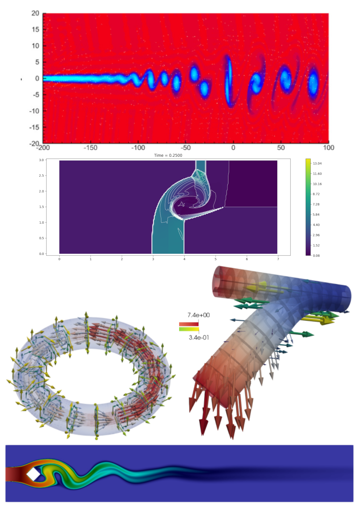

<!--
title: Lecture 010 Introduction
paginate: true
_class: titlepage
-->

# Calcolo Scientifico 2025/2026

## Davide Torlo

--- 
# Info sul docente
* Ricercatore in Sapienza dal 2024
* Mi occupo di metodi numerici per equazioni alle derivate parziali iperboliche
  * Metodi d'alto ordine
  * Metodi che preservano proprietà fisiche delle soluzioni
  * Modelli ridotti per accelerare la soluzione di problemi parametrici
* Mail [davide.torlo@uniroma1.it](mailto:davide.torlo@uniroma1.it)
* Ufficio 5
* Ricevimento su appuntamento

---
# Informazioni sul corso
* 48 ore
* Materiale su [GitHub](https://github.com/accdavlo/calcolo-scientifico) (slides, note, esercizi, codici, progetti)
* Lezioni: slides + note + codice
* Laboratorio: portate il PC e sviluppiamo il codice un po' in classe un po' a casa
* Orari: 
  - martedì 8-10 (va bene 8.30-10 senza pausa?)
  - mercoledì 13.15-15.00

---
### Esame: 
  * Progetto (gruppi da 2/3 persone)
  * Orale a partire dal tema del progetto
  * Date:
    * Project day! Tutte le presentazioni dei progetti insieme (9/10 giugno)
    * Orale subito dopo o su appuntamento.
    * Se non funziona il project day (troppi progetti etc): orale dove si presenta il progetto (preferibilmente tutto il gruppo assieme) e qualche domanda
    * Date flessibili: scrivetemi in anticipo!! (meglio se tutto il gruppo insieme)
    * Date disponibili: 1-19 giugno + (13-17, 27-31) luglio + (1-4, 21-30) settembre 

---
# Informazioni sul corso
### Progetto: 
  * I progetti dell'anno scorso erano un po' troppo difficili (molto ChatGPT)
  * Fate vostre proposte, meno chatGPT più fantasia!!
  * Altrimenti vi propongo qualcosa io (un capitolo di un libro, etc.)
  * Progetti di sviluppo di un metodo per alcune equazioni/problemi specifici con qualche difficoltà aggiunta rispetto a quello che facciamo in classe
  * Desiderata: Collaborazione su Repository git -> Conoscete git?

---

# Informazioni sul corso
### Materiale
* Slides (in inglese) e note a mano durante le lezioni (scrivo abbastanza male)
* Libri:
  * Quarteroni, Alfio. Modellistica Numerica per Problemi Differenziali. Springer Science & Business Media, 2016. [Capitoli 1,2,3,4,5,8,19]
  * Cangiani, Andrea. Note del corso [Numerical Solution of Partial Differential Equations in SISSA, 2025](https://github.com/andreacangiani/NMPDE2025/blob/main/lecture%20notes/NSPDE.pdf) [Sezioni 1-5].
  * Evans, Lawrence C. Partial differential equations. Vol. 19. American Mathematical Society, 2010. [Introduzione alle PDE, per chi vuole approfondire la teoria]
  * LeVeque, Randall J. Finite difference methods for ordinary and partial differential equations: steady-state and time-dependent problems. Society for Industrial and Applied Mathematics, 2007. [Metodi alle differenze finite per iperbolica, capitolo 10]
  * LeVeque, Randall J. Finite volume methods for hyperbolic problems. Vol. 31. Cambridge university press, 2002. [Metodi ai volumi finiti, capitoli 2-4]
  * Langtangen, Hans Petter, and Anders Logg. Solving PDEs in python: the FEniCS tutorial I. Springer Nature, 2017. [Manuale per usare FEniCS]

---
# Informazioni sul corso
### Prerequisiti
  * Analisi II
  * Metodi numerici per (equazioni alle derivate ordinarie) ODE
  * Python
  
### Non richiesto, ma suggerito 
  * Git? [Notes](https://github.com/pcafrica/hpc_for_data_science_2023-2024/blob/main/notes/01/01-2-git.md) [Slides](https://github.com/pcafrica/hpc_for_data_science_2023-2024/blob/main/slides/01/01-intro.md) by Pasquale Africa
---

# Informazioni sul corso
### Computer setting
  * Python 3, ipykernel for Jupyter Notebooks (also Google Colab)
  * IDE (Integrated Develpment Environment) tipo [VisualStudio Code](https://code.visualstudio.com/download)
  * Mac/Linux/Windows tutto ok, io uso Linux
---
# Domande a voi
* Quanti da SMIA?
* Chi da non SMIA da cosa?
* Python fatto tutti?

---
# Introduzione al corso

---

## Equazioni alle derivate parziali

* La **fisica** ha sempre studiato i fenomeni naturali e ha cercato di descriverli in strumenti matematici.
* I **modelli** sono approssimazioni matematiche della descrizione dei fenomeni naturali, per un singolo fenomeno diversi livelli di approssimazione possono portare a diversi modelli.
* Le **equazioni alle derivate parziali** (PDE) sono strumenti che hanno permesso di descrivere molti fenomeni fisici.
* La **matematica** fornisce gli strumenti per studiare ed analizzare le equazioni che descrivono i modelli fisici.
* L'**analisi numerica** approssima le soluzioni di queste equazioni quando soluzioni analitiche non sono disponibili.

--- 

## Applicazioni delle PDE

* Diffusione di calore
* Elasticità e deformazione di solidi
* Vibrazioni
* Fluidi: acqua, gas, meteo
* Interazione fluidi-strutture
* Diffusione di agenti biologici/inquinanti
* Elettro-magnetismo
* Combinazioni di questi

---

# PDE

$\Omega \subset \mathbb R ^{d}$ con $d>1$
$u:\Omega \to R^s$ con $s\in \mathbb N_0$
Una PDE di ordine $k$ si scrive come
$$F(\nabla^{(k)}u,\nabla^{(k-1)}u, \dots, \nabla u, u)=0$$

Dove indico con $\nabla^{(j)} u$ il tensore con tutte le possibili derivate di ordine $j$-esimo. Per esempio in 2D $(x,y)\in \Omega$, 
$$ \nabla u = \begin{pmatrix}
  \partial_x u\\ \partial_y u
\end{pmatrix}, \quad  \nabla^{(2)} u = \begin{pmatrix}
  \partial_{xx} u & \partial_{xy} u\\ \partial_{yx} u & \partial_{yy} u
\end{pmatrix}, \quad \nabla^{(3)}u = \left(\begin{pmatrix}
  \partial_{xxx} u & \partial_{xxy} u\\ \partial_{xyx} u & \partial_{xyy} u
\end{pmatrix},\begin{pmatrix}
  \partial_{yxx} u & \partial_{yxy} u\\ \partial_{yyx} u & \partial_{yyy} u
\end{pmatrix} \right).$$

---

## Esempi
|Nome          | Equazione            |
|-----|-------|
|**Equazione del trasporto in 1D** | $\partial_t u + c \partial_x u =0$ |
| **Equazione del calore in 1D**|$\partial_t u - c \partial_{xx} u =0$|
| **Equazione di Burgers in 1D** |$\partial_t u + u \partial_x u =0$|
| **Equazione di Laplace in 2D**| $-(\partial_{xx}u + \partial_{yy}u) =0$|
| **Navier Stokes incomprimibile**| $\begin{cases}\frac{\partial u}{\partial t} -\nu \Delta u + \left( u \cdot \nabla \right) u + \nabla p = f\\-\text{div} u = 0\end{cases}$|

---

## Notazione derivate

Come già avete potuto notare dall'ultima slide, ci sono più notazioni per indicare le derivate parziali e totali.

| Notazione | Significato |
|:----------|:------------|
| $\partial_t u(t,x,y,\dots)=\frac{\partial }{\partial t} u(t,x,y,\dots)=u_t(t,x,y,\dots)$ | Derivata parziale in una variabile |
| $\frac{\text{d} }{\text{d} t} u(t,x(t),y(t),\dots)$  | Derivata totale in una variabile |
| $\nabla u = \begin{pmatrix} \partial_x u\\ \partial_y u\end{pmatrix}$  | Gradiente in 2D |
| $\Delta u = \partial_{xx} u +\partial_{yy} u = \partial_x^2 u + \partial_y^2 u$  | Laplaciano in 2D |
| $\text{div} \begin{pmatrix}u\\v \end{pmatrix} = \nabla \cdot \begin{pmatrix}u\\v \end{pmatrix} = \partial_{x} u +\partial_{y} v$  | Divergenza in 2D |
| $\nabla \times \begin{pmatrix}u\\v \end{pmatrix} = \partial_{x} v -\partial_{y} u$  | Rotore in 2D |
| $\nabla \times \begin{pmatrix}u\\v\\w \end{pmatrix} = \begin{pmatrix} \partial_{y} w -\partial_{z} v \\ \partial_{z} u -\partial_{x} w \\ \partial_{x} v -\partial_{y} u \end{pmatrix} = \text{det} \begin{pmatrix} \textbf{i} & \partial_x & u \\ \textbf{j} & \partial_y & v \\ \textbf{k} & \partial_z & w \\ \end{pmatrix}$  | Rotore in 3D |

---

### Esercizi per casa
* Calcola l'ordine delle seguenti PDE:
  1. $\partial_t u + c \partial_x u =0$
  2. $\partial_t u - c \partial_{xx} u =0$
  3. $\partial_t u + u \partial_x u =0$
  4. $-(\partial_{xx}u + \partial_{yy}u) =0$
  5. $\begin{cases}\frac{\partial u}{\partial t} -\nu \Delta u + \left( u \cdot \nabla \right) u + \nabla p = f\\-\text{div} u = 0\end{cases}$
  6. $\partial_x(\Delta u) + u \partial_{yy} u\partial_{xx} u = \sin(x)$
  7. Equazioni dispersive KdV: $\partial_t u + \partial_x^3 u + u \partial_x u =0$
  8. $\partial_{tt} u - c^2 \Delta u =0$ (equazione delle onde)
  9. Maxwell equations in 3D: $E,B: \mathbb R^{3} \to \mathbb R^{3}$ $\begin{cases}\nabla \cdot E = \frac{\rho}{\epsilon_0} \\ \nabla \cdot B = 0 \\ \nabla \times E = -\frac{\partial B}{\partial t} \\ \nabla \times B = \mu_0 J + \mu_0 \epsilon_0 \frac{\partial E}{\partial t}\end{cases}$
---

# Metodi Numerici
Trovare soluzioni esatte di PDE non è sempre facile, in particolare se:
* la geometria del dominio $\Omega$ è complicata (ponti, aerei, etc.),
* le equazioni sono complicate (nonlinearità, ordini alti, etc.).

L'analisi numerica fornisce strumenti per la risoluzione delle PDE. Vari metodi, ma più o meno tutti seguono queste procedure:
1. Discretizzazione del dominio
2. Discretizzazione dello spazio delle funzioni dove cerco la soluzione
3. Discretizzazione delle equazioni (il metodo numerico vero e proprio)
4. Risoluzione delle equazioni discretizzate

---

# Alcuni Metodi Numerici
Nel tempo numerosi metodi numerici sono stati sviluppati (alcuni più specifici per alcune applicazioni, altri più generici)

* Finite Difference (FD)
* Finite Volume (FV)
* Galerkin approximations:
  * Continous Finite Elements (FEM)
  * Discontinuous Galerkin (DG)
  * Spectral Methods
  * Spectral Element Methods (SEM)
  * Summation by parts (SBP)
* Physics Informed Neural Networks (PINN)

---
# Syllabus del corso
* Topic: metodi numerici per l'approssimazione di equazioni alle derivate parziali (PDE: partial differential equations) 
### Argomenti (circa): 
  - introduzione alle PDE + analisi funzionale [12h];
  - metodi per equazioni ellittiche (finite difference e finite element) [16h = 8 class + 8 lab];
  - ripasso di ODE [2h] (se necessario);
  - metodi per equazioni paraboliche (finite difference and finite element) [4h = 2h classes + 2h lab];
  - metodi per equazioni iperboliche (finite difference and finite volume) [10h = 6h classes + 4h lab];
  - physics informed neural networks [2h = 1h class + 1h lab];
  - model order reduction [2h = 1h class + 1h lab].

--- 
# Ripasso di ODE?

Sì, No? (Lo facciamo più avanti in ogni caso)
### Referenze
  * [Teoria delle ODE](../00/Chapter1_Theory_of_ODE.ipynb) 
  * [Eulero Implicito ed esplicito](../00/Chapter%202%20Classical%20Euler%20Methods.ipynb) 
  * [Runge Kutta e Multistep](../00/Chapter%203%20Classical%20High%20Order%20Methods.ipynb)
