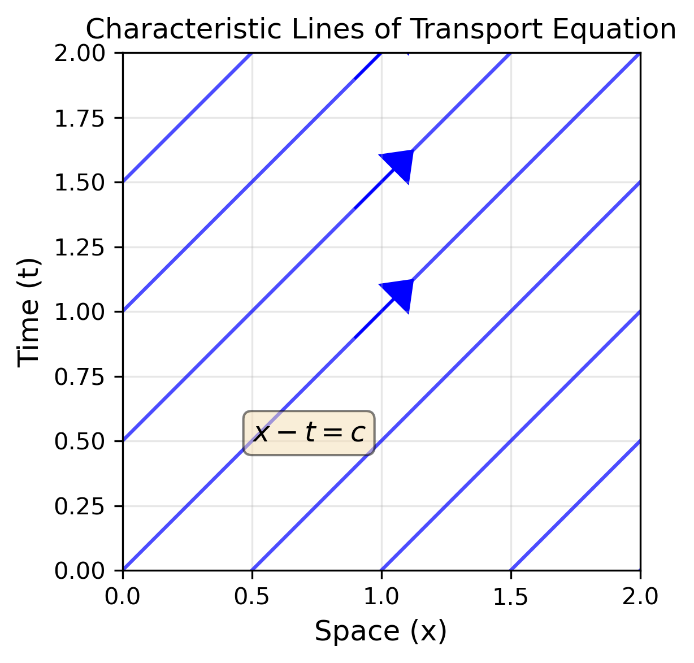

<!--
title: Lecture 011 PDE
paginate: true
_class: titlepage
-->

# Partial Differential Equations

---

# Motivation for PDEs: Conservation law (1/2)

Consider a transport problem coming from the gas dynamics, traffic, population dynamics, wave equations. Focus for example on gas dynamics where we describe the motion of a gas inside a tube (1D-like to simplify), where in the transversal direction the density and the velocity of the gas is constant.

We define the density of a gas $\rho(t,x)$ such that the mass of the gas in a given section $[x_1,x_2]$ gives the mass in that section at time $t$ by integrating the density 
$$
m_{[x_1,x_2]}=\int_{x_1}^{x_2} \rho(t,x) \mathrm{d} x.
$$ 

The walls of the tube are impermeable, no exchange of mass happens across these walls, so the change of mass is happening only across the points $x_1$ and $x_2$. The rate of flow at these points is given by the velocity $v$ times the density, i.e.,
$$
\text{mass flux at }(t,x) = \rho(t,x) v(t,x).
$$

---

# Motivation for PDEs: Conservation law  (2/2)

The rate of change of the mass in $[x_1,x_2]$ in a certain time step $[t_1,t_2]$ is then the difference of the flow at the two endpoints integrated in time, i.e.,
$$
\int_{x_1}^{x_2} \rho(t_2,x) \,\mathrm{d}x - \int_{x_1}^{x_2} \rho(t_1,x) \,\mathrm{d}x = \int_{t_1}^{t_2}  \rho(t,x_1)v(t,x_1) dt-\int_{t_1}^{t_2} \rho(t,x_2)v(t,x_2) dt.
$$
This is the **integral form** of the **conservation law** (of mass).
Supposing that all the quantities are differentiable, we can differentiate in $x_2$ and in $t_2$ and  obtain
$$
\frac{\mathrm{d}}{\mathrm{d}t} \rho(t,x) + \partial_x (\rho(t,x)v(t,x))=0.
$$
This is the differential form of the **conservation law**.

For the moment we suppose that the velocity is known a priori. More in general, we can write the conservation law as 
$$
\partial_t \rho(t,x) +\partial_x f(\rho(t,x) )=0.
$$

---

## PDE [Cangiani's notes](https://github.com/andreacangiani/NMPDE2025/blob/main/lecture%20notes/NSPDE.pdf)

Given a domain $\Omega \in \mathbb R ^{d}$ where $d>1$, we seek for $u:\Omega \to \mathbb R^s$ where $s\in \mathbb N_0$, solution of a **stationary PDE** of order $k$:
$$F(x,t,u, \nabla u \dots, \nabla^{(k-1)}u,\nabla^{(k)}u, g)=0$$
with $g:\Omega \to \mathbb R^s$ a given function called **datum**. Or, more explicitely as
$$\mathcal{P}(u,g) \equiv F(x, u, \frac{\partial u}{\partial x_1},\dots, \frac{\partial u}{\partial x_d}, \frac{\partial^2 u}{\partial x_1 \partial x_1}, \dots, \frac{\partial^{p_1+\dots+p_d} u}{\partial^{p_1} x_1 \, \partial^{p_2} x_2 \dots \partial^{p_d} x_d }, g  )=0,$$
where $p_1+ \dots + p_d\leq k$.

A **non stationary** PDE of order $k$ reads: find $u:\Omega \times [0,T] \to \mathbb R^{s}$
$$\begin{equation}\mathcal{P}(u,g) \equiv F(x,t, u, \frac{\partial u}{\partial t}, \frac{\partial u}{\partial x_1},\dots, \frac{\partial u}{\partial x_d}, \frac{\partial^2 u}{\partial x_1 \partial x_1}, \dots, \frac{\partial^{p_0+p_1+\dots+p_d} u}{\partial^{p_0}t \,\partial^{p_1} x_1  \dots \partial^{p_d} x_d }, g  )=0,\end{equation}$$
where $p_0+ \dots + p_d\leq k$.

A classical solution of a PDE is a function $u\in \mathcal{C}^k(\Omega \times [0,T])$ that solves the previous equation. 

---

### Definition
If the PDE can be written in the form 
$$
\mathcal{P}(u,g) = a(x) u + b_0(x) \partial_t u + b_1(x) \partial_{x_1}u +\dots + b_d(x) \partial_{x_d}u + c_{\alpha(2,0,\dots,0)} \partial_{tt} u +\dots + \gamma_{\alpha(p_0,\dots ,p_d)} \frac{\partial^{p_0+\dots +p_d} u}{\partial^{p_0}t\,\partial^{p_1}x_1\dots \partial^{p_d}x_d}+\dots -g=0,
$$
i.e., if the coefficitents of the unknown $u$ and of its derivatives depend only on the independent variables $(t,x)$, then the PDE is **linear**. Else, it is **nonlinear**.

### Definitions
Consider a nonlinear PDE of order $k$
* if the coefficients of the derivatives of order $k$ depend only on the indepenedent variables $(t,x)$, then the PDE is **semilinear**;
* if the coefficients of the derivates of order $k$ depend on the independent variables  $(t,x)$ and on the partial derivatives of $u$ of order at most $k-1$, then the PDE is **quasi-linear**;
* if it's not quasi-linear, its **fully nonlinear**.

--- 

### Examples

* Reaction-advection-diffusion equation
    $$ \partial_t u = u_{xx } + c u_x + u^2,$$
   *  is semilinear.
* Inviscid Burgers' equation
    $$
    \partial_t u + u u_x =0,
    $$
   *  is quasi-linear but not semilinear.
* The Korteweg-de Vries (KdV) equation
    $$
    \partial_t u + u \partial_x u + \partial_{xxx} u =0,
    $$
   *  is semilinear.
* The Monge-Ampère equation
    $$
    u_{xx}u_{yy} - (u_{xy})^2 =0
    $$
   * is fully nonlinear.

---

### Homework
Classify the following PDE as linear, semilinear, quasi-linear or fully nonlinear:
1. Transport with time-dependent velocity: $u_t + \sin(t) u_x =0$
2. Viscous Burgers' $u_t + u u_x + u_{xx} =0$
3. Navier-Stokes equations
   $$
   \begin{cases}
   \partial_t u + (u \cdot \nabla) u - \nu \Delta u + \nabla p = f,\\
   -\text{div} u =0.
   \end{cases}
   $$
4. Eikonal equation: $|\nabla u| =1$.
5. $\partial_tu \partial_{xx}u - u\partial_x u =0$.

---

# First order linear PDE , a.k.a. transport equation

$$ u_t(x,t) + u_x(x,t)=0 $$
How do I found a general solution $u\in \mathcal{C}^1(\mathbb R^2)$?

Let's try this change of variables 
$$(x,t) \to(\xi, \eta), \qquad \xi(x,t) = x+t,\, \,\eta(x,t)= x-t $$
with inverse
$$ x(\xi,\eta) = \frac{\xi+\eta}{2},\, t(\xi,\eta) = \frac{\xi-\eta}{2}.$$
I substitute the new variables: $v(\xi,\eta):=u(x(\xi,\eta),t(\xi,\eta))$
$$\begin{align}u_x = v_\xi \xi_x + v_\eta \eta_x = v_\xi + v_\eta\\
u_t = v_\xi \xi_t + v_\eta \eta_t = v_\xi -v_\eta\end{align}$$
obtaining a new PDE
$$0=u_t+u_x = 2 v_\xi \Longleftrightarrow v_\xi=0.$$
This implies that $v(\xi,\eta)=f(\eta)$ with $f\in\mathcal{C}^1(\mathbb R)$. Going back to the original variables
$$u(x,t) = v(\xi(x,t),\eta(x,t)) = f(\xi(x,t))=f(x-t)$$

---
# Characteristic lines

$$u_t+u_x=0, \qquad u(x,t) = v(\xi(x,t),\eta(x,t)) = f(\xi(x,t))=f(x-t).$$
$$X_{x_0}(t) = x_0+t$$

---

# Generalization to different coefficients

$$a(t,x)u_t+b(t,x)u_x+cu(t,x)=g(t,x), (t,x)\in\Omega\subset\mathbb R^2.$$
Well defined (non-singular and $\mathcal{C}^1$) transformation $(t,x) \Leftrightarrow (\xi,\eta)$, i.e.,
$$\left| \frac{\partial (\xi,\eta)}{\partial(t,x)}\right| := \left| \begin{pmatrix} \xi_t &\xi_x\\ \eta_t & \eta_x \end{pmatrix}\right| = \xi_t\eta_x - \xi_x \eta_t \neq 0.$$
Change of variables: $u_t=v_\xi \xi_t + v_\eta\eta_t , \,u_x = v_\xi \xi_x + v_\eta \eta_x,$ giving
$$(a \xi_t + b \xi_x) v_\xi + (a\eta_t +b\eta_x)v_\eta +cv = g(t(\xi,\eta),x(\xi,\eta))$$
Goal: simplify the previous equation, we choose $\eta$ such that
$$a\eta_t + b \eta_x =0,$$
so that we obtain an ODE for every $\eta$
$$v_\xi + \frac{c}{a \xi_t + b \xi_x}v = \frac{g(t(\xi,\eta),x(\xi,\eta))}{a \xi_t + b \xi_x}.$$

---
# Generalization to different coefficients

To obtain $a\eta_t + b \eta_x =0$, one should notice that, w.l.o.g., we are looking for a curve $x(t)$ such that $\eta(t,x(t)) = \eta_0$ constant for every $t$.

$$0= \frac{d \eta(t,x(t))}{dt} =\eta_t + \eta_x \frac{\partial x}{\partial t} \Longrightarrow \frac{\eta_t}{\eta_x} = -\partial_t x(t) $$

Hence, we have

$$\frac{\eta_t}{\eta_x} = -\frac{b}{a} \Longleftrightarrow \partial_t x(t) = \frac{b}{a}.$$

Integrating this ODE, one obtains the curve $x(t)$, leading to the definition of $\eta(t,x)$ solving for the constant $\eta_0$.

---

# Example
$$xu_t-tu_x=1$$
$$\begin{align}
&(x\xi_t -t\xi_x)v_\xi +(x\eta_t -t \eta_x)v_\eta =1\\
&(x\eta_t -t \eta_x)=0 \qquad\qquad\qquad\qquad \text{We look for } x(t): \frac{d\eta(t,x(t))}{dt}= \eta_t + \eta_x \frac{dx}{dt} =  0 \\
&\frac{dx}{dt}=-\frac{t}{x} \Longrightarrow \int x\,dx=\int -t\,dt \Longrightarrow \frac{x^2}{2}= -\frac{t^2}{2}+\underbrace{C}_{\geq 0}\\
&x=\sqrt{\eta_0^2-t^2}\\
&\eta(t,x):=\sqrt{t^2+x^2} \qquad \Longrightarrow \qquad  \eta_t = \frac{t}{\sqrt{t^2+x^2}}, \quad  \eta_x =  \frac{x}{\sqrt{t^2+x^2}},\\
&\text{I choose } \xi(t,x)=\arctan (x/t)\qquad \Longrightarrow \qquad  \xi_t = \frac{t^2}{x^2+t^2}\frac{-x}{t^2} = -\frac{x}{x^2+t^2}, \quad  \xi_x = \frac{t}{x^2+t^2},\\
& t=\eta \cos(\xi),\,x = \eta \sin(\xi),\\
&\underbrace{\left(-\eta \sin(\xi) \frac{\eta \sin(\xi)}{\eta^2} -\eta\cos(\xi)\frac{\eta\cos(\xi)}{\eta^2}\right)}_{=-1} v_\xi=1, \Longrightarrow  v=-\xi+f(\eta), \quad u=-\arctan(x/t)+f(x^2+t^2).
\end{align}
$$
* Homework: check when the transformation is invertible, draw the characteristic lines $\eta(t,x) = c$.

---

## Homework

* Solve $u_x-2u_y=0$
* Solve $u_t-t^2u_x=1$
* Solve $yu_x-xu_y+uy=xy$ (difficult)

---

# Second order linear PDE in 2D

Consider the PDE on $\Omega\subset \mathbb{R}^2$
$$\mathcal{P}(u,g) = A \partial_{xx}u+ B u_{xy} + C u_{yy} + Du_x + Eu_y +Fu-g=0\quad \forall (x,y) \in \Omega$$
where $u\in \mathcal{C}^2(\Omega)$ and $A,B,C\in \mathcal C^2(\Omega)$ and they do not vanish simultaneously. Let's **classify** the PDE depending on the *discriminant* 
$$
\Delta := B^2-4AC.
$$
## Definition
* If $\Delta>0$ the PDE is said to be **hyperbolic** (at a point $(x,y)$)
* If $\Delta=0$ the PDE is said to be **parabolic** (at a point $(x,y)$)
* If $\Delta<0$ the PDE is said to be **elliptic** (at a point $(x,y)$)

---

* ### Hyperbolic example: wave equation
    $$ \partial_{tt} u - c \partial_{xx} u =0 \text{ with }c>0$$
    * Indeed, $\Delta = 4c>0.$

* ### Parabolic example: heat equation
    $$ \partial_{t} u - c \partial_{xx} u =0 \text{ with }c>0$$
    * Indeed, $\Delta = 0.$

* ### Elliptic example: Poisson equation
    $$ - c \partial_{xx} u -c\partial_{yy}u =-c \Delta u =f \text{ with }c>0$$
    * Indeed, $\Delta = -4c^2<0.$

* ### Changing sign example: Tricomi equation
    $$y u_{xx}+ u_{yy}=0$$
    * $\Delta = -4y.$

---

### Theorem
The sign of the discriminant $\Delta$ is invariant under smooth non-singular transformation of coordinates (i.e. under a change of variables).

#### Proof (not asked at exam) 1/3
We focus only on the second order terms as the first order ones do not contribute to the discriminant.
Suppose we perform a smooth change of variables $(x,y) \mapsto (\xi,\eta)$, given by a diffeomorphism.
Under this transformation, the second-order derivatives transform as follows:
$$\begin{equation}
    u_{xx} = \alpha^2 u_{\xi\xi} + 2\alpha\beta u_{\xi\eta} + \beta^2 u_{\eta\eta},
\end{equation}$$
$$\begin{equation}
    u_{xy} = \alpha\gamma u_{\xi\xi} + (\alpha\delta + \beta\gamma) u_{\xi\eta} + \beta\delta u_{\eta\eta},
\end{equation}$$
$$\begin{equation}
    u_{yy} = \gamma^2 u_{\xi\xi} + 2\gamma\delta u_{\xi\eta} + \delta^2 u_{\eta\eta},
\end{equation}$$
where
$$\begin{equation}
    \alpha = \frac{\partial \xi}{\partial x}, \quad \beta = \frac{\partial \eta}{\partial x}, \quad \gamma = \frac{\partial \xi}{\partial y}, \quad \delta = \frac{\partial \eta}{\partial y}.
\end{equation}$$

---

#### Proof 2/3

Rewriting the PDE in the new coordinates, we get
$$\begin{align*}
    &A u_{xx} + B u_{xy} + C u_{yy} =\\
    & A (\alpha^2 u_{\xi\xi} + 2\alpha\beta u_{\xi\eta} + \beta^2 u_{\eta\eta}) + B (\alpha\gamma u_{\xi\xi} + (\alpha\delta + \beta\gamma) u_{\xi\eta} + \beta\delta u_{\eta\eta}) + C (\gamma^2 u_{\xi\xi} + 2\gamma\delta u_{\xi\eta} + \delta^2 u_{\eta\eta})=\\
    & (A\alpha^2 + B\alpha\gamma + C\gamma^2) u_{\xi\xi} + (2A\alpha\beta + B(\alpha\delta + \beta\gamma) + 2C\gamma\delta) u_{\xi\eta} + (A\beta^2 + B\beta\delta + C\delta^2) u_{\eta\eta}=\\
    &A' u_{\xi\xi} + B' u_{\xi\eta} + C' u_{\eta\eta}.
\end{align*}$$

with the transformed coefficients $A', B', C'$ are given by
$$\begin{align*}
    &A' = A\alpha^2 + B\alpha\gamma + C\gamma^2,\\
    &B' = 2A\alpha\beta + B(\alpha\delta + \beta\gamma) + 2C\gamma\delta,\\
    &C' = A\beta^2 + B\beta\delta + C\delta^2.
\end{align*}$$

---

#### Proof 3/3
$$\begin{align*}
    &A' = A\alpha^2 + B\alpha\gamma + C\gamma^2,\\
    &B' = 2A\alpha\beta + B(\alpha\delta + \beta\gamma) + 2C\gamma\delta,\\
    &C' = A\beta^2 + B\beta\delta + C\delta^2.
\end{align*}$$
Now, computing the transformed discriminant:
$$\begin{align}
    \Delta' &= B'^2 - 4A'C' \\
    &= (2A\alpha\beta + B(\alpha\delta + \beta\gamma) + 2C\gamma\delta)^2 \\
    &\quad - 4(A\alpha^2 + B\alpha\gamma + C\gamma^2)(A\beta^2 + B\beta\delta + C\delta^2).
\end{align}$$
Expanding both terms and simplifying, we find that
$$\begin{align*}
    \Delta' =&  4A^2 \alpha^2 \beta^2 + 4AB\alpha\beta(\alpha\delta + \beta\gamma) + 8AC\alpha\beta\gamma\delta + B^2(\alpha\delta + \beta\gamma)^2 + 4BC(\alpha\delta + \beta\gamma)\gamma\delta + 4C^2\gamma^2\delta^2 \\
    &-4(A^2\alpha^2\beta^2 + AB\alpha^2\beta\delta + AC\alpha^2\delta^2 + AB\alpha\beta^2\gamma + B^2\alpha\beta\gamma\delta + BC \alpha \gamma\delta^2 + AC\gamma^2\beta^2 + BC\gamma^2\beta\delta + C^2 \gamma^2 \delta^2)\\
    =&A^2 (4\alpha^2\beta^2-4\alpha^2\beta^2) 
    + AB(4\alpha\beta(\alpha\delta + \beta\gamma) - 4\alpha\beta (\alpha\delta + \beta\gamma)) 
    + AC(8\alpha\beta\gamma\delta - 4\alpha^2\delta^2 - 4\gamma^2 \beta^2) \\
    &+ B^2((\alpha\delta + \beta\gamma)^2 - 4 \alpha \beta \gamma \delta)
    +BC (4(\alpha\delta + \beta\gamma)\gamma\delta - 4\gamma \delta(\alpha\delta + \gamma \beta))
    + C^2(4 \gamma^2 \delta^2 - 4 \gamma^2 \delta^2) \\
    =&(B^2 - 4AC)(\alpha\delta - \beta\gamma)^2 = \Delta \det(J)^2,
\end{align*}$$
where $J$ is the Jacobian matrix of the transformation. Since $\det(J)^2 \geq 0$, the sign of $\Delta$ remains unchanged. This proves the invariance of the discriminant sign under a change of variables.

---

## Hyperbolic canonical form: example wave equation

Consider the wave equation
$$\partial_{tt} u- c^2 \partial_{xx} u =0$$
with $c>0$, so $\Delta = B^2-4AC = 0^2 - 4(-c) = 4c > 0$. We can find a change of variables $(x,t) \mapsto (\xi,\eta)$ such that the PDE simplifies to
$$\partial_{\xi\eta} v =0.$$
The map is defined by 
$$\eta=x+ct,\quad \xi = x-ct \quad \Longrightarrow \eta_x =1, \, \eta_t = c, \quad \xi_x =1, \, \xi_t = -c$$
### Check the change of variables
$$\begin{align}
\partial_{tt}u-c^2\partial_{xx}u =& (\xi_t^2 \partial_{\xi\xi}v +2 \xi_t \eta_t  \partial_{\xi\eta}v + \eta_t^2 \partial_{\eta\eta}v) - c^2(\xi_x^2 \partial_{\xi\xi}v +2 \xi_x \eta_x  \partial_{\xi\eta}v + \eta_x^2 \partial_{\eta\eta}v)\\
=& (\xi_t^2 - c^2\xi_x^2)\partial_{\xi\xi}v + 2(\xi_t\eta_t - c^2\xi_x\eta_x)\partial_{\xi\eta}v + (\eta_t^2 - c^2\eta_x^2)\partial_{\eta\eta}v\\
=& 0\cdot \partial_{\xi\xi}v + 2( -c^2 - c^2)\partial_{\xi\eta}v + 0 \cdot \partial_{\eta\eta}v = -4c^2\partial_{\xi\eta}v=0\\
\end{align}
$$
This is the canonical form of a hyperbolic PDE. 

---

## Hyperbolic canonical form solution
$$\partial_{\xi\eta} v =0.$$
The general solution is given integrating in $\xi$ and then in $\eta$, i.e.,
$$v(\xi,\eta) = \int^{\xi} \int^{\eta} \partial_{wz} v(w,z)\, dz\, dw = \int^{\xi} f(w)  dw = F(\xi) + G(\eta) ,$$
where $\partial_\xi F(\xi) = f(\xi)$, for arbitrary functions $f,G$.
Recall the change of variables 
$$\eta=x+ct,\quad \xi = x-ct.$$
So, the general solution of the wave equation is 
$$ u(x,t) = F(x-ct) + G(x+ct).$$

---

## Hyperbolic canonical form for general hyperbolic PDE
Consider just the second order terms of the hyperbolic PDE $\Delta = B^2-4AC>0$.
$$ A \partial_{xx}u+ B u_{xy} + C u_{yy} =0.$$
We look for a change of variables $(x,y) \mapsto (\xi,\eta)$ such that the PDE simplifies to 
$$\partial_{\xi\eta} v =0.$$
The transformation can be applied noting that
$$
\begin{align}
&u_{xx} = v_{\xi\xi}(\xi_x)^2 + 2v_{\xi\eta}\xi_x\eta_x + v_{\eta\eta}(\eta_x)^2,\\
&u_{xy} = v_{\xi\xi}\xi_x\xi_y + v_{\xi\eta}(\xi_x\eta_y+\xi_y\eta_x) + v_{\eta\eta}\eta_x\eta_y,\\
&u_{yy} = v_{\xi\xi}(\xi_y)^2 + 2v_{\xi\eta}\xi_y\eta_y + v_{\eta\eta}(\eta_y)^2,
\end{align}
$$

The transformed PDE reads
$$ (A\xi_x^2+B\xi_x\xi_y + C \xi_y^2)v_{\xi\xi} + (2A\xi_x\eta_x + B(\xi_x\eta_y+\xi_y\eta_x )+ 2C\xi_y\eta_y)v_{\xi\eta} + (A\eta_x^2+B\eta_x\eta_y+C\eta_y^2)v_{\eta\eta}=0.$$

---

$$ (A\xi_x^2+B\xi_x\xi_y + C \xi_y^2)v_{\xi\xi} + (2A\xi_x\eta_x + B(\xi_x\eta_y+\xi_y\eta_x )+ 2C\xi_y\eta_y)v_{\xi\eta} + (A\eta_x^2+B\eta_x\eta_y+C\eta_y^2)v_{\eta\eta}=0.$$

We want to find the change of variables such that
$$
\begin{align}
\begin{cases}
A\xi_x^2+B\xi_x\xi_y + C \xi_y^2 = 0\\
A\eta_x^2+B\eta_x\eta_y+C\eta_y^2=0
\end{cases}
\end{align}
$$
These are first order PDE, so we are looking for characteristics curves such that $\xi(x,y)=\text{const}$, if we find a curve, for example $y(x)$ such that $\xi(x,y(x))=\text{const}$, then
$$\frac{d\xi}{dx} = \frac{\partial \xi}{\partial x} + \frac{\partial \xi}{\partial y}\frac{dy}{dx} =0 \Longrightarrow \frac{dy}{dx} = -\frac{\partial_x \xi}{\partial_y \xi}.$$
From the first PDE, we then get
$$
A\left(\frac{dy}{dx}\right)^2 - B\frac{dy}{dx} + C =0,
$$
which is called the characteristic equation for the original PDE. This is quadratic equation in $\frac{dy}{dx}$ with $\Delta = B^2-4AC>0$. The two distinct solutions are
$$
\frac{dy}{dx} = \frac{+B\pm \sqrt{\Delta}}{2A}.
$$
From this we can get the transformation $(x,y) \mapsto (\xi,\eta)$ as we did in the linear PDE.

---

## Example 
$$u_{tt}+u_{tx} =0$$

$$
\begin{align}
(\xi_t^2+\xi_t\xi_x)u_{\xi\xi} + (2\xi_t\eta_t +\xi_t\eta_x+\xi_x\eta_t)u_{\xi\eta} + (\eta_t^2+\eta_t\eta_x)u_{\eta\eta} =0\\
\end{align}
$$
The equations for $\xi$ and $\eta$ are the same equations.
We look for a curve $y(x)$ such that $\xi(x,y(x))=\text{const}$, i.e., $\xi(x,y(x)) = x+y(x)=\text{const}$ and that
$$
\begin{align}
&\xi_t^2+\xi_t\xi_x =0\\
&\frac{\xi_t^2}{\xi_x^2}+\frac{\xi_t}{\xi_x} =0\\
&\left(\frac{dx}{dt}\right)^2-\frac{dx}{dt} =0\\
&\frac{dx}{dt}=\begin{cases}
0\\
1
\end{cases}
 \Longrightarrow x(t) = \begin{cases}
\xi_0\\
\eta_0+t
\end{cases}\\
\Longrightarrow & \eta=x-t, \quad \xi=x.
\end{align}
$$
---

## Homework

1. Find the change of variables that transforms $u_{tt}+u_{tx}-2u_{xx}=0$ into the canonical form $\partial_{\xi\eta} v =0$.
2. Solutions of wave equations $F(x-ct)+G(x+ct)$ are extremely similar to transport equation solutions $f(x-ct)$. Write the wave equations $u_{tt}-c^2 u_{xx}=0$ as a system of two first order linear transport PDEs. (Hint introduce a new variable $v$ such that $v_t=c^2u_x$)*

---

$$ (A\xi_x^2+B\xi_x\xi_y + C \xi_y^2)v_{\xi\xi} + (2A\xi_x\eta_x + B(\xi_x\eta_y+\xi_y\eta_x )+ 2C\xi_y\eta_y)v_{\xi\eta} + (A\eta_x^2+B\eta_x\eta_y+C\eta_y^2)v_{\eta\eta}=0.$$

### What if we try to do the same with a parabolic PDE $\Delta =0$?

$$
\frac{dx}{dt} = \frac{B\pm \sqrt{\Delta}}{2A}=\frac{B}{2A}.
$$
There is only one characteristic curve. So, choosing $\eta = 2A y - B x$ and $\xi = x$ (or anything else lin. independent from $\eta$), we have that $C'=0$, which means that also $B'=0$ (as $\Delta = B^2-4AC=0$), so 
we get the canonical form
$$
A'\frac{\partial^2 v}{\partial \xi^2} =0,
$$
with the general solution $v(\xi,\eta) = F(\eta) + \xi G(\eta) = F(2Ax-By)+xG(2Ax-By)$.

---

$$ (A\xi_x^2+B\xi_x\xi_y + C \xi_y^2)v_{\xi\xi} + (2A\xi_x\eta_x + B(\xi_x\eta_y+\xi_y\eta_x )+ 2C\xi_y\eta_y)v_{\xi\eta} + (A\eta_x^2+B\eta_x\eta_y+C\eta_y^2)v_{\eta\eta}=0.$$
### What if we try to do the same with an elliptic PDE?
There is no characteristics that is conserved. But, one can instead eliminate the coefficient of $u_{\xi\eta}$ to obtain the canonical form for the elliptic PDE. Using $\eta=x$ and $\xi=\frac{2Ay-Bx}{\sqrt{-\Delta}}$, we get
$$
A\left(\frac{\partial^2 v}{\partial \xi^2} + \frac{\partial^2 v}{\partial \eta^2}\right) =0.
$$
We cannot rewrite it as an ODE. One could use complex functions to solve it. 

## Different approach: Fourier space
Suppose that we consider only periodic functions on $[-\pi,\pi]^2$, we can they something on the solutions. Since, we are periodic and boundaries play a marginal role, we better consider a right hand side $g$ that is periodic and we look for periodic solutions. We can then use Fourier series to solve the PDE, which is a powerful tool for linear PDEs with constant coefficients.

---

## Exact solutions for periodic elliptic equations (Fourier) (1/3)

### Eigenfunctions of the differential operator
First of all, let's notice that the trigonometric functions are special functions for the differential operator
$$
\begin{align*}
&\partial_ x e^{i x k} = i k e^{i x k}, \qquad &\partial_{xx} e^{i x k} = -k^2 e^{i x k},\\
&\partial_x \sin(kx) = k \cos(kx), \qquad &\partial_{xx} \sin(kx) = -k^2 \sin(kx),\\
&\partial_x \cos(kx) = -k \sin(kx), \qquad &\partial_{xx} \cos(kx) = -k^2 \cos(kx).
\end{align*}
$$

Recall:
$$
\begin{align*}
e^{i\pi}=-1,&&\sin(x) = \frac{e^{ix}-e^{-ix}}{2i}, && \cos(x) = \frac{e^{ix}+e^{-ix}}{2},\\
&&e^{ix} = \cos(x) + i \sin(x), && e^{-ix} = \cos(x) - i \sin(x).
\end{align*}
$$

So we focus on the trigonometric functions of the type $e^{ixk}$.

---

## Exact solutions for periodic elliptic equations (Fourier) (2/3)

### Fourier series
For simplicity let's consider $\Omega = [-\pi,\pi]$ with periodic boundary conditions. We can decompose any periodic function $g$ in Fourier series if $g\in L^2(\Omega)$.
$$
g(x) = \sum_{k\in \mathbb Z} \hat{g}_k e^{i k x}, \qquad \hat{g}_k = \frac{1}{2\pi} \int_{-\pi}^{\pi} g(x) e^{-i k x} \textrm{d}x.
$$

### Parseval theorem
$$
\lVert \mathbf{\hat{g}} \rVert_2^2=\sum_{k\in \mathbb Z} |\hat{g}_k|^2 = \frac{1}{2\pi} \int_{-\pi}^{\pi} |g(x)|^2 \textrm{d}x = \frac{1}{2\pi} \lVert g \rVert_2^2.
$$

[Wikipedia page on Fourier series](https://en.wikipedia.org/wiki/Fourier_series)
[Youtube playlist of 3Blue1Brown on Fourier series](https://www.youtube.com/watch?v=spUNpyF58BY&list=PL4VT47y1w7A1-T_VIcufa7mCM3XrSA5DD)
[Youtube video on solving heat equations with Fourier](https://www.youtube.com/watch?v=ToIXSwZ1pJU&list=PL4VT47y1w7A1-T_VIcufa7mCM3XrSA5DD&index=3)

---

## Exact solutions for periodic elliptic equations (Fourier) (3/3)
$$-u_{xx}-u_{yy}=g$$
### Exploiting linearity for heat equation
Let's us use the ansatz $u(x,y) = \sum_{k\in \mathbb Z}\sum_{j\in \mathbb Z} \hat{u}_{k,j} e^{i k x} e^{i j y}$, where $\hat{u}_{k,j}$ are the Fourier coefficients of the solution.
The elliptic PDE with a periodic source term $g(x,y) = \sum_{k\in \mathbb Z}\sum_{j\in \mathbb Z} \hat{g}_{k,j} e^{i k x} e^{i j y}$ with $\hat{g}_{0,0}=0$ reads
$$-(u_{xx}(x,y)+u_{yy}(x,y)) = g(x,y)$$
We can rewrite it as
$$
\begin{align*}
&-\sum_{k\in \mathbb Z}\sum_{j\in \mathbb Z} \hat{u}_{k,j}(-k^2-j^2) e^{i k x} e^{i j y} = \sum_{k\in \mathbb Z}\sum_{j\in \mathbb Z} \hat{g}_{k,j} e^{i k x} e^{i j y}\\
\Longrightarrow & \hat{u}_{k,j} = \frac{\hat{g}_{k,j}}{k^2+j^2} \quad \text{for } (k,j)\neq (0,0), \qquad \hat{u}_{0,0} \text{ is arbitrary}.
\end{align*}
$$
The last step is possible because the trigonometric functions are orthogonal, so we can directly compare only the coefficients of the two sides of the equality (see next slide).

---

## Orthogonality of trigonometric functions
$$
\begin{align*}
\int_{-\pi}^{\pi} e^{i k x} e^{-i j x} \textrm{d}x =& \int_{-\pi}^{\pi} e^{i (k-j) x} \textrm{d}x = \begin{cases}
2\pi, & k=j,\\
0, & k\neq j, 
\end{cases} = \delta_{kj} 2\pi.
\end{align*}
$$
Indeed, for any $z\in \mathbb Z$ with $z\neq 0$, we have
$$
\begin{align*}
&\int_{-\pi}^\pi e^{izx} \textrm{d} x = \int_{-\pi}^\pi \cos(zx) \textrm{d} x + i \int_{-\pi}^\pi \sin(zx) \textrm{d} x = \left[ \frac{\sin(zx)}{z} \right]_{-\pi}^\pi + i \left[-\frac{\cos(zx)}{z}\right]_{-\pi}^\pi =0,\text{ or}\\
&\int_{-\pi}^\pi e^{izx} \textrm{d} x = \left[ \frac{e^{izx}}{iz} \right]_{-\pi}^\pi = \frac{e^{iz\pi}-e^{-iz\pi}}{iz} =\begin{cases}
\frac{1-1}{iz} =0, & z \text{ even},\\
\frac{-1-(-1)}{iz} =0, & z \text{ odd}.
\end{cases}
\end{align*}
$$
Hence, if we know that $\sum_{k\in \mathbb Z} a_k e^{i k x} = \sum_{k\in \mathbb Z} b_k e^{i k x}$, then we can multiply both sides by $e^{-i j x}$, for any $j\in \mathbb Z$ and integrate to get
$$
\begin{align*}
&\int_{-\pi}^\pi \sum_{k\in \mathbb Z} a_k e^{i k x} e^{-i j x} \textrm{d} x = \int_{-\pi}^\pi \sum_{k\in \mathbb Z} b_k e^{i k x} e^{-i j x} \textrm{d} x\\
\Longrightarrow & \sum_{k\in \mathbb Z} a_k \int_{-\pi}^\pi e^{i k x} e^{-i j x} \textrm{d} x = \sum_{k\in \mathbb Z} b_k \int_{-\pi}^\pi e^{i k x} e^{-i j x} \textrm{d} x\\
\Longrightarrow & \sum_{k\in \mathbb Z} a_k \delta_{kj} 2\pi = \sum_{k\in \mathbb Z} b_k \delta_{kj} 2\pi \Longrightarrow a_j = b_j.
\end{align*}
$$

---

# Existence, uniqueness and well-posedness
For the PDEs above we have found classes of solutions. How can we find unique solutions to specific problems? What should we need to specify?
## Definition (Cauchy problem)
Consider a PDE of order $k$ in $\Omega\subset \mathbb R^d$ and let $S$ be a given smooth surface on $\mathbb R^d$. Let also $n = n(x)$ denote the unit normal vector to the surface $S$ at a point $x = (x_1 , x_2 ,\dots, x_d )\in S$. Suppose that on any point $x$ of the surface $S$ the values of the solution u and of all its directional derivatives up to order $k − 1$ in the direction of $n$ are given, i.e., we are given functions $f_0 , f_1 , \dots, f_{k−1}: S \to \mathbb R$ such that
$$u(x) = f_0 (x),
\text{ and }
\frac{\partial u}{\partial n}(x) = f_1(x),
\text{ and }
\frac{\partial^2 u}{\partial n^2}(x) = f_2 (x), \dots,
\text{ and }
\frac{\partial^{k-1} u}{\partial n^{k-1}}(x) = f_{k−1} (x).
$$
The **Cauchy problem** consists of finding the unknown function(s) $u$ that satisfy simultaneously the PDE and the conditions above, which are called the **initial conditions** (ICs) and the given functions $f_0 , f_1 , \dots , f_{k−1}$, will be referred to as the initial data.
According to the role of the ICs they can be called also **boundary conditions** (BCs).

---

## Examples (Cauchy problem for transport equation)
$$
\begin{align}
\begin{cases}
    u_t+u_x = 0, \quad &(t,x)\in  \Omega = \mathbb R^+ \times \mathbb R,\\
    u(0,x) = \sin(x), \quad & x\in\mathbb R.
\end{cases}
\end{align}
$$
Here, $S=\lbrace (t,x)\in \mathbb R^2: t=0  \rbrace$.
The general solution of the transport equation is $u(x,t) = f(x-t)$, so that the initial condition reads $f(x) = \sin(x)$, i.e., $u(x,t) = \sin(x-t)$.

---

## Examples (Cauchy problem for wave equation)

$$
\begin{align}
\begin{cases}
    u_{tt}-u_{xx} = 0, \quad &(t,x)\in \Omega = \mathbb R^+ \times \mathbb R,\\
    u(t,0) = \sin(t), \quad & t\in\mathbb R^+,\\
    u_x(t,0) = 0, \quad & t\in\mathbb R^+.
\end{cases}
\end{align}
$$
In this case, $S=\lbrace (t,x)\in \mathbb R^2: x=0  \rbrace$ and $n=(n_t,n_x)=(0,1)$. The general solution of the wave equation is $u(t,x) = f(x-t) + g(x+t)$, so that the initial (boundary) conditions read $f_0(t) = \sin(t)$ and $f_1(t) = 0$, so
$$
\begin{align}
    \begin{cases}
        f(-t)+g(t) = \sin(t),\\
        f'(-t)+g'(t) = 0,
    \end{cases} \Longrightarrow f(\xi) = \frac{1}{2}\sin(-\xi)+C, \quad g(\eta) = \frac{1}{2}\sin(\eta)-C,
\end{align}
$$
so, $u(t,x) = \frac12 \left( \sin(x+t) + \sin(-x+t) \right)$.

---

# Theorem (Cauchy-Kovalesvskaya Theorem)
Consider a Cauchy problem for a linear PDE, let $x^0$ be a point of the initial surface $S$, which is assumed to be *analytic* (very regular). Suppose that $S$ is not a *characteristic surface* at the point $x^0$. Assume that all the coefficients of the linear PDE, the right-hand side $g$, and all the initial data $f_0 , f_1 ,\dots, f_{k−1}$ are *analytic* functions on a neighbourhood of the point $x^0$. Then, the Cauchy problem **has a solution** $u$, defined in the neighbourhood of $x^0$. Moreover, the solution $u$ is *analytic* in a neighbourhood of $x^0$ and it is **unique** in the class of analytic functions.

* Assumptions: Regularity
* Assumptions: Linearity of PDE
* Outcome: Existence
* Outcome: Uniqueness
* Outcome: Regularity of the solution

$\,$
* Is this enough? No, the solution might still mis-behave

---

# Well-posedness

## Definition
A PDE problem is well-posed if:
1. The PDE has a solution
2. The solution is unique
3. The solution depends continuously on the PDE coefficients and on the problem data (IC/BC)

If the PDE problem is not well-posed, we say it is ill-posed.

---

## Exercise
Show that the solution of the Cauchy problem for the wave equation 
$$
\begin{cases}
    \partial_{tt} u - \partial_{xx} u =0,\\
    u(t,0) = f(t),\\
    u_x(t,0) = g(t)
\end{cases}
$$
for some known BCs $f$ and $g$ is given by the d'Alembert's formula
$$
u(t,x) = \frac12 (f(t-x)+f(t+x)) + \frac12 \int_{t-x}^{t+x}g(s) \textrm{d}s.
$$
Show that the Cauchy problem is well-posed (skipping the uniqueness). *

---

## Exercise (Difficult) [Dubrovin's notes](https://people.sissa.it/~dubrovin/fm1_web.pdf)
1. Find the solution of the Laplace equation on the periodic domain $\Omega=[0,2\pi]$ for various $k$
$$
\begin{cases}
    \partial_{tt} u + \partial_{xx} u =0,\\
    u(0,x) = 0,\\
    u_t(0,x) = \frac{\sin(kx)}{k},\\
    u(t,0)=u(t,2\pi).
\end{cases}
$$
Steps:
* $u_k = \frac{a_0(t)}{2} + \sum_{n=1}^{\infty} [a_n(t) \cos (nx) + b_n(t)\sin(nx)]$
* Substitute in the equation and find the general solution using the method of separation of variables *(different setting from the Fourier series we have sen before)*
* $\partial_{tt} a_n(t)=n^2 a_n(t)$ for all $n$ with $a_n(0)=0, \partial_t a_n(0)=0$
* $\partial_{tt} b_n(t)=n^2 b_n(t)$ for all $n$ with $b_n(0)=0, \partial_t b_n(0)=0$ for $n\neq k$, $\partial_t b_k(0)=1/k$.
* $u_k(t,x)= \frac{1}{k^2}\sin(kx) \sinh(kt)$ 

2. Even if $\sup_x |u_k(0,x)| + |\partial_t u_k(0,x)|$ is small, we can find large enough $k$ so that for any time $t_0>0$ $\sup_x |u_k(t_0,x)| + |\partial_t u_k(t_0,x)|$ is large.

---

### Theorem *
Let $u_k(t,x) =  \frac{1}{k^2}\sin(kx) \sinh(kt)$. For any positive $\varepsilon, M, t_0$ there exists an integer $K$ such that for any $k>K$ the initial data satisfies $\sup_x |u_k(0,x)| + |\partial_t u_k(0,x)|<\varepsilon$ but the solution at the time $t_0$ satisfies $\sup_x |u_k(t_0,x)| + |\partial_t u_k(t_0,x)|>M$.
**Proof:** Choosing an integer $K_1$ satisfying $K_1 > \frac{1}{\epsilon}$ we will have the initial condition inequality for any $k \geq K_1$. In order to obtain a lower estimate of the second form at time $t_0$ let us first observe that
$$\sup_{x \in [0, 2\pi]} (|u_k (x, t)| + |\partial_t u_k (x, t)|) = \frac{1}{k^2}  \sinh(kt) + \frac{1}{k} \cosh(kt) > \frac{1}{k^2} e^{kt}$$
where we have used an obvious inequality $\frac{1}{k} > \frac{1}{k^2} \text{ for } k > 1.$
The function $y = \frac{e^x}{x^2}$ is monotone increasing for $x > 2$ and $\lim_{x \to +\infty} \frac{e^x}{x^2} = +\infty.$
Hence for any $t_0 > 0$ there exists $x_0$ such that $\frac{e^x}{x^2} > \frac{M}{t_0^2} \text{ for } x > x_0.$
Let $K_2$ be a positive integer satisfying $K_2 > \frac{x_0}{t_0}.$
Then for any $k > K_2$ 
$$\frac{e^{kt_0}}{k^2} = t_0^2 \frac{e^{kt_0}}{k^2t_0^2} > t_0^2\frac{e^{x_0}}{x_0^2} > M.$$
Choosing $K = \max(K_1, K_2)$ we complete the proof of the Theorem.

---

## Take home message
Not all boundary conditions are suitable for having a well-posed problem even if we are looking at constant coefficient linear PDEs.