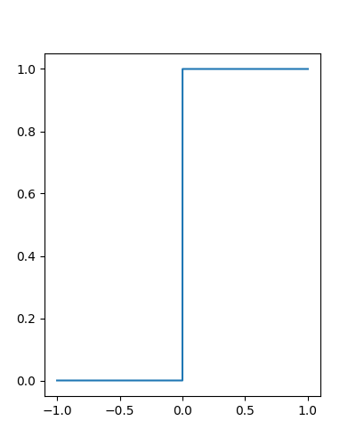

<!--
title: Lecture 012 Functional Analysis
paginate: true
_class: titlepage
-->

# Review of Functional analysis concepts

---

## Linear and bilinear functionals

Given a functional space $V$, a linear functional is a map $L: V \to \mathbb{R}$ that satisfies linearity: $L(\alpha u + \beta v) = \alpha L(u) + \beta L(v)$ for all $u, v \in V$ and scalars $\alpha, \beta \in \mathbb{R}$.

A bilinear functional is a map $B: V \times V \to \mathbb{R}$ that is linear in each argument.

### Boundedness and Continuity
A functional $L$ is bounded if there exists a constant $C$ such that $|L(u)| \leq C ||u||_V$ for all $u \in V$. If $V$ is a Banach space (normed and complete), then a linear bounded functional is also continuous.

### Dual Space
The dual space $V^*=V'$ is the space of all bounded linear functionals on $V$.

$$V^*:=\lbrace F: V\to \mathbb R :\, F \text{ is linear and bounded}\rbrace.$$

### Norm
The norm of a functional $L \in V^*$ is defined as 
$||L||_{V^*} = \sup_{||u||_V \leq 1} |L(u)|=\sup_{||u||_V \neq 0} \frac{|L(u)|}{||u||_V}.$

---

### Hilbert Space
A Hilbert space $H$ is a real or complex inner product space that is also a complete metric space with respect to the distance function induced by the inner product.

The inner product is a bilinear function $(\cdot,\cdot)_H: V\times V \to \mathbb R$ that is symmetric and positive definite. The induced norm  is $|| u||_H:= \sqrt{(u,u)_H}$.

### Riesz Representative
The Riesz representation theorem states that for every bounded linear functional $L$ on a Hilbert space $H$, there exists a unique element $v_L \in H$ such that 
$$L(u) = ( u, v_L )_H$$
for all $u \in H$. Moreover, $||L||_{H^*} = ||u_L||_H$.
Conversly, for every element $u\in H$ there exists  a linear and bounded functional $L_u$ such that 
$$ 
L_u(v) = (u,v)_H \text{ for every }v\in H.
$$
Moreover, $||L_u||_{H^*} = ||u||_H$.

Hence, there is a bijection between $H$ and $H^*$.

---

## Bilinear form
Given $V$ a normed functional space, a bilinear form $a$ is a function that maps every two elements of $V$ to a scalar
$$a:V\times V \to \mathbb R.$$

A form
* is bilinear if 
  * $a(\lambda u + \mu w, v)  = \lambda a( u ,v) + \mu a( w, v)$ for every $\lambda, \mu \in \mathbb R$ and every $v,w,u\in V$, and
  * $a( u, \lambda v + \mu w)  = \lambda a( u ,v) + \mu a( u,w)$ for every $\lambda, \mu \in \mathbb R$ and every $v,w,u\in V$;
* is continuous if  there exists an $M>0$ such that
  $$ a(u,v) \leq M \lVert u \rVert_V \lVert v \rVert_V \text{ for every } v,u\in V;$$
* is symmetric if $a(u,v)=a(v,u)$ for every $u,v\in V$;
* is positive if $a(v,v)>0$ for all $v\in V$ with $v\neq 0$;
* is coercive if there exists $\alpha>0$ such that $a(v,v)>\alpha \lVert v \rVert^2_V$ for all $v \in V$.

---

## Distributions

Let $\Omega\subset \mathbb R^{d}$ be an open set and $f:\Omega \to \mathbb R$ a function.

### Support of a Function
The support of a function $f$, denoted by $\text{supp}(f)$, is the closure of the set where $f$ is non-zero.
$$\text{supp}(f):=\overline{\lbrace x\in\Omega : f(x) \neq 0\rbrace}.$$

### Compact Support
A function has compact support if its support is a compact set.

### $C^\infty$ Compact Support Functions
A function is in $\mathcal{D}(\Omega):=C^\infty_c(\Omega)$ if it is infinitely differentiable and has compact support in $\Omega$.

---

### Convergence in $\mathcal{D}(\Omega)$
A sequence of functions $\{f_n\}$ in $\mathcal{D}(\Omega)$ converges to $f$ in $C^\infty_c(\Omega)$ if 
* exists a fixed compact set $K$ that contains all supports of $f_n$ 
* all derivatives of $f_n$ converge uniformly to the corresponding derivatives of $f$, i.e. $\partial_{x_1^{p_1}\dots x_d^{p_d}}f_n \to \partial_{x_1^{p_1}\dots x_d^{p_d}}f$ for all $p_1, \dots, p_d$.
 

---

### Distributions
A **distribution** is a linear functional $T:\mathcal{D}(\Omega) \to \mathbb R$ that is continuous, i.e.,
$$\lim_{k\to \infty} T(\varphi_k) = T(\varphi),$$
for all $\varphi_k \to_{\mathcal{D}} \varphi \in \mathcal{D}$.
Hence, the distribution space $\mathcal{D}^*(\Omega)$ is the dual of $\mathcal{D}(\Omega)$.

Notation for distribution $T\in\mathcal{D}^*(\Omega)$ applied to a function $f\in\mathcal{D}(\Omega)$: $T(f)=\langle T,f\rangle$.

### Example Dirac Delta
The Dirac delta distribution $\delta_a$ with $a\in \Omega$ a point, is defined by $\delta_a(\phi) = \phi(a)$ for all $\phi \in \mathcal{D}(\Omega)$. It is a distribution that "picks out" the value of a function at a point.

### Convergence in $\mathcal{D}^*(\Omega)$
A sequence of distributions $T_n$ converges in $\mathcal{D}^*(\Omega)$ to $T\in \mathcal{D}^*(\Omega)$ if 
$$ \lim_{n\to \infty} T_n(\varphi) = T(\varphi), \qquad \forall \varphi \in \mathcal{D}(\Omega).$$

---

## $L^2(\Omega)$ squared summable functions
$$L^2(\Omega):= \lbrace f:\Omega \to \mathbb R \text{ such that } \int_{\Omega} f(x)^2 \textrm{d} x < \infty \rbrace.$$
1. $L^2(\Omega)$ is a Hilbert space with scalar product $(f,g):=\int_{\Omega} f(x)g(x)\textrm{d} x$.
2. The $L^2(\Omega)$ norm is define through the inner product as $\lVert f \rVert_{L^2(\Omega)} :=\sqrt{\int_{\Omega} f(x)^2\textrm{d} x}.$
3. To every function $f\in L^2(\Omega)$ is associated a distribution $T_f\in \mathcal{D}^*(\Omega)$ defined by 
   $$T_f(\varphi):= \int_{\Omega} f(x) \varphi(x)   \textrm{d} x,\qquad \forall \varphi \in \mathcal{D}(\Omega).$$
4. $\mathcal{D}(\Omega)$ is dense in $L^2(\Omega)$, i.e., for every $f\in L^2(\Omega)$ there exists a sequence of $\varphi_k\in \mathcal{D}(\Omega)$ such that 
$$\lVert \varphi_k - f \rVert_{L^2(\Omega)} \to 0.$$
5. $\mathcal{D}(\Omega)\subset L^2(\Omega) \Longrightarrow (L^2(\Omega))^*=L^2(\Omega)\subset \mathcal{D}^*(\Omega)$.
 
---

## Example: convergence to Dirac Delta

Let $\chi_{[a,b]}$ be the characteristic function on the interval $[a,b]\subset \mathbb R$ defined as
$$
\chi_{[a,b]}(x)= \begin{cases}
0 & \text{if } x\notin [a,b]  ,    \\
1 & \text{if } x\in [a,b]  .    
\end{cases}
$$

Let us build the sequence of functions in $L^2(\mathbb R)$ $f_n(x) := \frac{n}2 \chi_{[-1/n,1/n]}(x).$ Clearly, we have that
1. $\int_{\mathbb R} f_n(x) \mathrm{d}x = 1$
2. $T_{f_n}(\varphi)= \int_{\mathbb R} f_n(x) \varphi(x) \mathrm{d}x = \frac{n}{2}\int_{-1/n}^{1/n} \varphi(x) \textrm{d}x = \frac{n}{2} (\Phi(1/n)-\Phi(-1/n))$ where $\frac{d}{dx}\Phi(x) = \varphi(x)$.
3. Let $h_n=1/n$, $T_{f_n}(\varphi)=\frac{\Phi(h)-\Phi(-h)}{2h}$
4. $\lim_{n\to \infty} T_{f_n}(\varphi)= \lim_{n\to \infty}\frac{\Phi(h)-\Phi(-h)}{2h} = \frac{d}{dx} \Phi(0) = \varphi(0)$.
5. $T_{f_n}(\varphi) \to \varphi(0) = \delta_0(\varphi)$.

---

## Derivation in distributional sense
Let $T\in\mathcal{D}^*(\Omega)$, with $\Omega\subset \mathbb R^d$ open. We can define the derivative of $T$ using the integration by parts.

$$
\partial_{x_i} T (\varphi) = \langle \partial_{x_i} T , \varphi \rangle:= -\langle T, \partial_{x_i}\varphi \rangle,\qquad \forall \varphi\in \mathcal{D}(\Omega)= C^{\infty}_c(\Omega).
$$

If $T$ is a $T_f$ with $f\in\mathcal{C}^1(\Omega)$, it is clearly the classical derivative. Let's see in 1D with $\Omega = [a,b]$.
$$
\partial_{x} T_f (\varphi) = \langle \partial_{x} T_f , \varphi \rangle = \int_a^b  \partial_{x} f(x) \varphi(x) \textrm{d}x = \underbrace{\left[  f(x) \varphi(x)\right]_a^b}_{=0} - \int_a^b   f(x) \partial_{x}\varphi(x) \textrm{d}x , \qquad \forall \varphi\in \mathcal{D}(\Omega).
$$

**Higher derivatives**
$$
\left\langle \frac{\partial^{p_1+\dots+p_d} T}{\partial x_1^{p_1} \dots \partial x_d^{p_d}}  , \varphi \right\rangle  := (-1)^{p_1+\dots+p_d}\left\langle T, \frac{\partial^{p_1+\dots+p_d}  \varphi}{\partial x_1^{p_1} \dots \partial x_d^{p_d}} \right\rangle,\qquad \forall \varphi\in \mathcal{D}(\Omega)= C^{\infty}_c(\Omega).
$$

---

## Example: Derivative of Heaviside function

$$
H(x) = \begin{cases}
    1 &\text{ if }x>0,\\
    0 &\text{ if }x\leq 0,\\
\end{cases}
$$
* $H\in L^2((-1,1))$
* $H\notin C((-1,1))$
* $T_H\in \mathcal{D}^*((-1,1))$

$$\langle \partial_x T_H,\varphi \rangle = -\int_{-1}^1 H(x) \partial_x \varphi(x) \textrm{d} x$$
$$=-\int_{0}^1  \partial_x \varphi(x) \textrm{d} x = - \left[ \varphi\right]_0^1=\varphi(0)$$
$$
\Longrightarrow \partial_x H = \delta_0.
$$

---

## Sobolev Spaces

As we have seen $L^2(\Omega)\subset \mathcal{D}^*(\Omega)$. This does not imply that their distributional derivatives are still in $L^2$. The Heaviside function is in $L^2$ but its derivative it's not.

We need to introduce other spaces!

### Sobolev spaces
Let $\Omega\subset \mathbb R^d$ and $k \in \mathbb N_0$. We define the Sobolev space of order $k$ on $\Omega$ the space of the functions in $L^2(\Omega)$ with distributional derivatives up to order $k$ in $L^2(\Omega)$.
$$
H^k(\Omega):=\lbrace f\in L^2(\Omega): \partial_{x_1^{p_1}\dots x_d^{p_d}}f \in L^2(\Omega), \text{ for all }p_1,\dots,p_d: p_1+\dots+p_d \leq k \rbrace.
$$

* $H^{k+1}(\Omega)\subset H^k(\Omega)$
* $L^2(\Omega)=H^0(\Omega)$
* Heaviside $H\in H^0((-1,1))$, but $H\notin H^1((-1,1))$

---

## Examples
* Example of $H^\infty(\Omega)$ but not $C(\Omega)$ 
  $$
  f(x) = \begin{cases}
    x^2 & \text { if }x\neq 0,\\
    3 & \text { if }x = 0.
  \end{cases} 
  $$
* Example of $H^1(\Omega)$ but not $H^2(\Omega)$ 
  $$
  f(x) = \begin{cases}
    x & \text { if }x > 0,\\
    0 & \text { if }x \leq 0.
  \end{cases} \qquad f'(x)= \begin{cases}
    1 & \text { if }x > 0,\\
    0 & \text { if }x \leq 0.
  \end{cases}
  $$

---

## Norms and inner products of Sobolev spaces

* Sobolev spaces $H^k(\Omega)$ are Hilbert space with respect to the following scalar product
  $$(f,g)_k =(f,g)_{H^k(\Omega)}:= \sum_{p_1+\dots+p_d\leq k} \int_{\Omega} \partial_{x_1^{p_1}\dots x_d^{p_d}}f \cdot \partial_{x_1^{p_1}\dots x_d^{p_d}} g \, \textrm{d} x, $$
  with the norms
  $$\lVert f \rVert_k =\lVert f \rVert_{H^k(\Omega)}:= \sqrt{ \sum_{p_1+\dots+p_d\leq k} \int_{\Omega} (\partial_{x_1^{p_1}\dots x_d^{p_d}}f )^2 \, \textrm{d} x}, $$
* Seminorms
  $$\lvert f \rvert_k =\lvert f \rvert_{H^k(\Omega)}:= \sqrt{ \sum_{p_1+\dots+p_d = k} \int_{\Omega} (\partial_{x_1^{p_1}\dots x_d^{p_d}}f )^2 \, \textrm{d} x}, $$
* $\lVert f \rVert_k = \sqrt{\sum_{m=0}^k |f|_{m}^2}$

---

## Examples for $k=1$

$$(f,g)_1=(f,g)_{H^1(\Omega)}= \int_{\Omega}f(x)\,g(x)\, \textrm{d}x+\int_{\Omega}f'(x)\,g'(x)\, \textrm{d}x$$

$$\lVert f \rVert_1= \sqrt{\int_{\Omega}f^2(x)\, \textrm{d}x+\int_{\Omega}(f'(x))^2\, \textrm{d}x} = \sqrt{ \lVert f \rVert_{L^2(\Omega)}^2 + \lVert f' \rVert_{L^2(\Omega)}^2 }$$

$$\lvert f \rvert_1= \sqrt{\int_{\Omega}(f'(x))^2\, \textrm{d}x} =  \lVert f' \rVert_{L^2(\Omega)} $$

---

## Boundary for bounded domains
### Property 
If $\Omega\subset \mathbb R^d$ is open with a *smooth enough* boundary, then $H^k(\Omega)\subset C^m(\bar{\Omega})$ if $m<k-\frac{d}{2}$.

Careful, in this case we mean that there is a representative of the function in $H^k$ such that it also belongs to $C^m$. In the previous example where 
$$  f(x) = \begin{cases}
    x^2 & \text { if }x\neq 0,\\
    3 & \text { if }x = 0.
  \end{cases} 
  $$
there exists a continuous representative of this function $f(x)=x^2$ which is the same function in $L^2(\Omega)$.

---

## $H^1_0(\Omega)$
Let $\Omega$ be a bounded domain. We denote with $H^1_0(\Omega)$ the closure of $\mathcal{D}(\Omega)$ in $H^1(\Omega)$. (*morally zero on the boundary*)

## Poincarè inequality
Let $\Omega \subset \mathbb{R}^d$ be a bounded domain with a Lipschitz boundary. There exists a constant $C = C(\Omega) > 0$ such that for all $u \in H^1_0(\Omega)$,
$$
\|u\|_{L^2(\Omega)} \leq C \|\nabla u\|_{L^2(\Omega)} = C|u|_1.
$$

### Proof
Since $\Omega\subset \mathbb R ^d$ is bounded there exists a ball $S_R=\lbrace x: |x-x_0|<R\rbrace$ that contains $\Omega$. Since, $\mathcal{D}(\Omega)$ is dense in $H^1_0(\Omega)$, we can prove the inequality for $u\in  \mathcal{D}(\Omega)$ and pass to the limit to get it for $H^1_0$. Notice that $\text{div}(x-x_0) = d$. So,
$$
\begin{align*}
&\lVert u\rVert_{L^2(\Omega)}^2 = d^{-1} \int_{\Omega} d \, |u(x)|^2 \textrm{d}x = d^{-1} \int_{\Omega} \text{div}(x-x_0)|u(x)|^2 \textrm{d}x= -d^{-1} \int_{\Omega} (x-x_0) \nabla(|u(x)|^2) \textrm{d}x=\\
&-2d^{-1} \int_{\Omega} (x-x_0) u(x)\nabla(u(x)) \textrm{d}x\leq 2d^{-1} \lVert x-x_0 \rVert_{\infty} \lVert u \rVert_{L^2(\Omega)} \lVert \nabla u \rVert_{L^2(\Omega)} = 2d^{-1}R \lVert u \rVert_{L^2(\Omega)} \lvert  u \rvert_{1}.
\end{align*}
$$

---

### Proposition
On $H^1_0(\Omega)$ the seminorm $\lvert \cdot \rvert_1$ is actually a norm and it is equivalent to $\lVert \cdot \rVert_1$.
### Proof
$$ \lVert u \rVert_1^2 =\lvert u \rvert_1^2 + \lVert u \rVert_{L^2}^2 \leq (1+C^2)\lvert u \rvert_1^2.$$
On the other hand
$$\lvert u \rvert_1^2\leq \lvert u \rvert_1^2 + \lVert u \rVert_{L^2}^2 = \lVert u \rVert_1^2. $$

