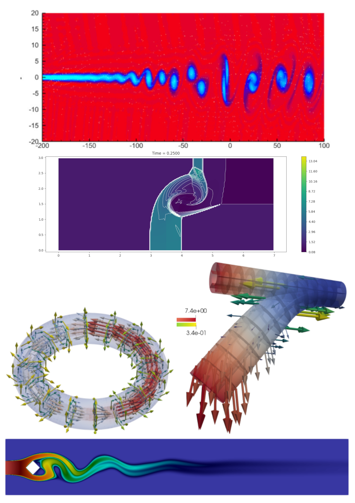

<!--
title: Lecture 01
paginate: true
_class: titlepage
-->

# Calcolo Scientifico 2024/2025

## Davide Torlo

--- 
# Info sul docente
* Ricercatore in Sapienza dal 2024
* Mi occupo di metodi numerici per equazioni alle derivate parziali iperboliche
  * Metodi d'alto ordine
  * Metodi che preservano proprietà fisiche delle soluzioni
  * Modelli ridotti per accelerare la soluzione di problemi parametrici
* Mail [davide.torlo@uniroma1.it](mailto:davide.torlo@uniroma1.it)
* Ufficio 5
* Ricevimento su appuntamento

---
# Informazioni sul corso
* 48 ore
* Materiale su GitHub (slides, note, esercizi, codici, progetti)
* Lezioni: slides + note + codice
* Laboratorio: portate il PC e sviluppiamo il codice un po' in classe un po' a casa
### Esame: 
  * Progetto (gruppi da 2/3 persone)
  * Orale dove si presenta il progetto (preferibilmente tutto il gruppo assieme) e qualche domandina
  * Date flessibili (meglio se tutto il gruppo insieme)
---
# Informazioni sul corso
### Progetto: 
  * Durante il corso vi faccio alcune proposte, ma sono ben accette anche vostre proposte
  * Progetti di sviluppo di un metodo per alcune equazioni/problemi specifici con qualche difficoltà aggiunta rispetto a quello che facciamo in classe
  * Repository su git -> Conoscete git?

---

# Informazioni sul corso
### Materiale
* Slides, pasticciandole qua e là
* Libri:
  * Evans, Lawrence C. Partial differential equations. Vol. 19. American Mathematical Society, 2010. [Introduzione alle PDE]
  * LeVeque, Randall J. Finite difference methods for ordinary and partial differential equations: steady-state and time-dependent problems. Society for Industrial and Applied Mathematics, 2007. [Metodi alle differenze finite]
  * Quarteroni, Alfio, and Alberto Valli. Numerical approximation of partial differential equations. Vol. 23. Springer Science & Business Media, 2008. [Metodi agli elementi finiti]
  * LeVeque, Randall J. Finite volume methods for hyperbolic problems. Vol. 31. Cambridge university press, 2002. [Metodi ai volumi finiti]
  * Langtangen, Hans Petter, and Anders Logg. Solving PDEs in python: the FEniCS tutorial I. Springer Nature, 2017. [Manuale per usare FEniCS]

---
# Informazioni sul corso
### Prerequisiti
  * Analisi II
  * Metodi numerici per (equazioni alle derivate ordinarie) ODE
  * Python 3
  * Git? [Notes](https://github.com/pcafrica/hpc_for_data_science_2023-2024/blob/main/notes/01/01-2-git.md) [Slides](https://github.com/pcafrica/hpc_for_data_science_2023-2024/blob/main/slides/01/01-intro.md) by Pasquale Africa
---
# Informazioni sul corso
### Computer setting
  * Python 3, ipykernel for Jupyter Notebooks (also Google Colab)
  * IDE (Integrated Develpment Environment) tipo [VisualStudio Code](https://code.visualstudio.com/download)
  * Mac/Linux/Windows tutto ok, io uso Linux
---
# Introduzione al corso

---

## Equazioni alle derivate parziali

* La **fisica** ha sempre studiato i fenomeni naturali e ha cercato di descriverli in strumenti matematici.
* I **modelli** sono approssimazioni matematiche della descrizione dei fenomeni naturali, per un singolo fenomeno diversi livelli di approssimazione possono portare a diversi modelli.
* Le **equazioni alle derivate parziali** (PDE) sono strumenti che hanno permesso di descrivere molti fenomeni fisici.
* La **matematica** fornisce gli strumenti per studiare ed analizzare le equazioni che descrivono i modelli fisici.
* L'**analisi numerica** approssima le soluzioni di queste equazioni quando soluzioni analitiche non sono disponibili.

--- 
## Applicazioni delle PDE

* Diffusione di calore
* Elasticità e deformazione di solidi
* Vibrazioni
* Fluidi: acqua, gas, meteo
* Interazione fluidi-strutture
* Diffusione di agenti biologici/inquinanti
* Elettro-magnetismo
* Combinazioni di questi

---
# PDE
$\Omega \in \mathbb R ^{d}$ where $d>1$
$u:\Omega \to R^s$ where $s\in \mathbb N_0$
Una PDE di ordine $k$ si scrive come
$$F(\nabla^{(k)}u,\nabla^{(k-1)}u, \dots, \nabla u, u)=0$$

Dove indico con $\nabla^{(j)} u$ il tensore con tutte le possibili derivate di ordine $j$-esimo. Per esempio in 2D $(x,y)\in \Omega$, 
$$ \nabla u = \begin{pmatrix}
  \partial_x u\\ \partial_y u
\end{pmatrix}, \qquad  \nabla^{(2)} u = \begin{pmatrix}
  \partial_{xx} u & \partial_{xy} u\\ \partial_{yx} u & \partial_{yy} u
\end{pmatrix}.$$

---

## Esempi
|Nome          | Equazione            |
|-----|-------|
|**Equazione del trasporto in 1D** | $\partial_t u + c \partial_x u =0$ |
| **Equazione del calore in 1D**|$\partial_t u + c \partial_{xx} u =0$|
| **Equazione di Burgers in 1D** |$\partial_t u + u \partial_x u =0$|
| **Equazione di Laplace in 2D**| $\partial_{xx}u + \partial_{yy}u =0$|
| **Navier Stokes incomprimibile**| $\frac{\partial u}{\partial t} -\nu \Delta u + \left( u \cdot \nabla \right) u + \nabla p = f$ and $-\text{div} u = 0$|

---
# Metodi Numerici
Trovare soluzioni esatte di PDE non è sempre facile, in particolare se:
* la geometria del dominio $\Omega$ è complicata (ponti, aerei, etc.),
* le equazioni sono complicate (nonlinearità, ordini alti, etc.).

L'analisi numerica fornisce strumenti per la risoluzione delle PDE. Vari metodi, ma più o meno tutti seguono queste procedure:
1. Discretizzazione del dominio
2. Discretizzazione dello spazio delle funzioni dove cerco la soluzione
3. Discretizzazione delle equazioni (il metodo numerico vero e proprio)
4. Risoluzione delle equazioni discretizzate

---

# Alcuni Metodi Numerici
Nel tempo numerosi metodi numerici sono stati sviluppati (alcuni più specifici per alcune applicazioni, altri più generici)

* Finite Difference (FD)
* Finite Volume (FV)
* Galerkin approximations:
  * Continous Finite Elements (FEM)
  * Discontinuous Galerkin (DG)
  * Spectral Methods
  * Spectral Element Methods (SEM)
  * Summation by parts (SBP)
* Physics Informed Neural Networks (PINN)

---
# Syllabus del corso
* Topic: metodi numerici per l'approssimazione di equazioni alle derivate parziali (PDE: partial differential equations) 
### Argomenti (circa): 
  - ripasso di ODE [2h] (se necessario);
  - introduzione alle PDE [6h];
  - finite difference methods [8h = 4h classes + 4h lab];
  - finite element methods [18h = 10h classes + 8h lab];
  - finite volume methods [10h = 7h classes + 3h lab];
  - physics informed neural networks [2h = 1h class + 1h lab];
  - model order reduction [2h = 1h class + 1h lab].

--- 
# Ripasso di ODE?

Sì
  * [Teoria delle ODE](../00/Chapter1_Theory_of_ODE.ipynb) 
  * [Eulero Implicito ed esplicito](../00/Chapter%202%20Classical%20Euler%20Methods.ipynb) 
  * [Runge Kutta e Multistep](../00/Chapter%203%20Classical%20High%20Order%20Methods.ipynb)

No

---