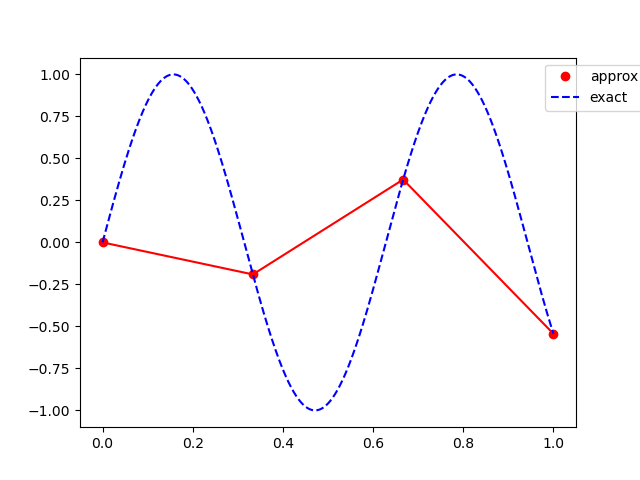
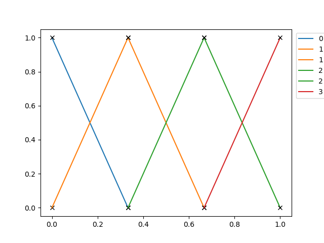

<!--
title: Lecture 022 Finite Elements Elliptic
paginate: true
_class: titlepage
-->

# Finite Element Method for Elliptic Differential Equations

---

## Pro and cons of the Finite Differences methods

### Pro
* Easy to setup
* Simple implementation
* Easy high order stencils
* Easy truncation error analysis with Taylor expansion

### Cons
* Difficult to generlize to more complex geometries
* Difficult to deal with boundaries + high order
* No general analysis of stability, existence, uniqueness

---

## Can we write a discrete formulation of the type $a(u,v)=F(v)\,\forall v \in V$?
Goals:
1. find a discrete Hilbert space $V_h\subset V\subset H^1(\Omega)$
2. find a discrete bilinear form $a_h(\cdot,\cdot):V_h\times V_h\to \mathbb R$ continuous and coercive that approximates $a$
3. find a discrete linear form $F_h:V_h\to \mathbb R$ bounded that approximates $F$.

$h>0$ is a parameter that describes the discretization scale of the discrete space (e.g. the minimum of the $\Delta x$ in the mesh).

So, let's suppose that we have $V_h\subset V$ : $\text{dim} (V_h) = N_h<\infty \, \forall h>0$. 
Now, we can simply take $a_h$ as the restriction of $a$ on $V_h$ and $F_h$ as the restriction on $V_h$ as well. This means that we can simply look for a solution $u_h\in V_h$ such that for every $v_h\in V_h$
$$
a(u_h,v_h)=F(v_h).
$$
This is called **Galerkin problem**. 

---

## Let's move to a basis of $V_h$

Let's consider a basis for $V_h$ given by $\lbrace \varphi_i \rbrace_{j=1}^{N_h}$, since we are talking about linear and bilinear operators, we can instead look for the approximation $u_h\in V_h$ such that
$$
a(u_h,\varphi_i) = F(\varphi_i),\qquad \forall i=1,\dots, N_h.
$$
Moreover, also $u_h(x)=\sum_{j=1}^{N_h} u_j \varphi_j(x),$ we have
$$
\sum_{j=1}^{N_h} a(\varphi_j,\varphi_i) u_j = F(\varphi_i),\qquad \forall i=1,\dots, N_h.
$$

We can denote with $A$ the *stiffness* matrix and with $\mathbf{f}\in\mathbb R^{N_h}$ the right-hand-side vector defined as 
$$
a_{ij} = a(\varphi_j,\varphi_i),\qquad f_i = F(\varphi_i).
$$

The Galerkin problem can be written as a linear system for the vector $\mathbf{u}\in \mathbb R^{N_h}$
$$
A \mathbf{u} = \mathbf{f}.
$$

---

## $A$ is positive definite
$A$ associated to the elliptic problem $a(u,v)=F(v)\, \forall v\in V$ where $a(\cdot,\cdot)$ is bilinear and coercive, then $A$ is positive definite.
### Proof
Recall that $B$ is positive definite if $\mathbf{v}^\top B \mathbf{v} \geq 0 \quad \forall \mathbf{v} \in \mathbb R^n$ and $\mathbf{v}^\top B \mathbf{v}=0 \Leftrightarrow \mathbf{v}=0.$
The map 
$$\mathbf{v} = (v_i)\in \mathbb R^{N_h} \leftrightarrow v_h(x)=\sum_{j=1}^{N_h} v_j\varphi_j(x) \in V_h
$$
is  a bijection between $\mathbb R^{N_h}$ and $V_h$. For any vector $\mathbf v\in \mathbb R^{N_h}$ we have 
$$
\begin{align*}
\mathbf{v}^\top A \mathbf{v} &= \sum_{j=1}^{N_h} \sum_{i=1}^{N_h} v_ia_{ij}v_j = \sum_{j=1}^{N_h} \sum_{i=1}^{N_h} v_ia(\varphi_j,\varphi_i)v_j \\
& =  a\left(\sum_{j=1}^{N_h} v_j \varphi_j,\sum_{i=1}^{N_h}v_i\varphi_i\right)= a(v_h,v_h) \geq \alpha \lVert v_h \rVert_V^2 \geq 0.
\end{align*}
$$
Moreover, if $\mathbf{v}^\top A \mathbf{v} =0$ then $\lVert v_h\rVert_V=0$, i.e. $v_h=0$ and $\mathbf{v}=\mathbf{0}$.

---

## Exercise
$A$ is symmetric if and only if $a$ is symmetric.

---

## Analysis of Galerkin method

* Existence and uniqueness of a discrete solution $u_h$;
* Stability of the discrete solution $u_h$;
* Convergence of $u_h$ towards the exact solution $u$ for $h\to 0$.

---

## Existence and uniqueness

Lax-Milgram lemma holds for any Hilbert space, so, also for $V_h$!!!

Moreover, $a(\cdot,\cdot)$ and $F(\cdot)$ are the same of the weak formulation.

## Corollary 
There exists one unique solution $u_h\in V_h$ of the Galerkin problem $a(u_h,v_h)=F(v_h)\quad \forall v_h\in V_h.$

## Alternative proof (as for FD)
$A$ is positive definite, so invertible.

---

## Stability

Following the Corollary of Lax-Milgram, we can say for the Galerkin method that

### Corollary
Galkerin method is stable uniformly with respect to $h$ since it holds 
$$
\lVert u_h \rVert_V \leq \frac{1}{\alpha} \lVert F \rVert_{V^*}.
$$
Indeed,
$$
\lVert u_h \rVert^2_V = \lVert u_h \rVert^2_{V_h}\leq \frac{1}{\alpha}  a(u_h,u_h) = F(u_h) \leq \lVert F \rVert_{V^*} \, \lVert u_h \rVert_V.
$$

## Continuity on data
Let $u_h$ be the solution for the Galerkin problem with $F$ rhs and let $w_h$ be the solution of the Galerkin problem with $G$ rhs, then
$$
\lVert u_h -w_h \rVert_V \leq \frac{1}{\alpha} \lVert F-G \rVert_{V^*}.
$$

---

## Convergence (1/n)
Goal: check that $u_h\to u$ for $h\to 0$ in $V$.

### Galerkin Orthogonality 
$$
a(u-u_h, v_h)=0\qquad \forall v_h \in V_h.
$$
**Proof** Bilinearity and 
$$
a(u,v_h) = F(v_h) = a(u_h,v_h), \qquad \forall v_h \in V_h\subset V.
$$

### Why orthogonality?
$a(\cdot,\cdot)$ is a scalar product in $V$ if it's symmetric (since it's coercive). The associated norm is called **energy norm** and it is defined as 
$$
\lVert v_h\rVert_a = \sqrt{a(v_h,v_h)}.
$$
$u_h$ is the orthogonal projection of $u$ onto $V_h$ with the scalar product $a(\cdot, \cdot).$
In particular, $u_h$ is the minimizer of the error in energy norm 
$$u_h  = \arg\min_{v_h\in V_h} \lVert v_h - u \rVert_a.$$

---

## Convergence (2/n) (Céa's Lemma)

Let $v_h\in V_h$, compute
$$
a(u-u_h,u-u_h) = a(u-u_h,u-v_h)+\underbrace{a(u-u_h,v_h-u_h)}_{=0 \text{ since }v_h-u_h\in V_h}
$$
Moreover, using the continuity constant $C$ of $a(\cdot, \cdot)$, we have
$$
\lvert a(u-u_h,u-v_h) \rvert \leq C \lVert u-u_h \rVert_V \lVert u-v_h \rVert_V.
$$
On the other side, using the coercivity constant $\alpha$, we have that
$$
\lVert u-u_h \rVert_V^2 \leq \frac{1}{\alpha} a(u-u_h,u-u_h) \leq \frac{C}{\alpha} \lVert u-u_h \rVert_V \lVert u-v_h \rVert_V
$$
So,
$$
\lVert u-u_h \rVert_V \leq \frac{C}{\alpha} \lVert u-v_h \rVert_V \leq \frac{C}{\alpha} \inf_{v_h\in V_h} \lVert u-v_h \rVert_V.
$$

---

## Convergence (3/3)
$$
\lVert u-u_h \rVert_V \leq \frac{C}{\alpha} \inf_{v_h\in V_h} \lVert u-v_h \rVert_V.
$$
Céa's lemma tells us that even if $u_h$ is not the best approximation for the $V$ norm in $V_h$, its error will decrease as the best approximation error will decrease.
So we can just enlarge the space $V_h$, i.e., let $h\to 0$ so that the discrete space saturates the space $V$. i.e.,
$$
\lim_{h\to 0}\inf_{v_h\in V_h} \lVert v-v_h \rVert_V = 0 ,\qquad \forall v \in V.
$$
Then, we will have convergence of the Galerkin method also in the $\lVert \cdot \rVert_V$ norm!

### Order of convergence
$$
\inf_{v_h\in V_h} \lVert v-v_h \rVert_V = O(h^p)\Longrightarrow \lVert u-u_h \rVert_V= O(h^p).
$$

---

# Finite element method (1 dimension)
Take $\Omega=(a,b)$ and we want to approximate $H^1((a,b))$ with a space depending on a scale $h$. Consider a partition of $(a,b)$ called $\mathcal T_h$ composed of $N$ intervals $K_{j}:=(x_{j-1},x_j)$ with $j=1,\dots, N$ with size $h_{j} = x_j-x_{j-1}$ for $j=1,\dots, N$ with 
$$
a=x_0< x_1 < \dots <x_N=b
$$
and we set $h=\max_{j=1,\dots,N}h_{j}$.

Motivational: Since $H^1((a,b))\subset C^0([a,b])$ (slide 16 of [lesson_012](/lectures/01/012_functional_analysis.md)), we can look for a continuous functions in $V_h$ (not really necessary).

$$
X^r_h = \left\lbrace v_h \in C^0(\bar{\Omega}) : v_h|_{K_j} \in \mathbb P^r(K_j)  \text{ for every } K_j \in \mathcal{T} \right\rbrace \subset H^1((a,b)).
$$

### Let's choose a basis
$V_h = X_h^R = \left \langle  \varphi_1, \dots, \varphi_{N_h}\right \rangle$
Choices to have simple life and sparse $A$:
* Lagrangian
* As local as possible

---

## $X^1_h$

Piece-wise linear functions! 
How many degrees of freedom do we have? For every cell $K_j$ with $j=1,\dots,N$ there are two coefficients to choose (to define a line): $2N$ possibilities, in every vertex $x_j$ for $j=1,\dots,N-1$ we have to impose continuity: $N-1$ constraints. Total $N+1$ degrees of freedom.

### Can we find a practical way to define such degrees of freedom?

A line can be defined through two points values, if we choose exactly the values of the function in the points $x_j$ for $j=0,\dots,N$ then we have 
* exactly $N+1$ degrees of freedom
* lines in each cell
* continuity.

---

## Lagrangian basis functions for each cell

So, we take $\varphi_i\in X^1_h$ such that
$$
\varphi_i(x_i) = \delta_{ij}, \qquad \forall i,j =0,\dots, N.
$$

More specifically,
$$
\begin{align*}
&\varphi_i(x)  = \begin{cases}
    \frac{x-x_{i-1}}{x_i-x_{i-1}} &\text{ if } x_{i-1}\leq x<x_{i},\\
    \frac{x_{i+1}-x}{x_{i+1}-x_{i}} &\text{ if } x_{i}\leq x<x_{i+1},\\
    0 &\text{ else.}
\end{cases}\\
&\text{supp}(\varphi_i) = (x_{i-1},x_{i+1})\\
&a_{ij} \neq 0 \Longleftrightarrow  j \in \lbrace i-1, i , i+1 \rbrace.
\end{align*}
$$

---

## Reference element
It is useful to define every basis function onto a reference element $[0,1]$ and then transform the basis functions onto the physical element $[x_{i-1},x_i]$.
We use a linear transformations $T_{i+1}:[0,1]\to [x_{i},x_{i+1}]$ defined as 
$$
x= T_{i+1}(\xi) = x_{i}+\xi(x_{i+1}-x_i), \qquad \xi = T_{i+1}^{-1}(x)=\frac{x-x_i}{x_{i+1}-x_i}.
$$
So the two basis functions in the reference element can be defined as 
$$
\hat{\varphi}_0(\xi) = 1-\xi,\qquad \hat{\varphi}_1(\xi) =\xi,
$$
this means that
$$
\varphi_i(x) = \hat\varphi_0(T_{i+1}^{-1}(\xi)) = \hat\varphi_0\left(\frac{x-x_i}{x_{i+1}-x_i} \right) ,\qquad \varphi_{i+1}(x) = \hat\varphi_1(T_{i+1}^{-1}(\xi)) =\hat\varphi_1\left(\frac{x-x_i}{x_{i+1}-x_i} \right).
$$

---

## $X^2_h$

Let's work on the reference element.

Consider 3 equispaced points $\lbrace 0,\frac12, 1 \rbrace\subset [0,1]$ and the corresponding Lagrangian basis functions
$$
\begin{align*}
    &\hat\varphi_0(\xi) = 2(\xi-\frac12)(\xi-1),\qquad \\
    &\hat{\varphi}_{1}(\xi) = 4\xi(1-\xi),\qquad \\
    &\hat{\varphi}_2(\xi) = 2\xi(\xi-\frac12).
\end{align*}
$$
Alternatively, something gerarchical 
$$
\begin{align*}
    &\hat\varphi_0(\xi) = 1-\xi,\qquad \\
    &\hat{\varphi}_{1}(\xi) = \xi,\qquad \\
    &\hat{\varphi}_2(\xi) = \xi(1-\xi).
\end{align*}
$$

---

## $X^r_h$

One can proceed with higher orders similarly. Using a reference element will help the construction.

For Lagrangian basis functions: careful with the choice of nodes inside the reference element! Equispaced might lead to Gibbs' phenomena!

 

---

## Discrete problem!

General Poisson-reaction problem
$$
\begin{cases}
-u''+\sigma u = f, & x\in (a,b)\\
u(a)= 0,\\
u(b)=0.
\end{cases} 
$$
The weak formulation reads: find $u\in H^1_0((a,b))$ such that
$$
\int_{a}^b u' v' \textrm{d}x + \int_{a}^b\sigma uv \textrm{d}x = \int_{a}^b fv \textrm{d} x \qquad \forall v \in H^1_0((a,b)).
$$

Discretely, choose $V_h:=\lbrace v_h \in X^1_h: v_h(a)=v(b)=0 \rbrace\subset H^1_0((a,b))$, so the discrete problem reads: find $u_h\in V_h$ such that
$$
\int_{a}^b u_h' v_h' \textrm{d}x + \int_{a}^b\sigma u_hv_h \textrm{d}x = \int_{a}^b fv_h \textrm{d} x \qquad \forall v_h \in V_h.
$$

---

## Assemble the problem!
We check for all basis functions $\varphi_i \in V_h$ instead of all $v_h\in V_h$ and we can expand $u_h(x)= \sum_{j=1}^{N_h} u_j \varphi_j(x)$, to obtain a system
$$
\sum_{j=1}^{N_h} \int_{a}^b u_j \varphi'_j(x) \varphi_i'(x) \textrm{d}x + \sum_{j=1}^{N_h}\int_{a}^b\sigma u_j \varphi_j(x) \varphi_i(x) \textrm{d}x = \int_{a}^b f \varphi_i(x) \textrm{d} x \qquad \forall i=1,\dots, N_h.
$$

So we get the linear system 
$$
A \mathbf{u} = \mathbf{f},
$$
with 
$$
A=[a_{ij}], \quad a_{ij} = \int_{a}^b \varphi'_j(x) \varphi_i'(x) \textrm{d}x + \int_{a}^b\sigma  \varphi_j(x) \varphi_i(x) \textrm{d}x,\qquad \mathbf{f} = [f_i], \, f_i=\int_{a}^b f \varphi_i(x) \textrm{d} x
$$
and $\mathbf{u}=[u_j]$ the unknown of our system.

---

## Assemble the matrix!
We have seen that $\text{supp}(\varphi_i) \subset [x_{i-1},x_{i+1}]$, so the integrals 
$$
a_{ij} = \int_{a}^b \varphi'_j(x) \varphi_i'(x) \textrm{d}x + \int_{a}^b\sigma  \varphi_j(x) \varphi_i(x) \textrm{d}x = 0\qquad \text{ for }|i-j|>1.
$$
So, we just need to compute the terms $a_{i,i-1}, a_{i,i}, a_{i,i+1}.$

#### Example

$$
\begin{align*}
a_{i,i-1} &= \int_{a}^b \varphi_i'\varphi_{i-1}' + \sigma \varphi_i\varphi_{i-1} \, \mathrm{d}x=
\int_{x_{i-1}}^{x_i} \varphi_i'\varphi_{i-1}' + \sigma \varphi_i\varphi_{i-1} \, \mathrm{d}x\\
a_{i,i} &= \int_{a}^b \varphi_i'\varphi_i' + \sigma \varphi_i\varphi_i \, \mathrm{d}x=
\int_{x_{i-1}}^{x_i} \varphi_i'\varphi_i' + \sigma \varphi_i\varphi_i \, \mathrm{d}x+\int_{x_i}^{x_{i+1}} \varphi_i'\varphi_i' + \sigma \varphi_i\varphi_i \, \mathrm{d}x
\end{align*}
$$

---

## Focus on one integral
Change of variables into the reference domain! (Recall $\xi=T^{-1}_{i}(x)=\frac{x-x_{i-1}}{x_i-x_{i-1}}$)
$$
\begin{align*}
&\int_{x_{i-1}}^{x_i} \partial_x \varphi_i(x) \partial_x \varphi_{i-1}(x) + \sigma \varphi_i(x)\varphi_{i-1}(x) \, \mathrm{d}x \\
=& \int_{0}^{1} \frac{\partial \xi}{\partial x} \partial_\xi \hat{\varphi}_1(\xi) \frac{\partial \xi}{\partial x} \partial_\xi \hat{\varphi}_0(\xi) + \sigma \hat\varphi_1(\xi)\hat\varphi_0(\xi) \frac{d T_i(\xi)}{d \xi} \mathrm{d}\xi\\
=&\frac{1}{h_i}\int_{0}^{1} \partial_\xi \hat{\varphi}_1(\xi)  \partial_\xi \hat{\varphi}_0(\xi) \textrm{d}\xi + h_i \int_{0}^{1}  \sigma \hat\varphi_1(\xi)\hat\varphi_0(\xi)  \mathrm{d}\xi
\end{align*}
$$
with $h_i=(x_i-x_{i-1})$.

If coefficients are constant, the integrals can be computed just for the reference element and then be multiplied by coefficients when assembling the bigger matrix!

---

## Matrix structure for high order $X_h^r$

First of all, let's reorder the DoFs indexes: $K_i=[x_{i-1},x-i]$, and we put inside some points that on the reference element we denote by $0=\hat{y}_0<\hat{y}_1<\dots <\hat{y}_r=1$
$$
y_\alpha = y_{(i,s)} = x_{i-1}+ (x_{i}-x_{i-1}) \hat{y}_s \qquad \text{for }i=1,\dots,N,\, s=0,\dots,r,
$$
with the equivalence $y_{(i,0)}=y_{(i-1,r)}$.
So, we can map with a bijection the indexes $(i,s)\leftrightarrow \alpha=(i-1)\cdot r +s$ for $\alpha = 0,\dots,rN$.

### Draw a matrix example!

---

## Error estimation (1/2)
Goal: move from error of Galerkin approximation to interpolation error.
### Interpolation error
For a function $v\in C^0((a,b))$, take the interpolant of $v$ in $X^r_h$ as
$$
\Pi^r_h v (x_i) = v(x_i) ,\quad \forall i=0,\dots, N_h.
$$

### Theorem (see Quarteroni for proof)
Let $v\in H^{r+1}((a,b))$ for $r\geq 1$ and let $\Pi^r_hv \in X^r_h$ its interpolant. It holds that
$$
|v-\Pi^r_hv|_{H^k((a,b))} \leq C_{k,r} h^{r+1-k} \lvert v\rvert_{H^{r+1}((a,b))}, \qquad \text{ for }k=0,1.
$$
The constants $C_{k,r}$ are independent of $v$ and $h$.

---

## Error estimation (2/2)
Let $u\in V$ be the exact solution of the variational problem and $u_h$ its Finite Element approximation with polynomials of degree $r$, with $u_h\in V_h=V\cap X^r_h$. Let $u\in H^{p+1}((a,b))$ for a $p\geq r$. Then, it holds

$$
\lVert u-u_h \rVert_V \leq \frac{M}{\alpha} C h^r \lvert u \rvert_{H^{r+1}((a,b))}
$$
with $C$ independent of $u$ and $h$.

#### Proof
It's trivial from the previous result and Céa's Lemma, i.e.,
$$
\lVert u-u_h \rVert_V \leq \frac{M}{\alpha} \inf_{v\in V_h} \lVert u-v_h \rVert_V .
$$

---

## Boundary conditions
### Dirichlet
As for finite differences, we can simply exclude the Dirichlet boundary DoFs from the system and solve for these DoFs the equation $u_0=u(a)$ or $u_{N_h} = u(b)$ by setting
$$
a_{11}= 1,\qquad f_1=u(a),\qquad \text{ or } a_{N_hN_h}=1, \quad f_{N_h}=u(b).
$$

### Neumann
Recall the weak formulation for Neumann, for example for $u'(a)=g$ and $u(b)=\beta$, for all $\varphi_i$ for $i =1,\dots,N_h-1$
$$
\int_a^b f\varphi_i \mathrm{d}x =\int_a^b -u''\varphi_i \mathrm{d}x =\int_a^b u'\varphi_i' \mathrm{d}x - [u'\varphi_i]_a^b  = \int_a^b u'\varphi_i' \mathrm{d}x + u'(a)\varphi_i(a)  
$$
The only nonzero Neumann term is the one for $\varphi_0(a)=1$. So,
$$
\int_a^b u'\varphi_0' \mathrm{d}x    = \int_a^b f\varphi_0 \mathrm{d}x -g
$$
for the equation $i=0$ we change only the right hand side adding the Neumann contribution.

---

# CODE IT!

---

## 2D Finite Elements