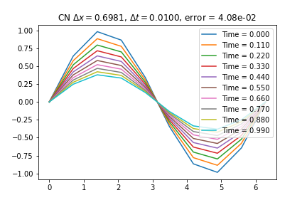
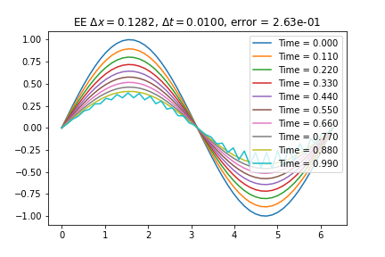

<!--
title: Lecture 030 Parabolic
paginate: true
_class: titlepage
-->

# Parabolic Linear Differential Equations

---

## Heat equation

Given a domain $\Omega \in \mathbb R$ we look for a solution $u:\Omega \times \mathbb R^+ \to \mathbb R$ solution of 

$$\partial_t u(t,x) -a \partial_{xx} u(t,x) = f(t,x),$$
with $a>0$.

### Physical applications
* Heat conduction ($u$ temperature),
* Elastic membrane subject to a body force $f$ ($u$ is the displacement),
* Electric potential distribution ($u$) due to a charge $f$.

## Difference with Elliptic
* Variation in time

---

## Cauchy problem
We couple the PDE with initial conditions (IC) at time $t=0$ AND boundary conditions (either Nuemann or Dirichlet) for all times $t\in\mathbb R^{+}$. 
$$
\begin{cases}
    \partial_t u(t,x) -a \partial_{xx} u(t,x) = f(t,x), & t>0, x\in\Omega\\
    u(0,x)=u_0(x), & x\in\Omega,\\  
    u(t,x) = u_D(t,x), & \forall t \in \mathbb R^+, x\in\Gamma_D \subset \partial \Omega,\\
    \partial_x u(t,x) \cdot \mathbf{n} = u_N(t,x), & \forall t \in \mathbb R^+, x\in\Gamma_N \subset \partial \Omega.
\end{cases}
$$

### Periodic boundary conditions
Alternatively, for boundary conditions one can impose periodic conditions, i.e., if $\Omega = [a,b]$, then 
$$u(t,a)=u(t,b)$$
 for all $t\in \mathbb R^+$.

---

## Exact solutions for periodic boundary conditions (Fourier) (1/n)

### Eigenfunctions of the differential operator
First of all, let's notice that the trigonometric functions are special functions for the differential operator
$$
\begin{align*}
&\partial_ x e^{i x k} = i k e^{i x k}, \qquad &\partial_{xx} e^{i x k} = -k^2 e^{i x k},\\
&\partial_x \sin(kx) = k \cos(kx), \qquad &\partial_{xx} \sin(kx) = -k^2 \sin(kx),\\
&\partial_x \cos(kx) = -k \sin(kx), \qquad &\partial_{xx} \cos(kx) = -k^2 \cos(kx).
\end{align*}
$$

Recall:
$$
\begin{align*}
&\sin(x) = \frac{e^{ix}-e^{-ix}}{2i}, \qquad \cos(x) = \frac{e^{ix}+e^{-ix}}{2}.
\end{align*}
$$

So we focus on the trigonometric functions of the type $e^{ixk}$.

---

## Exact solutions for periodic boundary conditions (Fourier) (2/n)

### Fourier series
For simplicity let's consider $\Omega = [-\pi,\pi]$ with periodic boundary conditions. We can decompose the initial condtion in Fourier series if $u_0\in L^2(\Omega)$.
$$
u_0(x) = \sum_{k\in \mathbb Z} c_k e^{i k x}, \qquad c_k = \frac{1}{2\pi} \int_{-\pi}^{\pi} u_0(x) e^{-i k x} \textrm{d}x.
$$

### Parseval theorem
$$
\lVert \mathbf{c} \rVert_2^2=\sum_{k\in \mathbb Z} |c_k|^2 = \frac{1}{2\pi} \int_{-\pi}^{\pi} |u_0(x)|^2 \textrm{d}x = \frac{1}{2\pi} \lVert u_0 \rVert_2^2.
$$

[Wikipedia page on Fourier series](https://en.wikipedia.org/wiki/Fourier_series)
[Youtube playlist of 3Blue1Brown on Fourier series](https://www.youtube.com/watch?v=spUNpyF58BY&list=PL4VT47y1w7A1-T_VIcufa7mCM3XrSA5DD)
[Youtube video on solving heat equations with Fourier](https://www.youtube.com/watch?v=ToIXSwZ1pJU&list=PL4VT47y1w7A1-T_VIcufa7mCM3XrSA5DD&index=3)

---

## Exact solutions for periodic boundary conditions (Fourier) (3/n)

### Exploiting linearity for heat equation
Let's us use the ansatz $u(t,x) = \sum_{k\in \mathbb Z} c_k(t) e^{i k x}$, where $c_k(t)$ are the Fourier coefficients of the solution at time $t$.
$$
\begin{align*}
    &\partial_t u(t,x) - a \partial_{xx} u(t,x)=0\\
    &\sum_{k\in \mathbb Z}   \partial_t c_k(t) e^{i k x} - a \sum_{k\in \mathbb Z} c_k(t) \partial_{xx} e^{i k x}=0\\
    &\sum_{k\in \mathbb Z}   \partial_t c_k(t) e^{i k x} + a \sum_{k\in \mathbb Z} k^2 c_k(t)  e^{i k x}=0\\
    &  \partial_t c_k(t) + a k^2 c_k(t) = 0, \quad \forall k\in \mathbb Z,\\
    &c_k(t) = c_k(0) e^{-a k^2 t}, \quad \forall k\in \mathbb Z.
\end{align*}
$$

---

## Discretization of $\partial_t u - \partial_{xx} u=0$
* Domain in space $\Omega=[a,b]$ and time $[0,T]$
* Grid in space $a=x_0<x_1<\dots <x_i<\dots<x_{N_x}=b$
* Grid in time $0=t^0<t^1<\dots<t^n<\dots<t^{N_t}=T$

### Explicit Euler

$$
\frac{u^{n+1}_i-u^n_i}{\Delta t} - \frac{u_{i+1}^n-2u_i^n+u_{i-1}^n}{\Delta x^2}=0 
$$

### Implicit Euler

$$
\frac{u^{n+1}_i-u^n_i}{\Delta t} - \frac{u_{i+1}^{n+1}-2u_i^{n+1}+u_{i-1}^{n+1}}{\Delta x^2}=0 
$$

### Crank-Nicolson

$$
\frac{u^{n+1}_i-u^n_i}{\Delta t} - \frac{u_{i+1}^{n+1}-2u_i^{n+1}+u_{i-1}^{n+1}}{2\Delta x^2}- \frac{u_{i+1}^{n}-2u_i^{n}+u_{i-1}^{n}}{2\Delta x^2}=0 
$$

---

## Numerical solutions
### Explicit Euler
$$
\frac{u^{n+1}_i-u^n_i}{\Delta t} - \frac{u_{i+1}^n-2u_i^n+u_{i-1}^n}{\Delta x^2}=0 
$$
* Explicit -> no systems
### Implicit Euler
$$
\frac{u^{n+1}_i-u^n_i}{\Delta t} - \frac{u_{i+1}^{n+1}-2u_i^{n+1}+u_{i-1}^{n+1}}{\Delta x^2}=0 
$$
* Linear system 
$$
LHS =I-\frac{\Delta t}{\Delta x^2} D^2 = \begin{pmatrix}
1+2\frac{\Delta t}{\Delta x^2} &-\frac{\Delta t}{\Delta x^2} & 0&\dots & \dots\\
-\frac{\Delta t}{\Delta x^2} &1+2\frac{\Delta t}{\Delta x^2} &-\frac{\Delta t}{\Delta x^2} &\dots & \dots\\
\vdots & \ddots & \ddots & \ddots &\vdots\\
0&\dots & \dots &-\frac{\Delta t}{\Delta x^2} &1+2\frac{\Delta t}{\Delta x^2}     
\end{pmatrix} \qquad RHS = u^n
$$

---

### Crank-Nicolson
$$
\frac{u^{n+1}_i-u^n_i}{\Delta t} - \frac{u_{i+1}^{n+1}-2u_i^{n+1}+u_{i-1}^{n+1}}{2\Delta x^2}- \frac{u_{i+1}^{n}-2u_i^{n}+u_{i-1}^{n}}{2\Delta x^2}=0 
$$
* Linear system 
$$
LHS = I-\frac{1}{2}\frac{\Delta t}{\Delta x^2} D^2 = \begin{pmatrix}
1+\frac{\Delta t}{\Delta x^2} &-\frac{\Delta t}{2\Delta x^2} & 0&\dots & \dots\\
-\frac{\Delta t}{2\Delta x^2} &1+\frac{\Delta t}{\Delta x^2} &-\frac{\Delta t}{2\Delta x^2} &\dots & \dots\\
\vdots & \ddots & \ddots & \ddots &\vdots\\
0&\dots & \dots &-\frac{\Delta t}{2\Delta x^2} &1+\frac{\Delta t}{\Delta x^2}     
\end{pmatrix}
$$
$$
RHS = u^n +\frac12 \frac{\Delta t}{\Delta x^2} D^2 u^n
$$

---

# Example
$$
\begin{align*}
    &\begin{cases}
        \partial_t u - \partial_{xx}u =0
        u_0(x) = \sin(x)\qquad x\in [0,2\pi],\\
        u(t,0) = 0. \qquad t \in \mathbb{R}^+,\\
        u(t,2\pi) = 0. \qquad t \in \mathbb{R}^+,
    \end{cases}\qquad
    &u(t,x)=e^{-t}\sin(x)\qquad x\in [0,2\pi],\qquad t \in \mathbb{R}^+.
\end{align*}
$$

---

## Explicit Euler

---

## Physical derivation 

$u$ is a concentration, at equilibrium there will be zero net flux $\mathbf{F}$ through the boundary of any regular subdomain $S\subset \Omega$, so
$$
\int_{\partial S} \mathbf{F}\cdot \mathbf{n} \textrm{d}\Gamma = 0,
$$
using the Gauss-Green theorem, we have that
$$
\int_S \text{div} \mathbf{F} \textrm{d} x =\int_{\partial S} \mathbf{F}\cdot \mathbf{n} \textrm{d}\Gamma = 0, 
$$
so $\text{div} \mathbf{F}=0$. In many applications it is reasonable to assume that the flux is proportional to the gradient of the concentration (chemical concentration, heat), from the higher concentration region to the lower ones $\mathbf{F}=-a \nabla u.$

Substituting we get
$$ \text{div} \mathbf{F} = -\text{div} ( a \nabla u) = - a \Delta  u=0.$$

---

# Boundary conditions
To obtain uniqueness of the solution, we need to enforce some extra constraints.
## Dirichlet boundary conditions
$$u=g \text{ on }\partial \Omega.$$
If $g\equiv 0$, then they are called homogeneous Dirichlet BC. 

Elastic application -> imposing a given displacement. 

## Neumann boundary conditions
$$\nabla u \cdot \textbf{n} = \frac{\partial u}{\partial \textbf{n}}  = h \text{ on }\partial \Omega.$$
$\textbf{n}$ is the normal vector going out of the domain $\Omega$ in each point of the boundary $\partial \Omega$.

Elastic application -> prescribed surface traction or stress on the boundary. 

--- 

# Boundary conditions

## Geometric Combinations
$$
\begin{align*}
    &\partial\Omega = \Gamma_D \cup \Gamma_N, \qquad \Gamma_D^\circ \cap \Gamma_N^\circ = \emptyset\\
&\begin{cases}
    u=g \text{ on }\Gamma_D\\
    \nabla u \cdot \textbf{n} = g \text{ on }\Gamma_N.
\end{cases}
\end{align*}
$$

## Physical Combinations: Robin boundary
$$
\begin{align*}
    \nabla u \cdot \textbf{n} + \gamma u = r \text{ on }\Gamma_R.
\end{align*}
$$

---

## Regularity of the solution
It is not always possible to find the strong solution of the equation. 
Consider the problem $-\Delta u=1$ on $\Omega=[0,1]^2$ with homogeneous Dirichlet boundary conditions. Clearly, in $(0,0)$ the solution at the boundaries is such that
$$-\Delta u (0,0) = -\partial_{xx} u(0,0) - \partial_{yy} u(0,0) =0,$$
as the BC impose that $u(x,0)=0=u(0,y)$ for all $x,y\in[0,1]$.

So, even if $f\in C^0(\bar{\Omega})$ it does not makes sense to look for a solution in $\mathcal{C}^2(\bar{\Omega})$.
What we are actually looking for, in this case, is a solution in the space $C^2(\Omega) \cap C^0(\bar{\Omega}) \supset C^2(\bar{\Omega})$.

---

## Towards a weak formulation

Let's go back to 1D and to the homogeneous Dirichlet BCs.

$$
\begin{cases}
-u''(x) = f(x), \qquad 0<x<1,\\
u(0)=u(1)=0.
\end{cases}
$$
This describes the displacement of a string under a transversal force with intensity $f(x)$ in each point. The total force acting on a portion of the domain $(0,x)$ is given by $F(x) = \int_0^x f(s)\textrm{d}s$.

It is not possible to use this formulation to describe, for example, the case where the force is applied in only a point, for example $x_0=\frac12$. There $f=-\delta_{x_0}$ would be what describes the force. A physical solution of course exists, it is continuous but not $C^1$ on the whole domain, in particular it will have a discontinuity in the derivative in $x_0$. 
$$
u(x) = \begin{cases}
    -\frac12 x, & x<\frac12,\\
    \frac12 x - \frac12, & x<\frac12.\\ 
\end{cases}
$$

---

Even if we take $f\in L^2((0,1))$, but not continuous we might have similar problems: take $f= -\chi_{[0.4,0.6]}$, then the solution (physically) is 
$$u(x)=
\begin{cases}
    -\frac1{10}x, & x<0.4,\\
    \frac1{2}x^2-\frac12 x+ \frac2{25}, & x\in[0.4,0.6],\\
    -\frac1{10}(1-x), & x>0.6.
\end{cases}
$$
Clearly, $u\in C^1$ but $u\notin C^2$. Still, we would like our problem to have a meaning also in these contexts. Goal: get rid of the second derivative! Consider a smooth test function $v\in \mathcal{D}((0,1))$ 
$$
-u''=f \, \Longrightarrow -u''v=fv\, \Longrightarrow \int_0^1 -u''(x)v(x)  \,\textrm{d}x =\int_0^1 f(x)v(x) \,\textrm{d}x.
$$
Integration by parts
$$ 
\int_0^1 -u''(x)v(x)  \,\textrm{d}x =\int_0^1 f(x)v(x) \,\textrm{d}x \Longrightarrow 
\int_0^1 u'(x)v'(x)  \,\textrm{d}x -\left[ u'v\right]_0^1 =\int_0^1 f(x)v(x) \,\textrm{d}x 
$$
since $v\in\mathcal{D}((0,1))$ it is zero on the boundary, so,
$$ 
\int_0^1 u'(x)v'(x)  \,\textrm{d}x  =\int_0^1 f(x)v(x) \,\textrm{d}x .
$$

---

$$ 
\int_0^1 u'(x)v'(x)  \,\textrm{d}x  =\int_0^1 f(x)v(x) \,\textrm{d}x .
$$

We can consider a test function in $\mathcal{D}$ with zero boundaries because we are imposing the Dirichlet boundary conditions on $u$ itself, so, we already know $u$ at the boundaries. 

Hence, one could think that looking for a solution and a test function in 
$$V=\lbrace v \in C^1([0,1]): v(0)=v(1)=0 \rbrace$$
is a possibility. Unfortunately, looking for something so regular is still too much as the regularity of the solution will depends on $f$. (Lesson 011)

The problem is that the space $V$ with the norm $\lvert \cdot \rvert_1$ is not complete.

Let's enlarge the space, to get a complete functional space.

Take $u,v \in V:=H^1_0((0,1))$, now all the integrals are meaningful if we take $f\in L^2((0,1))$, and the space normed with $\lvert \cdot \rvert_1$ is complete.

---

## Variational equivalent problem
**Weak problem** is find $u\in H^1_0((0,1))$ such that for every $v\in H^1_0((0,1))$
$$ 
\int_0^1 u'(x)v'(x)  \,\textrm{d}x  =\int_0^1 f(x)v(x) \,\textrm{d}x .
$$

Equivalent **variational problem** is find $u\in V=H^1_0((0,1))$ such that
$$
\begin{cases}
    J(u) = \min_{v\in V} J(v) \text{ with }\\
    J(v):= \frac12 \int_0^1 (v')^2 \textrm{d}x - \int_{0}^1 fv\textrm{d}x.
\end{cases}
$$
### Sketch of the proof
Define for every $w \in V$ the function $\psi(\delta) = J(u+\delta w)$.
$$
\psi(\delta) = \frac12 \int_0^1 (u')^2 + \delta \int_0^1 u'w' + \frac{\delta^2}{2} \int_0^1 (w')^2 -\int_0^1fu-\delta \int_0^1fw.
$$
This is a quadratic function in $\delta$, it's a parabola, and the minimum is at 
$$
\delta = -\frac{\int_0^1u'w'-\int_0^1fw}{\int_0^1 (w')^2}=0.
$$
Hence, for every $w$ and every $\delta$, $\psi(0)=J(u)\leq J(u+\delta w)=\psi(\delta).$

---

## Nonhomogeneous Poisson problem
If we have nonhomogeneous Dirichlet BC, e.g.
$$
\begin{cases}
    -u''=f\\
    u(0)=u_L, \quad u(1)=u_R,
\end{cases}
$$
we can consider the *lifting* $u_{lift}:= [(1-x)u_L + x u_R]$ that solves $u_{lift}''=0$, $u_{lift}(0)=u_L$ and $u_{lift}(1)=u_R$. Defining 
$\tilde{u}:=u - u_{lift}$, we have that $\tilde{u}$ solves the homogeneous problem
$$
\begin{cases}
    -\tilde{u}'' = -\tilde{u}'' = f\\
    \tilde{u}(0) = u(0) - u_{lift}(0) = 0,\qquad  \tilde{u}(1) = u(1) - u_{lift}(1) = 0,
\end{cases}
$$ 
and we are back to the previous case!

---

## Neumann boundary conditions

$$
\begin{cases}
    -u''=f\\
    u'(0)=h_0, \quad u'(1)=h_1,
\end{cases}
$$
is clearly not well defined, as if $u$ is a solution, then also $\tilde{u}(x) = u(x) +c$ for every $c\in \mathbb R$ is a solution! Non uniqueness!

**Possibilities:**
* Change the problem into something like $-u'' + \sigma u = f$.
* Change BC into a mixed BC: one boundary Dirichlet, one boundary Neumann.

---

## Mixed homogeneous conditions (homogeneous in Dirichlet)
$$
\begin{cases}
    -u''=f\\
    u(0)=0, \quad u'(1)=g_1.
\end{cases}
$$
As for Dirichlet problem, I need the test function to be 0 on the left boundary, while, since we have no information on the right boundary, I have to let them free on the right.
$$
V = \lbrace v \in H^1((0,1)): v(0) =0 \rbrace
$$

Let's write the weak formulation for every $v\in V$, again using integration by parts, we have
$$
0=\int_0^1 -u''v -fv \, \textrm{d}x = \int_0^1 u'v' -fv \, \textrm{d}x  - \underbrace{u'(1)}_{=g_1}v(1) +u'(0)\underbrace{v(0)}_{=0} = \int_0^1 u'v' -fv \, \textrm{d}x - g_1v(1).
$$

---

## Weak formulation for 2D problems
Let $\Omega \subset \mathbb R^2$ a bounded domain with boundary $\partial \Omega = \Gamma_D \cup \Gamma_N$. The Poisson problem with Dirichlet and Neumann BC reads
$$
\begin{cases}
    -\Delta u=f, & \text{ in } \Omega,\\
    u(x)=u_D(x), & \text{ in }\Gamma_D,\\
    \nabla u(x) \cdot \mathbf{n} = g_N(x), & \text{ in }\Gamma_N.
\end{cases}
$$
* Test function $v\in V = \lbrace v\in H^1(\Omega) : v|_{\Gamma_D} =0 \rbrace$
  $$
  \int_{\Omega} -\Delta u v  -fv \textrm{d} x = 0  + BCs.
  $$

Instead of integration by parts, we use the divergence theorem: $\int_\Omega \text{div} (\mathbf{a}) \textrm{d}x = \int_{\partial\Omega} \mathbf{a}\cdot \mathbf{n} \, \mathrm{d}\gamma$ and we notice that
$$
\begin{align}
&\int_\Omega \text{div} (v\nabla u) \textrm{d}x = \int_{\partial\Omega} v\nabla u\cdot \mathbf{n} \, \mathrm{d}\gamma\\
&\int_\Omega \text{div} (v\nabla u) \,\textrm{d}x = \int_{\Omega} \sum_{i=1}^d \partial_{x_i} (v \partial_{x_i} u )\,\textrm{d}x = \int_{\Omega} \sum_{i=1}^d \partial_{x_i} v \cdot  \partial_{x_i} u \,\textrm{d}x +  \int_{\Omega} \sum_{i=1}^d \partial_{x_ix_i}u \cdot  v \,\,\textrm{d}x =\\
=&\int_{\Omega} \nabla u \cdot \nabla v\,\textrm{d}x + \int_{\Omega} v\Delta u \,\textrm{d}x 
\end{align}
$$

---

### Laplacian Green's formula
$$ 
-\int_{\Omega}v\Delta u \,\textrm{d}x  = \int_{\Omega} \nabla u \cdot \nabla v\,\textrm{d}x - \int_\Omega \text{div} (v\nabla u) \textrm{d}x =  \int_{\Omega} \nabla u \cdot \nabla v\,\textrm{d}x -\int_{\partial\Omega} v\nabla u\cdot \mathbf{n} \, \mathrm{d}\gamma.
$$

### Weak formulation of 2D problem
Let's go back to our problem, we can use the fact that $v=0$ on $\Gamma_D$ and that $\nabla u \cdot \textbf{n} = g_N$ on $\Gamma_N$ to write the weak formulation of Poisson problem as find $u\in V_D:= \lbrace v \in H_1(\Omega) : v|_{\Gamma_D} = u_D \rbrace$

$$ 
\int_{\Omega} \nabla u \cdot \nabla v\,\textrm{d}x -\int_{\partial\Omega} v\, g_N(\gamma) \, \mathrm{d}\gamma=\int_{\Omega} v f\,\textrm{d}x  \qquad \forall v \in V= \lbrace v\in H^1(\Omega) : v|_{\Gamma_D} =0 \rbrace.
$$

To have symmetry between the space of $u$ and the space of $v$, we can use again the lifting $u_{lift}\in V_D$ such that $-\Delta u_{lift}=0$ and solve for $\tilde{u} = u - u_{lift} \in V$. 

### Proposition [Check Quarteroni]
The weak formulation is equivalent to the strong formulation where the differential operators are meant in a distributional sense (take as a test function $v\in \mathcal{D}$).

---

## General problem
Let $\Omega\subset \mathbb R^d$, $\Gamma_N \cup \Gamma_D = \partial \Omega$, $\Gamma_N^\circ \cap \Gamma_D^\circ = \emptyset$, $f\in L^2(\Omega)$, $\mu,\sigma \in L^\infty(\Omega)$, $u_D \in H^1(\Omega)$ and $g \in L^2(\Gamma_N)$. Find $u\in V_D = H^1(\Omega)\cap\lbrace v: v|_{\Gamma_D} = u_D\rbrace$ such that
$$
\begin{cases}
    -\text{div}(\mu \nabla u) + \sigma u = f, & \text{ in }\Omega,\\
    u = u_D, & \text{ in }\Gamma_D,\\
    \mu \nabla u\cdot \mathbf{n} = g, & \text{ in }\Gamma_N.
\end{cases}
$$

### Weak formulation
Find $u\in V_D$ such that for every $v\in V$
$$
\int_{\Omega} \mu \nabla u \cdot \nabla v \,\textrm{d}x +\int_{\Omega}  \sigma \, u \,  v \,\textrm{d}x  = \int_{\Omega}  f \,  v \,\textrm{d}x + \int_{\Gamma_N} g v \, \textrm{d}\gamma .
$$
Let's symmetrize the spaces using a known lifting $u_{lift}\in V_D$, so that we look for a $\tilde{u} = u - u_{lift} \in V$ such that
$$
\int_{\Omega} \mu \nabla \tilde {u} \cdot \nabla v \,\textrm{d}x +\int_{\Omega}  \sigma \, \tilde u \,  v \,\textrm{d}x  = \int_{\Omega}  f \,  v \,\textrm{d}x + \int_{\Gamma_N} g v \, \textrm{d}\gamma -\int_{\Omega}\mu \nabla  u_{lift} \cdot \nabla v \,\textrm{d}x -\int_{\Omega}  \sigma \, u_{lift}\,  v \,\textrm{d}x.
$$

---

## Bilinear form

We can define now the bilinear form $a: V\times V \to \mathbb R$  and the linear form $F : V \to \mathbb R$ defined as 
$$
\begin{cases}
a(u,v):=\int_{\Omega} \mu \nabla {u} \cdot \nabla v \,\textrm{d}x +\int_{\Omega}  \sigma \, u \,  v \,\textrm{d}x, \\
F(v):=\int_{\Omega}  f \,  v \,\textrm{d}x + \int_{\Gamma_N} g v \, \textrm{d}\gamma -\int_{\Omega}\mu \nabla  u_{lift} \cdot \nabla v \,\textrm{d}x -\int_{\Omega}  \sigma \, u_{lift}\,  v \,\textrm{d}x.
\end{cases}
$$

The previous problem is now: find $\tilde{u} \in V$ such that for all $v\in V$ $a(u,v)=F(v)$.

### Exercise
* $F$ is linear and bounded
* $a$ is symmetric: $a(u,v)= a(v,u)$
* $a$ is continuous: $|a(u,v)| \leq C \lVert u \rVert_V \lVert v \rVert_V$ 
* $a$ is coercive: $|a(u,u)| \geq \alpha \lVert u \rVert_V^2$

---

# Existance and uniqueness
## Lax-Milgram Lemma
Let $V$ a Hilbert space, $a(\cdot,\cdot):V\times V \to \mathbb R$ a bilinear **continuous** and **coercive** form, $F: V \to \mathbb R$ a bounded linear functional. Then, there exists and it is unique the solution of the problem: find $u\in V$ such that for every $v\in V$
$$
a(u,v)=F(v).
$$

### Proof [Evans]

## Corollary
The solution $u$ is bounded by boundary and right hand side data, i.e., $\lVert u \rVert_V \leq \frac{1}{\alpha} \lVert F \rVert_{V^*}.$
### Proof
$$
\alpha \lVert u \rVert_V^2 \leq a(u,u) = F(u) \leq  \lVert F \rVert_{V^*} \lVert u \rVert_V.
$$

---

## Equivalent variational problem
If, in addition, $a$ is symmetric, then the problem is equivalent to the following variational problem: find $u$ such that
$$
\begin{cases}
    J(u)=\min_{v\in V}J(v), \text{ with }\\
    J(v) : = \frac12 a(v,v)-F(v).
\end{cases}
$$

### Exercise: Proof

---

## Summary: Poisson on Hilbert spaces!
If we can write the Poisson problem in the form
$$
a(u,v)=F(v) \;\forall v\in V, \text{ with }a(u,v) = \int_{\Omega} \mu \nabla {u} \cdot \nabla v \,\textrm{d}x +\int_{\Omega}  \sigma \, u \,  v \,\textrm{d}x,
$$
and we look for a solution $u\in V$ with $V$ a Hilbert space, then we can use the Lax-Milgram Lemma to prove existence and uniqueness of the solution.

* continuity $a(u,v)\leq \max(\mu,\sigma) \lVert u \rVert_1\lVert v \rVert_1$
* coercivity $a(u,u)\geq \min(\mu,\sigma) \lVert u \rVert_1^2$ or $a(u,u)\geq \mu C(\Omega) \lVert u \rVert_1^2$ (if $\sigma=0$ and Dirichlet BC, we use Poincarè inequality)
* $F(v)=\int_{\Omega} fv\, \textrm{d}x$ is a bounded linear functional if $f\in L^2(\Omega)$.  