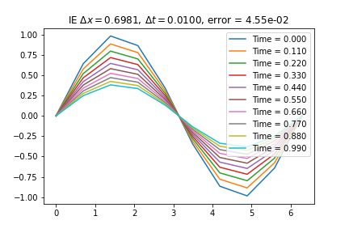
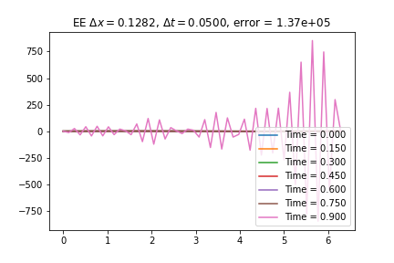
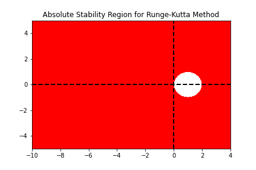

<!--
title: Lecture 030 Parabolic
paginate: true
_class: titlepage
-->

# Parabolic Linear Differential Equations

---

## Heat equation

Given a domain $\Omega \in \mathbb R$ we look for a solution $u:\Omega \times \mathbb R^+ \to \mathbb R$ solution of 

$$\partial_t u(t,x) -a \partial_{xx} u(t,x) = f(t,x),$$
with $a>0$.

### Physical applications
* Heat conduction ($u$ temperature),
* Elastic membrane subject to a body force $f$ ($u$ is the displacement),
* Electric potential distribution ($u$) due to a charge $f$.

## Difference with Elliptic
* Variation in time

---

## Cauchy problem
We couple the PDE with initial conditions (IC) at time $t=0$ AND boundary conditions (either Nuemann or Dirichlet) for all times $t\in\mathbb R^{+}$. 
$$
\begin{cases}
    \partial_t u(t,x) -a \partial_{xx} u(t,x) = f(t,x), & t>0, x\in\Omega\\
    u(0,x)=u_0(x), & x\in\Omega,\\  
    u(t,x) = u_D(t,x), & \forall t \in \mathbb R^+, x\in\Gamma_D \subset \partial \Omega,\\
    \partial_x u(t,x) \cdot \mathbf{n} = u_N(t,x), & \forall t \in \mathbb R^+, x\in\Gamma_N \subset \partial \Omega.
\end{cases}
$$

### Periodic boundary conditions
Alternatively, for boundary conditions one can impose periodic conditions, i.e., if $\Omega = [a,b]$, then 
$$u(t,a)=u(t,b)$$
 for all $t\in \mathbb R^+$.

---

## Exact solutions for periodic boundary conditions (Fourier) (1/n)

### Eigenfunctions of the differential operator
First of all, let's notice that the trigonometric functions are special functions for the differential operator
$$
\begin{align*}
&\partial_ x e^{i x k} = i k e^{i x k}, \qquad &\partial_{xx} e^{i x k} = -k^2 e^{i x k},\\
&\partial_x \sin(kx) = k \cos(kx), \qquad &\partial_{xx} \sin(kx) = -k^2 \sin(kx),\\
&\partial_x \cos(kx) = -k \sin(kx), \qquad &\partial_{xx} \cos(kx) = -k^2 \cos(kx).
\end{align*}
$$

Recall:
$$
\begin{align*}
&\sin(x) = \frac{e^{ix}-e^{-ix}}{2i}, \qquad \cos(x) = \frac{e^{ix}+e^{-ix}}{2}.
\end{align*}
$$

So we focus on the trigonometric functions of the type $e^{ixk}$.

---

## Exact solutions for periodic boundary conditions (Fourier) (2/n)

### Fourier series
For simplicity let's consider $\Omega = [-\pi,\pi]$ with periodic boundary conditions. We can decompose the initial condtion in Fourier series if $u_0\in L^2(\Omega)$.
$$
u_0(x) = \sum_{k\in \mathbb Z} c_k e^{i k x}, \qquad c_k = \frac{1}{2\pi} \int_{-\pi}^{\pi} u_0(x) e^{-i k x} \textrm{d}x.
$$

### Parseval theorem
$$
\lVert \mathbf{c} \rVert_2^2=\sum_{k\in \mathbb Z} |c_k|^2 = \frac{1}{2\pi} \int_{-\pi}^{\pi} |u_0(x)|^2 \textrm{d}x = \frac{1}{2\pi} \lVert u_0 \rVert_2^2.
$$

[Wikipedia page on Fourier series](https://en.wikipedia.org/wiki/Fourier_series)
[Youtube playlist of 3Blue1Brown on Fourier series](https://www.youtube.com/watch?v=spUNpyF58BY&list=PL4VT47y1w7A1-T_VIcufa7mCM3XrSA5DD)
[Youtube video on solving heat equations with Fourier](https://www.youtube.com/watch?v=ToIXSwZ1pJU&list=PL4VT47y1w7A1-T_VIcufa7mCM3XrSA5DD&index=3)

---

## Exact solutions for periodic boundary conditions (Fourier) (3/n)

### Exploiting linearity for heat equation
Let's us use the ansatz $u(t,x) = \sum_{k\in \mathbb Z} c_k(t) e^{i k x}$, where $c_k(t)$ are the Fourier coefficients of the solution at time $t$.
$$
\begin{align*}
    &\partial_t u(t,x) - a \partial_{xx} u(t,x)=0\\
    &\sum_{k\in \mathbb Z}   \partial_t c_k(t) e^{i k x} - a \sum_{k\in \mathbb Z} c_k(t) \partial_{xx} e^{i k x}=0\\
    &\sum_{k\in \mathbb Z}   \partial_t c_k(t) e^{i k x} + a \sum_{k\in \mathbb Z} k^2 c_k(t)  e^{i k x}=0\\
    &  \partial_t c_k(t) + a k^2 c_k(t) = 0, \quad \forall k\in \mathbb Z,\\
    &c_k(t) = c_k(0) e^{-a k^2 t}, \quad \forall k\in \mathbb Z.
\end{align*}
$$

---

## Discretization of $\partial_t u - \partial_{xx} u=0$
* Domain in space $\Omega=[a,b]$ and time $[0,T]$
* Grid in space $a=x_0<x_1<\dots <x_i<\dots<x_{N_x}=b$
* Grid in time $0=t^0<t^1<\dots<t^n<\dots<t^{N_t}=T$

### Explicit Euler

$$
\frac{u^{n+1}_i-u^n_i}{\Delta t} - \frac{u_{i+1}^n-2u_i^n+u_{i-1}^n}{\Delta x^2}=0 
$$

### Implicit Euler

$$
\frac{u^{n+1}_i-u^n_i}{\Delta t} - \frac{u_{i+1}^{n+1}-2u_i^{n+1}+u_{i-1}^{n+1}}{\Delta x^2}=0 
$$

### Crank-Nicolson

$$
\frac{u^{n+1}_i-u^n_i}{\Delta t} - \frac{u_{i+1}^{n+1}-2u_i^{n+1}+u_{i-1}^{n+1}}{2\Delta x^2}- \frac{u_{i+1}^{n}-2u_i^{n}+u_{i-1}^{n}}{2\Delta x^2}=0 
$$

---

## Numerical solutions
### Explicit Euler
$$
\frac{u^{n+1}_i-u^n_i}{\Delta t} - \frac{u_{i+1}^n-2u_i^n+u_{i-1}^n}{\Delta x^2}=0 
$$
* Explicit -> no systems
### Implicit Euler
$$
\frac{u^{n+1}_i-u^n_i}{\Delta t} - \frac{u_{i+1}^{n+1}-2u_i^{n+1}+u_{i-1}^{n+1}}{\Delta x^2}=0 
$$
* Linear system 
$$
LHS =I-\frac{\Delta t}{\Delta x^2} D^2 = \begin{pmatrix}
1+2\frac{\Delta t}{\Delta x^2} &-\frac{\Delta t}{\Delta x^2} & 0&\dots & \dots\\
-\frac{\Delta t}{\Delta x^2} &1+2\frac{\Delta t}{\Delta x^2} &-\frac{\Delta t}{\Delta x^2} &\dots & \dots\\
\vdots & \ddots & \ddots & \ddots &\vdots\\
0&\dots & \dots &-\frac{\Delta t}{\Delta x^2} &1+2\frac{\Delta t}{\Delta x^2}     
\end{pmatrix} \qquad RHS = u^n
$$

---

### Crank-Nicolson
$$
\frac{u^{n+1}_i-u^n_i}{\Delta t} - \frac{u_{i+1}^{n+1}-2u_i^{n+1}+u_{i-1}^{n+1}}{2\Delta x^2}- \frac{u_{i+1}^{n}-2u_i^{n}+u_{i-1}^{n}}{2\Delta x^2}=0 
$$
* Linear system 
$$
LHS = I-\frac{1}{2}\frac{\Delta t}{\Delta x^2} D^2 = \begin{pmatrix}
1+\frac{\Delta t}{\Delta x^2} &-\frac{\Delta t}{2\Delta x^2} & 0&\dots & \dots\\
-\frac{\Delta t}{2\Delta x^2} &1+\frac{\Delta t}{\Delta x^2} &-\frac{\Delta t}{2\Delta x^2} &\dots & \dots\\
\vdots & \ddots & \ddots & \ddots &\vdots\\
0&\dots & \dots &-\frac{\Delta t}{2\Delta x^2} &1+\frac{\Delta t}{\Delta x^2}     
\end{pmatrix}
$$
$$
RHS = u^n +\frac12 \frac{\Delta t}{\Delta x^2} D^2 u^n
$$

---

## Consistency
### Explicit Euler

$$
\begin{align*}
&\frac{u^{n+1}_i-u^n_i}{\Delta t} - \frac{u_{i+1}^n-2u_i^n+u_{i-1}^n}{\Delta x^2}=0 \\
e_{\Delta t, \Delta x}^{EE} =&\frac{u(t^{n+1},x_i)-u(t^n,x_i)}{\Delta t} - \frac{u(t^n,x_{i+1})-2u(t^n,x_i)+u(t^n,x_{i-1})}{\Delta x^2} \\
=&\partial_t u(t^n,x_i) +\frac{\Delta t}2 \partial_{tt}u(t^n,x_i) - \partial_{xx} u(t^n,x_i) -\frac{\Delta x^2}{12} \partial_{xxxx}u(t^n,x_i)+O(\Delta t^2) + O(\Delta x^3) \\
=&   \frac{\Delta t}2 \partial_{tt}u(t^n,x_i) -\frac{\Delta x^2}{12} \partial_{xxxx}u(t^n,x_i)+O(\Delta t^2) + O(\Delta x^3) = O(\Delta t) + O(\Delta x^2)
\end{align*}
$$

Second order in space and first order in time

---

## Consistency
### Crank-Nicolson

$$
\begin{align*}
&\frac{u^{n+1}_i-u^n_i}{\Delta t} - \frac{u_{i+1}^n-2u_i^n+u_{i-1}^n}{2\Delta x^2}- \frac{u_{i+1}^{n+1}-2u_i^{n+1}+u_{i-1}^{n+1}}{2\Delta x^2}=0 \\
e_{\Delta t, \Delta x}^{EE} =&\frac{u(t^{n+1},x_i)-u(t^n,x_i)}{\Delta t} - \frac{u(t^n,x_{i+1})-2u(t^n,x_i)+u(t^n,x_{i-1})}{\Delta x^2} \\
=&\partial_t u(t^n,x_i) +\frac{\Delta t}2 \partial_{tt}u(t^n,x_i) - \partial_{xx} u(t^n,x_i) -\frac{\Delta x^2}{12} \partial_{xxxx}u(t^n,x_i)\\
&- \frac{\Delta t}{2} \underbrace{\partial_{txx} u(t^n,x_i)}_{=\partial_{tt}u} -\frac{\Delta t}{2}\frac{\Delta x^2}{12} \partial_{xxxxt}u(t^n,x_i)+O(\Delta t^2) + O(\Delta x^4) \\
=&  \frac{\Delta t}2 \partial_{tt}u(t^n,x_i)-\frac{\Delta t}2 \partial_{tt}u(t^n,x_i) +O(\Delta t^2) + O(\Delta x^2) = O(\Delta t^2) + O(\Delta x^2)
\end{align*}
$$
Second order in space and time

---

# Example
$$
\begin{align*}
    &\begin{cases}
        \partial_t u - \partial_{xx}u =0
        u_0(x) = \sin(x)\qquad x\in [0,2\pi],\\
        u(t,0) = 0. \qquad t \in \mathbb{R}^+,\\
        u(t,2\pi) = 0. \qquad t \in \mathbb{R}^+,
    \end{cases}\qquad
    &u(t,x)=e^{-t}\sin(x)\qquad x\in [0,2\pi],\qquad t \in \mathbb{R}^+.
\end{align*}
$$

---

## Explicit Euler

---

# Semidiscretization / Method of lines

We have seen how to discretize the spatial derivatives, we can write a system of ODEs for that discretization.

$$
u_i'(t) = \frac{u_{i+1}(t)-2u_i(t)+u_{i-1}}{\Delta x^2}\qquad \forall i=1,\dots,N_x.
$$
Then, we apply a time discretization method (e.g. explicit Euler, implicit Euler, Runge-Kutta, etc.)

$$
U'(t) = A U(t) + g(t) =f(U,t)
$$
where $g$ contains boundary conditions and 
$$
A:=\frac{1}{\Delta x^2}\begin{bmatrix}
-2 & 1 & 0 & \dots & 0\\
1 & -2 & 1 & \dots & 0\\
0 & 1 & -2 & \dots & 0\\
\vdots & \vdots & \vdots & \ddots & \vdots\\
0 & 0 & 0 & \dots & -2
\end{bmatrix}
$$

---

# Method of lines (MOL) interpretation

---

## Advantage of MOL

We can study the stability of the numerical problem, splitting the spatial and temporal discretization. 

### Stability region of a RK method
A Runge-Kutta method for a linear problem $u'(t) = \lambda u(t)$ can be written as 
$$
y^{n+1} = R(z) y^n,\qquad \text{ with }z =\lambda \Delta t,
$$
and we define the stability region as $\mathcal{S}:= \lbrace z \in \mathbb{C}: |R(z)|\leq 1 \rbrace.$

### Connection with semidiscretized PDE

In our case, we have that the linear system
$$
U'(t) = A U(t),
$$
can be diagonalized with an orthogonal transformation $Z$ (i.e. $ZZ^T=I$) such that $Z^T A Z =D$  with $D$ diagonal matrix with the values of the **eigenvalues** of $A$. So, if we define $Y(t)= Z^TU(t)$ we can study many decoupled equations, instead of one system
$$
Y'(t)= Z^T U'(t) = Z^T A U(t) = Z^T A Z Z^T U(t) = D Z^T U(t) = D Y(t).
$$ 

If $\lambda_i \in \mathcal{S}$ for all $\lambda_i$ eigenvalues of $A$, then the method is stable.

---

## Stability regions of RK methods
Explicit Euler $\qquad\qquad\qquad\qquad$ Implicit Euler $\qquad\qquad\qquad\qquad$ Crank-Nicolson

---

## Eigenvalues of the spatial semidiscretization

$$
A:=\frac{1}{\Delta x^2}\underbrace{\begin{bmatrix}
-2 & 1 & 0 & \dots & 0\\
1 & -2 & 1 & \dots & 0\\
0 & 1 & -2 & \dots & 0\\
\vdots & \vdots & \vdots & \ddots & \vdots\\
0 & 0 & 0 & \dots & -2
\end{bmatrix}}_{=:\tilde{A}}
$$

* $A$ is negative definite and symmetric
* $A$ has real non-positive **real** eigenvalues
* The eigenvalues of $A$ scale as $\frac{1}{\Delta x^2}$
* For explicit Euler we need $\Delta t < 2 \frac{\Delta x^2}{\max_i \tilde{\lambda}_i}$ where $\tilde{\lambda}_i$ are te eigenvalues of $\tilde{A}$ independent of $\Delta x$ and $\Delta t$. **Very expensive!**
* For implicit Euler and Crank-Nicolson, we are unconditionally (for every $\Delta t$) stable!

---

# Von Neumann stability analysis

---

# Lax-Richtmyer stability

# Lax equivalence theorem

