<!--
title: Lecture 031 Transport
paginate: true
_class: titlepage
-->

# Linear Hyperbolic: Advection Equation

---

# Conservation law (1/n)

We can see the linear transport equation coming from the gas dynamics problem, where we describe the motion of a gas inside a tube (1D-like), where in the transversal direction the density and the velocity of the gas is constant.

We define the density of a gas $\rho(t,x)$ such that the mass of the gas in a given section $[x_1,x_2]$ gives the mass in that section at time $t$ by integrating the density 
$$
\int_{x_1}^{x_2} \rho(t,x) \mathrm{d} x.
$$ 

The walls of the tube are impermeable, no exchange of mass happens across these walls, so the change of mass is happening only across the points $x_1$ and $x_2$. The rate of flow at these points is given by the velocity $v$ times the density, i.e.,
$$
\text{mass flux at }(t,x) = \rho(t,x) v(t,x).
$$

---

# Conservation law (2/n)

The rate of change of the mass in $[x_1,x_2]$ is then the difference of the flow at the two endpoints, i.e.,
$$
\frac{\mathrm{d}}{\mathrm{d}t} \int_{x_1}^{x_2} \rho(t,x) \,\mathrm{d}x = \rho(t,x_1)v(t,x_1)-\rho(t,x_2)v(t,x_2).
$$
This is the **integral form** of the **conservation law** (of mass).
Supposing that all the quantities are differentiable, we can differentiate in $x_2$ and  obtain
$$
\frac{\mathrm{d}}{\mathrm{d}t} \rho(t,x) + \partial_x (\rho(t,x)v(t,x))=0.
$$
This is the differential form of the **conservation law**.

For the moment we suppose that the velocity is known a priori. More in general, we can write the conservation law as 
$$
\partial_t \rho(t,x) +\partial_x f(\rho(t,x) )=0.
$$
For a complete gas dynamics description we will need also an equation for the velocity (momentum conservation) and one for the pressure (total energy conservation).

---

# Conservation laws (3/3)
To complete the system to describe the gas dynamics, we need to add the momentum equation:
$$
\partial_t (\rho v ) + \partial_x \left(\rho v^2 + p \right)=0
$$
that depends on the pressure $p$. In simple approximations, we can assume that the pressure is a function of the density, i.e., $p=p(\rho)$. Otherwise, we can give a full description of the pressure, using also the total energy conservation equation. Define with $E$ the specific total energy, i.e., the energy per unit mass, we can write the total energy conservation equation as
$$
\partial_t (\rho E) + \partial_x \left( \rho v E + p v \right) = 0.
$$
Now, we need a relation between energy and pressure to close the three equations, this is for example given by the equation of states for ideal gases 
$$
p = (\gamma -1) \rho (E-v^2/2) \Longleftrightarrow E = \frac{p}{\rho(\gamma -1)}+v^2/2
$$
with $\gamma$ the adiabatic coefficient (for biatomic gasses $\gamma=1.4$). Overall,
$$
\partial_t \begin{pmatrix}
    \rho\\
    \rho v\\
    \rho E 
\end{pmatrix} + \partial_x \begin{pmatrix}
    \rho v\\
    \rho v^2 + p\\
    \rho v E + p v
\end{pmatrix} = 0.
$$

---

# Navier-Stokes

Finally, one can model turbulent effects through some viscosity terms, leading to the Navier-Stokes equations in multi-dimensions
$$
\partial_t \begin{pmatrix}
    \rho\\
    \rho \mathbf{v}\\
    \rho E 
\end{pmatrix} + \nabla \cdot \begin{pmatrix}
    \rho \mathbf{v}\\
    \rho \mathbf{v}\otimes \mathbf{v} + (p+ \frac23 \mu \nabla \cdot \mathbf{v}) I -\mu (\nabla \mathbf{v}+\nabla \mathbf{v}^T)\\
    \rho v (E I + (p+ \frac23 \mu \nabla \cdot \mathbf{v}) I -\mu (\nabla \mathbf{v}+\nabla \mathbf{v}^T)) - \kappa \nabla T
\end{pmatrix} = 0,
$$
where $I$ is the identity, $\kappa$ is the heat conduction coefficient and $T$ represents the temperature of the gas. The dynamic viscosity $\mu$  is linked with the heat conduction through the Prandtl number Pr with the law
$$
\kappa = \frac{\mu \gamma c_v}{\text{Pr}}
$$
where $c_v$ is the specific heat at constant volume. 
Finally the temperature is linked to the density and pressure through the ideal gas law
$$
\frac{p}{\rho} = R T, \qquad \frac{e}{\rho} = c_v T,
$$
with $R$ the ideal gas constant.

---

# Linear advection equation
Linear advection equation = Linear transport equation is defined on a domain $\Omega \in \mathbb R$: we look for a solution $u:\Omega \times \mathbb R^+ \to \mathbb R$ solution of 
$$\partial_t u(t,x) +a \partial_{x} u(t,x) =0,$$
with $a \in \mathbb R$. If $a>0$, the solution is moving to the right, else is moving to the left. 
The exact solution of the Cauchy problem with IC $u_0(x)$ is given by 
$$
u(t,x)=u_0(x-at).
$$

Recall that the lines in the $(x,t)$ plane where the solution is constant are called characteristics. They can be found looking for a curve $x(t)$ such that the solution is constant along the curve
$$
\begin{align*}
&0=\frac{\mathrm{d} u(t,x(t))}{\mathrm{d}t} = \partial_t u(t,x) + \partial_x u(t,x) \partial_t x(t) \\
&\partial_t x(t) =- \frac{ \partial_t u(t,x)}{\partial_x u(t,x)} = a\\
&x(t)=x_0 + a t.
\end{align*}
$$

---

# Variable velocity advection equation (1/2)
$$
u_t + a(x) u_x = 0
$$
has as characteristics curves the solution of the following ODEs 
$$
\partial_t x(t) = a(x(t)), \qquad x(0)=x_0.
$$

This is not properly a conservation law, as the velocity is not constant, so if we write
$$
\int_{x_1}^{x_2} \partial_t u(t,x) \mathrm{d}x =- \int_{x_1}^{x_2} a(x) \partial_x u(t,x) \mathrm{d}x,
$$
we can no longer apply the integration on the right side.
On the other side, 
$$
u_t + (a(x)u)_x =0
$$
is a conservation law, as 
$$
\int_{x_1}^{x_2} \partial_t u(t,x) \mathrm{d}x =- \int_{x_1}^{x_2} \partial_x  (a(x) u(t,x)) \mathrm{d}x = -a(x_2) u(t,x_2) + a(x_1) u(t,x_1).
$$
For which the characteristics are less trivial

---

# Variable velocity advection equation (2/2)
$$
u_t + (a(x)u)_x =0
$$
the characteristics are less obvious to find, we can write 
$$
u_t + a_xu + a u_x = 0 \Longleftrightarrow  u_t +a u_x = -a_x u
$$
and obtain again characteristics curves
$$
\partial_t x(t) = a(x(t)), \qquad x(0)=x_0,
$$

on which the solution $u$ is not anymore constant, but it satisfies the following ODE
$$
\frac{\mathrm{d} u(t,x(t))}{\mathrm{d}t} = -a_x(x(t)) u(x(t)).
$$

So, 2 ODEs give us the solution for the PDE.

---

## Nonsmooth data and weak solutions

If the initial datum $u_0$ is not differentiable, then the strong PDE loses its meaning.
Nevertheless, the analytical solution we found is still valid, but we need to interpret the PDE in the **weak sense** on a domain $[0,T]\times\Omega=[0,T]\times[x_L,x_R]$ as find $u\in L^2(\mathbb R^{+} \times \Omega)$ such that forall $\varphi\in C^\infty(\mathbb R^{+} \times \Omega)$ we have
$$
\begin{align*}
&\int_0^T\int_{\Omega} \varphi(t,x) \partial_t u(t,x) \mathrm{d}x\,\mathrm{d}t + \int_0^T \int_{\Omega} \varphi(t,x) \partial_x (a(x) u(t,x)) \mathrm{d}x\,\mathrm{d}t =0,\\
&\int_{\Omega}\varphi(T,x)u(T,x) \mathrm{d}x-\int_{\Omega}\varphi(0,x)u(0,x) \mathrm{d}x-\int_0^T\int_{\Omega} \partial_t \varphi(t,x) u(t,x) \mathrm{d}x \mathrm{d}t \\
&- \int_0^T\int_{\Omega} \partial_x \varphi(t,x) \, a(x) u(t,x) \mathrm{d}x + \int_0^T \left(\varphi(t,x_R)a(x_R)u(t,x_R)-\varphi(t,x_L)a(x_L)u(t,x_L)\right) \mathrm{d}t=0.
\end{align*}
$$
Or in the integral form (where $\varphi\equiv 1$), i.e.
$$
\begin{align*}
&\int_{\Omega}u(T,x) \mathrm{d}x-\int_{\Omega}u(0,x) \mathrm{d}x+ \int_0^T \left(a(x_R)u(t,x_R)-a(x_L)u(t,x_L)\right) \mathrm{d}t=0.
\end{align*}
$$

---

## Energy stability

As done in the parabolic case, we can also study the energy of the system and see what happens in time.

Again consider as a test function $\varphi = u$ and insert it in the weak formulation in the time interval $[t^0,t^1]$ and in the space domain $[x_L,x_R]$ for constant speed $a(x)\equiv a \in \mathbb R$.

$$
\begin{align*}
&\int_{t^0}^{t^1}\int_{x_L}^{x_R} u(t,x) \partial_t u(t,x) \mathrm{d}x\,\mathrm{d}t + \int_{t^0}^{t^1}\int_{x_L}^{x_R} u(t,x) \partial_x (a u(t,x)) \mathrm{d}x\,\mathrm{d}t =0,\\
&\int_{t^0}^{t^1}\int_{x_L}^{x_R} \partial_t \frac{u^2(t,x)}{2} \mathrm{d}x\,\mathrm{d}t + \int_{t^0}^{t^1}\int_{x_L}^{x_R}  \partial_x \left(a \frac{u^2(t,x)}{2}\right) \mathrm{d}x\,\mathrm{d}t =0,\\
&\int_{x_L}^{x_R}  \frac{u^2(t^1,x)}{2}-\frac{u^2(t^0,x)}{2} \mathrm{d}x + \int_{t^0}^{t^1} \left(a \frac{u^2(t,x_R)}{2}\right)-\left(a \frac{u^2(t,x_L)}{2}\right) \mathrm{d}t =0
\end{align*}
$$
that with appropriate boundary conditions (periodic/homogeneous Dirichlet/homogeneous Neumann) gives the energy conservation
$$
\int_{x_L}^{x_R}  \frac{u^2(t^1,x)}{2}\mathrm{d}x=\int_{x_L}^{x_R}\frac{u^2(t^0,x)}{2} \mathrm{d}x.
$$

---

# Vanishing viscosity solution

Another approach to discontinuous data is to consider a regularization of the advection equation, with an advection-diffusion equation
$$
\partial_t u + a \partial_x u = \varepsilon u_{xx}
$$
with $\varepsilon$ very small (going to zero). If we denote $u^{\varepsilon}$ the solution of the previous equation, we will have that $u^{\varepsilon} \in C^{\infty}( (0,T)\times (a,b))$ even when $u_0$ is not smooth (with decent BC)! This is thanks to the parabolic nature.

Then, we can consider the solution of the advection equation $u$ as the limit of the advection-diffusion equation for **vanishing viscosity** (diffusion), i.e.

$$
\lim_{\varepsilon\to 0}u^\varepsilon(t,x)  = u(t,x).
$$
The so obtained solution is called the **vanishing viscosity** solution.

---

# Finite Difference Discretization of $\partial_t u + \partial_{x} u=0$
* Domain in space $\Omega=[a,b]$ and time $[0,T]$
* Grid in space $a=x_0<x_1<\dots <x_i<\dots<x_{N_x}=b$
* Grid in time $0=t^0<t^1<\dots<t^n<\dots<t^{N_t}=T$
* Method of lines (MOL): spatial discretization + time discretization

### Explicit Euler
We have hope to have something stable for $\Delta t \approx \Delta x$ (in heat equations we had $\Delta t \approx \Delta x^2$ because of the second derivative term).
#### Central difference in space
$$
\frac{u^{n+1}_i-u^n_i}{\Delta t} + \frac{u_{i+1}^n-u_{i-1}^n}{2\Delta x}=0 
$$

---

## Von Neumann analysis of central difference with Explicit Euler (periodic BC)
$$
\frac{u^{n+1}_i-u^n_i}{\Delta t} + \frac{u_{i+1}^n-u_{i-1}^n}{2\Delta x}=0 
$$

$$
\begin{align*}
&c_k^{n+1} e^{ik j\Delta x} = c_k^{n} e^{ik j\Delta x} - \frac{\Delta t}{2\Delta x} \left( c_k^{n} e^{ik (j+1)\Delta x} - c_k^{n} e^{ik (j-1)\Delta x} \right)\\
&g(k) = 1- \frac{\Delta t}{2\Delta x} (e^{ik \Delta x} - e^{-ik \Delta x}) = 1- \frac{\Delta t}{\Delta x} i \sin(k \Delta x)\\
&|g(k)|^2 = 1+\left( \frac{\Delta t}{\Delta x} \sin(k \Delta x)\right)^2 > 1.
\end{align*}
$$
To be Lax-Richtmyer stable we needed $|g(k)|\leq 1 +\alpha \Delta t$, so choosing $\Delta t = C \Delta x$ will not work!
If we choose $\Delta t = C \Delta x^2$, we have that 
$$|g(k)|\leq \sqrt{1 +C \Delta t ^2} \leq 1+ \alpha \Delta t. $$

This is not what we hoped for!

---

### Simulations with explicit Euler

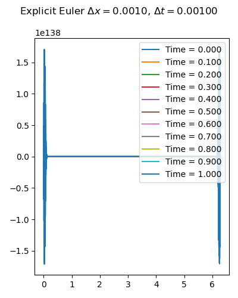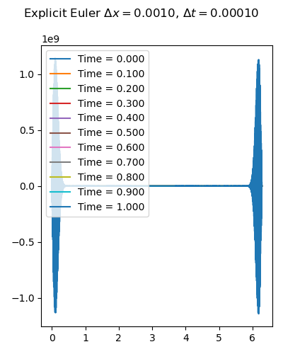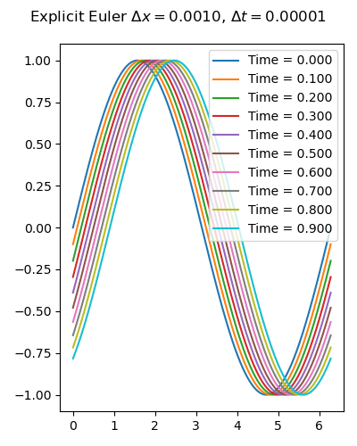

---

### Implicit Euler and central difference (1/n)

$$
\frac{u^{n+1}_i-u^n_i}{\Delta t} + \frac{u_{i+1}^{n+1}-u_{i-1}^{n+1}}{2\Delta x}=0 
$$

Von Neumann analysis
$$
\begin{align*}
&1+\frac{\Delta t}{2\Delta x} \left( e^{ik \Delta x} - e^{-ik \Delta x} \right) = 1+\frac{\Delta t}{\Delta x} i \sin(k \Delta x)\\
&|g(k)| = \left\lvert 1+\frac{\Delta t}{\Delta x} i \sin(k \Delta x)\right\rvert^{-1} <1, \qquad \forall k\in \mathbb R.
\end{align*}
$$
Which is even too much. Ok unconditional stability, but having an amplification factor always smaller than 1 is weird for a solution that keeps its energy.
$\lVert u(t) \rVert_{L^2} = \lVert u(0) \rVert_{L^2}$, here we will have that $\lVert u^n \rVert_{L^2} = |g(k)|^n \lVert u(0) \rVert_{L^2} \ll  \lVert u(0) \rVert_{L^2}$ for many timesteps. 

---

### Implicit Euler and central difference (2/n)
The mass matrix of the linear system is
$$
\begin{pmatrix}
1 &\frac{\Delta t}{2\Delta x} & 0&\dots & \dots\\
-\frac{\Delta t}{2\Delta x} &1 &\frac{\Delta t}{2\Delta x} &\dots & \dots\\
\vdots & \ddots & \ddots & \ddots &\vdots\\
\vdots & \cdots & \ddots & \ddots &\vdots\\
0&\dots & \dots &-\frac{\Delta t}{2\Delta x} &1     
\end{pmatrix}
$$
and it is not symmetric, not (unconditionally) positive definite, so we cannot expect the good properties of the heat equation. It might be not that simple to solve the linear system for large $\Delta t$.

---

## Numerical simulations for implicit euler and central difference (periodic BC)

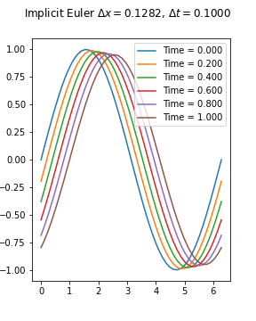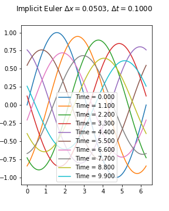
Very dissipative (and expensive w.r.t. an explicit method)!

---

## Can we do better with the spatial discretization? Lax-Friedrichs
A simple change in the method can adjust it:
The **Lax-Friedrichs** method considers this
$$
u^{n+1}_i= \frac{u^n_{i+1}+u^n_{i-1}}{2} - a\frac{\Delta t}{2\Delta x} (u_{i+1}^n-u_{i-1}^n)
$$
or
$$
u^{n+1}_i= u^n_i +\frac{u^n_{i+1}-2u^n_i +u^n_{i-1}}{2} - a\frac{\Delta t}{2\Delta x} (u_{i+1}^n-u_{i-1}^n)
$$

### Von Neumann
$$
g(k) = 1+ \frac{e^{ik\Delta x}-2+e^{-ik\Delta x}}{2} - a\frac{\Delta t}{2\Delta x} (e^{ik\Delta x}-e^{-ik\Delta x}) = 1+(\cos(k\Delta x) -1) - a\frac{\Delta t}{\Delta x}i \sin(k\Delta x). 
$$
Let us denote $\theta = k \Delta x \in [0,2\pi]$, we have
$$
|g(k)| = \sqrt{\cos(\theta)^2 + \left(a\frac{\Delta t}{\Delta x}\right)^2\sin(\theta)^2} \leq 1 \Longleftarrow \left\lvert a\frac{\Delta t}{\Delta x}\right\rvert \leq 1.
$$ 
This is much better! We can choose $\Delta t \approx \Delta x$!

---

# CFL condition (Courant-Friedrichs-Lax)
The condition
$$\Delta t \leq \frac{\Delta x}{|a|}$$
is called CFL condition and guarantees the stability for many explicit methods for hyperbolic problems.

Typically, one chooses a coefficient (the CFL coefficient) and sets the timestep, so that the CFL condition is verified. So, given a geometry, one can choose 

$$
\Delta t = \text{CFL}\frac{\Delta x}{|a|}
$$ 
with $\text{CFL}$ equals to any number below or equal to 1 and have a stable scheme.
Typically is better to choose $\text{CFL}<1$ just to be on the safe side, like 0.9.
Indeed 

$$\Delta t \leq \frac{\Delta x}{|a|} \Longleftrightarrow \text{CFL} =\frac{\Delta t}{\Delta x}|a| \leq 1. $$

---

### Von Neumann for Lax-Friedrichs and explicit Euler
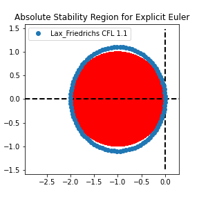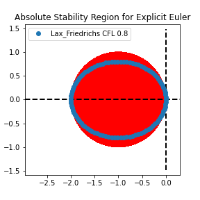

---

## What has changed? Lax-Friedrichs
$$
u^{n+1}_i= u^n_i +\underbrace{\frac{u^n_{i+1}-2u^n_i +u^n_{i-1}}{2}}_{\approx \frac12 \Delta x^2 u_{xx}} - a\frac{\Delta t}{2\Delta x} (u_{i+1}^n-u_{i-1}^n)
$$
We have added some **artificial viscosity** (diffusion), such that the method remains consistent, i.e.
$$
\begin{align*}
&u(t+\Delta t,x)= u(t,x)  +\frac12 \Delta x^2 u_{xx}- a \Delta t \partial_x u(t,x)\\
&\partial_t u(t,x)+ a \partial_x u(t,x)-\Delta x \frac{\Delta x}{2\Delta t} u_{xx} =0
\end{align*}
$$
So, the last term goes to zero when $\Delta x\to 0$ if $\Delta t \sim \Delta x$.

* The diffusion term has a stabilization effect, as we have seen in parabolic and elliptic equations, diffusion smoothens the oscillations and brings regularity.
* We are actually solving an advection-diffusion equation with **vanishing viscosity** (as $\Delta x \to 0$) and we know that the vanishing viscosity solution converges to the advection solution.

---

# Another spatial discretization idea: upwind (1/2)

Another point of view for advection equation $\partial_t u + a \partial_x u=0$

### Why is central difference wrong?

In advection problems the information travels along the characteristics, so if $a$ is positive it travels from left to right, while if $a$ is negative, it travels from right to left. 

Using a central discretization makes the information travel both from left and right to a certain point. We are going against the characteristics!

Instead one could use an **upwinded** flux (that follows the wind/the velocity $a$).
$$
u^{n+1}_i =u^n_i - a \Delta t \begin{cases}
\frac{u_i^n-u_{i-1}^n}{\Delta x} \qquad &\text{if }a>0,\\
\frac{u_{i+1}^n-u_{i}^n}{\Delta x} \qquad &\text{if }a<0.
\end{cases}
$$

If $a>0$ this sums up to
$$
u^{n+1}_i =u^n_i-a\frac{\Delta t}{\Delta x}(u^n_i-u^n_{i-1}) = u^n_i-a\frac{\Delta t}{2\Delta x}(u^n_{i+1}-u^n_{i-1})  +\underbrace{a\frac{\Delta t}{2\Delta x}(u^n_{i+1}-2u_i^n+u^n_{i-1})}_{a\frac{\Delta t \Delta x }{2} \partial_{xx}u}
$$

---

# Another spatial discretization idea: upwind (2/2)
Again we are using some **numerical viscosity** proportional to $|a|\frac{\Delta x}{2}$

If we compute the von Neumann stability analysis we get for $a>0$
$$-a\frac{\Delta t}{\Delta x} (u^n_i-u^n_{i-1}) \Longrightarrow -\text{CFL}(1-e^{-i k \Delta x}) $$ 

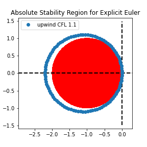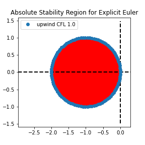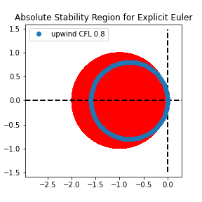

Stability for $\text{CFL}\leq 1$.

---

## Another interpretation of CFL condition
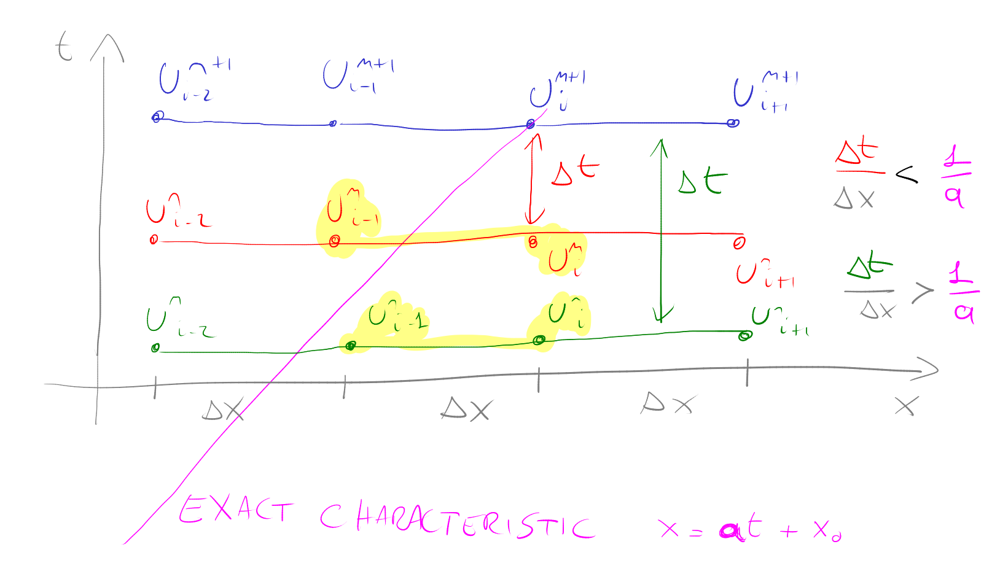

---

## Consistency of upwind/Lax-Friedrichs

$$
\frac{u^{n+1}_i-u^n_i}{\Delta t} + a \frac{u^n_{i+1}-u^n_{i-1}}{2\Delta x} - \varepsilon \frac{u^{n}_{i+1}-2u^n_i+u^n_{i-1}}{2\Delta x^2}=0
$$
Where $\varepsilon = \frac{\Delta x^2}{\Delta t}$ and  $\varepsilon = a \Delta x$ for upwind. So supposing $\Delta t \sim \Delta x$, we have that $\varepsilon = C \Delta x$ in both cases.

Substituing the exact solution, we have
$$
\partial_t u(t,x) + \frac{\Delta t}{2}  \partial_{tt} u(t,x) + a \partial_x u + a \frac{\Delta x^2}{6} \partial_{xxx}u  - \frac{C}{2} \Delta x \partial_{xx} u=O(\Delta x^3)
$$
In general, this is a **first order scheme**!

But it can become a second order scheme if we match the first order terms (recall that $\partial_{tt} u = a^2 \partial_{xx} u$): 
$$
\frac{\Delta t}{2}  \partial_{tt} u(t,x) - \frac{C}{2} \Delta x \partial_{xx} u = \frac{\Delta t}{2 a^2}  \partial_{xx} u - \frac{C \Delta x}{2}  \partial_{xx} u 
$$
so choosing  $C=\frac{\Delta t a^2}{\Delta x }$ we will have a second order scheme!

---

# High order: Lax-Wendroff

$$
\frac{u^{n+1}_i-u^n_i}{\Delta t} + a \frac{u^n_{i+1}-u^n_{i-1}}{2\Delta x} - \frac{\Delta t}{2} a^2 \frac{u^{n}_{i+1}-2u^n_i+u^n_{i-1}}{\Delta x^2}=0
$$
is the just obtained second order scheme.

Another way of getting it is doing a Taylor expansion and the equation $\partial_t u=-a\partial_x u$ and $\partial_{tt}u=a\partial_{xx} u$:
$$
\begin{align*}
&u^{n+1}_i \approx u^n_i +\Delta t \partial_t u^n_i+ \frac{\Delta t^2}{2} \partial_{tt} u^n_i\\
&u^{n+1}_i \approx u^n_i -a\Delta t \partial_x u^n_i+ \frac{\Delta t^2}{2} a^2\partial_{xx} u^n_i\\
&u^{n+1}_i \approx u^n_i -a\Delta t \frac{u^n_{i+1}-u^n_{i-1}}{2\Delta x}+ \frac{\Delta t^2}{2} a^2\frac{u^{n}_{i+1}-2u_i^n+u^n_{i-1}}{\Delta x^2}
\end{align*}
$$

### Von Neumann
$$
-\text{CFL} \,i\sin(\theta) +\text{CFL}^2 (\cos(\theta)-1)
$$
Ellipsis with center in $(-\text{CFL}^2,0)$ with imaginary semi axis = $\text{CFL}$ and real semiaxis = $\text{CFL}^2$. So, for $\text{CFL}\leq 1$ it is contained in the Explicit Euler stability region and it is Lax-Richtmyer stable!

---

# Lax-Wendroff von Neumann plots

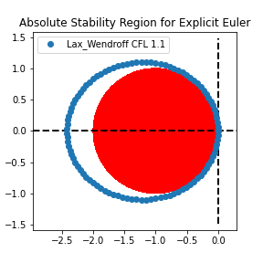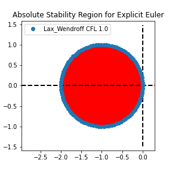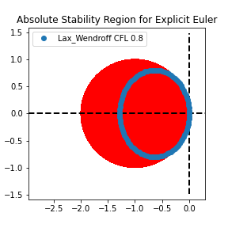

---

# High order upwind: Beam-Warming

We can also use the upwind idea to construct a high order scheme, extending the stencil on one side.

We can say, the information travels from left to right (for example) and choose a stencil that discretizes the first derivative only from one side. For example, a second order approximation of the first derivatives in the points $x_i, x_{i-1}, x_{i-2}$, i.e., using the method of lines, for $a>0$, is given by
$$
\partial_t u_i = -a \frac{u_{i-2}-4u_{i-1}+3u_i}{2\Delta x}.
$$
This is only second order in space, if one applies the explicit Euler. If one proceeds similarly to the Lax-Wendroff method with a second order Taylor expansion in time, it gets the so-called **Beam-Warming** scheme
$$
u_i^{n+1} = u^n_i  -a\Delta t \frac{u^n_{i-2}-4u^n_{i-1}+3u^n_i}{2\Delta x} +a^2\Delta t^2 \frac{u^n_{i-2}-2u^n_{i-1}+u^n_i}{2\Delta x^2}
$$
[Finite difference stencil generator](https://web.media.mit.edu/~crtaylor/calculator.html)

---

# Beam-Warming von Neumann plots
Stable up to CFL 2
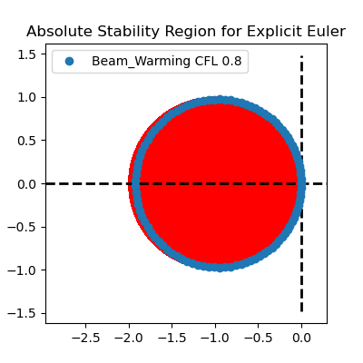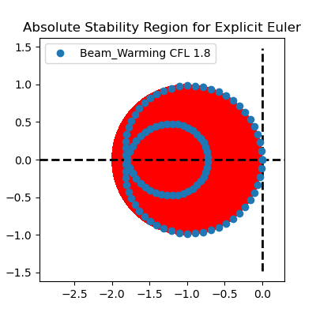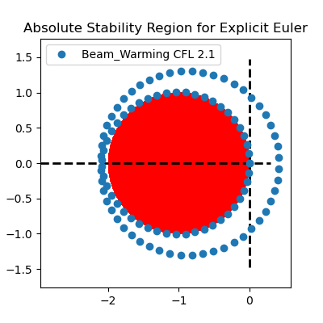

---

## Some simulations with convergence tests

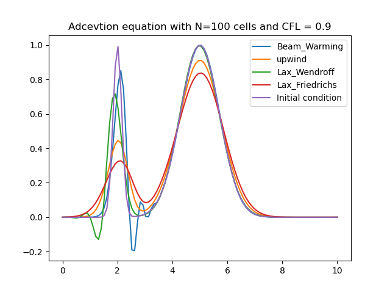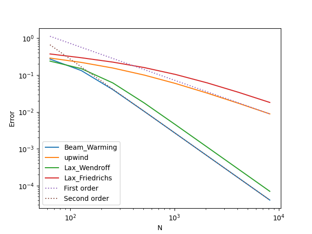

---

## On the boundary conditions
* Periodic: no problem
* Dirichlet: one has to be careful what to do. Since the information travels in one direction, it does not "make much sense" to impose a condition on the right if the information travels from left to right. Though, one might still want to impose it. This might create boundary layers and similar effects.
* Outflow boundary conditions: this is the equivalent of homogeneous Neumann boundary conditions. Suppose $a>0$, so we know on the right no info should come from the boundary, so we do **nothing** there. 

### Ghosts nodes
To impose these type of boundary conditions, sometimes ghosts values are used to compute the operators. For example, 
* for Dirichlet one can assume that if $u_0$ is the left value, we can use $u_{-1}=u_L$ to compute the solution;
* for outflow, a Ghost value equal to what we have inside the domain is repeated in the ghosts value, if $u_{N}$ is the last value we have, $u_{N+1}=u_N$ will do the job. This is essentially a homogeneous Neumann boundary condition, since the derivative $\partial_x u(x_R)=0$ numerically.
* also periodic BC can be imposed in similar way, setting $u_{-1} = u_{N-1}$ and $u_{N+1} = u_{1}$ etc. 
