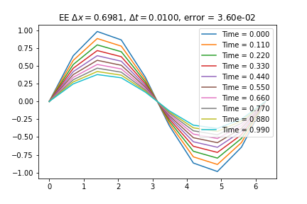
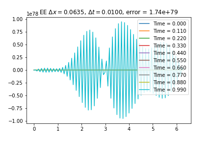
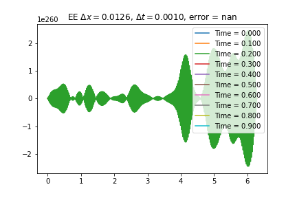
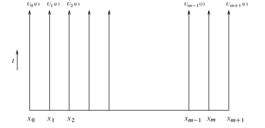
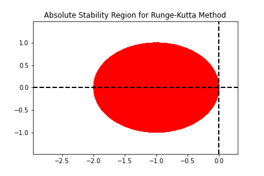
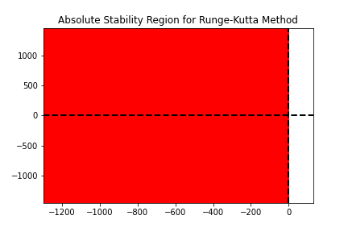

<!--
title: Lecture 031 Transport
paginate: true
_class: titlepage
-->

# Linear Transport Equation

---

# Linear transport equation

Given a domain $\Omega \in \mathbb R$ we look for a solution $u:\Omega \times \mathbb R^+ \to \mathbb R$ solution of 

$$\partial_t u(t,x) -a \partial_{xx} u(t,x) = f(t,x),$$
with $a>0$.

### Physical applications
* Heat conduction ($u$ temperature, $a$ thermal conductivity, $u_0$ initial temperature, Dirichlet = Thermal bath, Neumann = temperature change rate ),
* Elastic membrane subject to a body force $f$ ($u$ is the displacement),
* Electric potential distribution ($u$) due to a charge $f$.

## Difference with Elliptic
* Variation in time

---

## Cauchy problem
We couple the PDE with initial conditions (IC) at time $t=0$ AND boundary conditions (either Nuemann or Dirichlet) for all times $t\in\mathbb R^{+}$. 
$$
\begin{cases}
    \partial_t u(t,x) -a \partial_{xx} u(t,x) = f(t,x), & t>0, x\in\Omega\\
    u(0,x)=u_0(x), & x\in\Omega,\\  
    u(t,x) = u_D(t,x), & \forall t \in \mathbb R^+, x\in\Gamma_D \subset \partial \Omega,\\
    \partial_x u(t,x) \cdot \mathbf{n} = u_N(t,x), & \forall t \in \mathbb R^+, x\in\Gamma_N \subset \partial \Omega.
\end{cases}
$$

### Periodic boundary conditions
Alternatively, for boundary conditions one can impose periodic conditions, i.e., if $\Omega = [a,b]$, then 
$$u(t,a)=u(t,b)$$
 for all $t\in \mathbb R^+$.

---

## Exact solutions for periodic boundary conditions (Fourier) (1/n)

### Eigenfunctions of the differential operator
First of all, let's notice that the trigonometric functions are special functions for the differential operator
$$
\begin{align*}
&\partial_ x e^{i x k} = i k e^{i x k}, \qquad &\partial_{xx} e^{i x k} = -k^2 e^{i x k},\\
&\partial_x \sin(kx) = k \cos(kx), \qquad &\partial_{xx} \sin(kx) = -k^2 \sin(kx),\\
&\partial_x \cos(kx) = -k \sin(kx), \qquad &\partial_{xx} \cos(kx) = -k^2 \cos(kx).
\end{align*}
$$

Recall:
$$
\begin{align*}
&\sin(x) = \frac{e^{ix}-e^{-ix}}{2i}, \qquad \cos(x) = \frac{e^{ix}+e^{-ix}}{2}.
\end{align*}
$$

So we focus on the trigonometric functions of the type $e^{ixk}$.

---

## Exact solutions for periodic boundary conditions (Fourier) (2/n)

### Fourier series
For simplicity let's consider $\Omega = [-\pi,\pi]$ with periodic boundary conditions. We can decompose the initial condtion in Fourier series if $u_0\in L^2(\Omega)$.
$$
u_0(x) = \sum_{k\in \mathbb Z} c_k e^{i k x}, \qquad c_k = \frac{1}{2\pi} \int_{-\pi}^{\pi} u_0(x) e^{-i k x} \textrm{d}x.
$$

### Parseval theorem
$$
\lVert \mathbf{c} \rVert_2^2=\sum_{k\in \mathbb Z} |c_k|^2 = \frac{1}{2\pi} \int_{-\pi}^{\pi} |u_0(x)|^2 \textrm{d}x = \frac{1}{2\pi} \lVert u_0 \rVert_2^2.
$$

[Wikipedia page on Fourier series](https://en.wikipedia.org/wiki/Fourier_series)
[Youtube playlist of 3Blue1Brown on Fourier series](https://www.youtube.com/watch?v=spUNpyF58BY&list=PL4VT47y1w7A1-T_VIcufa7mCM3XrSA5DD)
[Youtube video on solving heat equations with Fourier](https://www.youtube.com/watch?v=ToIXSwZ1pJU&list=PL4VT47y1w7A1-T_VIcufa7mCM3XrSA5DD&index=3)

---

## Exact solutions for periodic boundary conditions (Fourier) (3/n)

### Exploiting linearity for heat equation
Let's us use the ansatz $u(t,x) = \sum_{k\in \mathbb Z} c_k(t) e^{i k x}$, where $c_k(t)$ are the Fourier coefficients of the solution at time $t$.
$$
\begin{align*}
    &\partial_t u(t,x) - a \partial_{xx} u(t,x)=0\\
    &\sum_{k\in \mathbb Z}   \partial_t c_k(t) e^{i k x} - a \sum_{k\in \mathbb Z} c_k(t) \partial_{xx} e^{i k x}=0\\
    &\sum_{k\in \mathbb Z}   \partial_t c_k(t) e^{i k x} + a \sum_{k\in \mathbb Z} k^2 c_k(t)  e^{i k x}=0\\
    &  \partial_t c_k(t) + a k^2 c_k(t) = 0, \quad \forall k\in \mathbb Z,\\
    &c_k(t) = c_k(0) e^{-a k^2 t}, \quad \forall k\in \mathbb Z.
\end{align*}
$$

---

# Finite Difference Discretization of $\partial_t u - \partial_{xx} u=0$
* Domain in space $\Omega=[a,b]$ and time $[0,T]$
* Grid in space $a=x_0<x_1<\dots <x_i<\dots<x_{N_x}=b$
* Grid in time $0=t^0<t^1<\dots<t^n<\dots<t^{N_t}=T$

### Explicit Euler

$$
\frac{u^{n+1}_i-u^n_i}{\Delta t} - \frac{u_{i+1}^n-2u_i^n+u_{i-1}^n}{\Delta x^2}=0 
$$

### Implicit Euler

$$
\frac{u^{n+1}_i-u^n_i}{\Delta t} - \frac{u_{i+1}^{n+1}-2u_i^{n+1}+u_{i-1}^{n+1}}{\Delta x^2}=0 
$$

### Crank-Nicolson

$$
\frac{u^{n+1}_i-u^n_i}{\Delta t} - \frac{u_{i+1}^{n+1}-2u_i^{n+1}+u_{i-1}^{n+1}}{2\Delta x^2}- \frac{u_{i+1}^{n}-2u_i^{n}+u_{i-1}^{n}}{2\Delta x^2}=0 
$$

---

## Numerical solutions
### Explicit Euler
$$
\frac{u^{n+1}_i-u^n_i}{\Delta t} - \frac{u_{i+1}^n-2u_i^n+u_{i-1}^n}{\Delta x^2}=0 
$$
* Explicit -> no systems
### Implicit Euler
$$
\frac{u^{n+1}_i-u^n_i}{\Delta t} - \frac{u_{i+1}^{n+1}-2u_i^{n+1}+u_{i-1}^{n+1}}{\Delta x^2}=0 
$$
* Linear system 
$$
LHS =I-\frac{\Delta t}{\Delta x^2} D^2 = \begin{pmatrix}
1+2\frac{\Delta t}{\Delta x^2} &-\frac{\Delta t}{\Delta x^2} & 0&\dots & \dots\\
-\frac{\Delta t}{\Delta x^2} &1+2\frac{\Delta t}{\Delta x^2} &-\frac{\Delta t}{\Delta x^2} &\dots & \dots\\
\vdots & \ddots & \ddots & \ddots &\vdots\\
0&\dots & \dots &-\frac{\Delta t}{\Delta x^2} &1+2\frac{\Delta t}{\Delta x^2}     
\end{pmatrix} \qquad RHS = u^n
$$

---

### Crank-Nicolson
$$
\frac{u^{n+1}_i-u^n_i}{\Delta t} - \frac{u_{i+1}^{n+1}-2u_i^{n+1}+u_{i-1}^{n+1}}{2\Delta x^2}- \frac{u_{i+1}^{n}-2u_i^{n}+u_{i-1}^{n}}{2\Delta x^2}=0 
$$
* Linear system 
$$
LHS = I-\frac{1}{2}\frac{\Delta t}{\Delta x^2} D^2 = \begin{pmatrix}
1+\frac{\Delta t}{\Delta x^2} &-\frac{\Delta t}{2\Delta x^2} & 0&\dots & \dots\\
-\frac{\Delta t}{2\Delta x^2} &1+\frac{\Delta t}{\Delta x^2} &-\frac{\Delta t}{2\Delta x^2} &\dots & \dots\\
\vdots & \ddots & \ddots & \ddots &\vdots\\
0&\dots & \dots &-\frac{\Delta t}{2\Delta x^2} &1+\frac{\Delta t}{\Delta x^2}     
\end{pmatrix}
$$
$$
RHS = u^n +\frac12 \frac{\Delta t}{\Delta x^2} D^2 u^n
$$

---

## Consistency
### Explicit Euler

$$
\begin{align*}
&\frac{u^{n+1}_i-u^n_i}{\Delta t} - \frac{u_{i+1}^n-2u_i^n+u_{i-1}^n}{\Delta x^2}=0 \\
e_{\Delta t, \Delta x}^{EE} =&\frac{u(t^{n+1},x_i)-u(t^n,x_i)}{\Delta t} - \frac{u(t^n,x_{i+1})-2u(t^n,x_i)+u(t^n,x_{i-1})}{\Delta x^2} \\
=&\partial_t u(t^n,x_i) +\frac{\Delta t}2 \partial_{tt}u(t^n,x_i) - \partial_{xx} u(t^n,x_i) -\frac{\Delta x^2}{12} \partial_{xxxx}u(t^n,x_i)+O(\Delta t^2) + O(\Delta x^3) \\
=&   \frac{\Delta t}2 \partial_{tt}u(t^n,x_i) -\frac{\Delta x^2}{12} \partial_{xxxx}u(t^n,x_i)+O(\Delta t^2) + O(\Delta x^3) = O(\Delta t) + O(\Delta x^2)
\end{align*}
$$

Second order in space and first order in time

---

## Consistency
### Crank-Nicolson

$$
\begin{align*}
&\frac{u^{n+1}_i-u^n_i}{\Delta t} - \frac{u_{i+1}^n-2u_i^n+u_{i-1}^n}{2\Delta x^2}- \frac{u_{i+1}^{n+1}-2u_i^{n+1}+u_{i-1}^{n+1}}{2\Delta x^2}=0 \\
e_{\Delta t, \Delta x}^{EE} =&\frac{u(t^{n+1},x_i)-u(t^n,x_i)}{\Delta t} - \frac{u(t^n,x_{i+1})-2u(t^n,x_i)+u(t^n,x_{i-1})}{\Delta x^2} \\
=&\partial_t u(t^n,x_i) +\frac{\Delta t}2 \partial_{tt}u(t^n,x_i) - \partial_{xx} u(t^n,x_i) -\frac{\Delta x^2}{12} \partial_{xxxx}u(t^n,x_i)\\
&- \frac{\Delta t}{2} \underbrace{\partial_{txx} u(t^n,x_i)}_{=\partial_{tt}u} -\frac{\Delta t}{2}\frac{\Delta x^2}{12} \partial_{xxxxt}u(t^n,x_i)+O(\Delta t^2) + O(\Delta x^4) \\
=&  \frac{\Delta t}2 \partial_{tt}u(t^n,x_i)-\frac{\Delta t}2 \partial_{tt}u(t^n,x_i) +O(\Delta t^2) + O(\Delta x^2) = O(\Delta t^2) + O(\Delta x^2)
\end{align*}
$$
Second order in space and time

---

# Example
$$
\begin{align*}
    &\begin{cases}
        \partial_t u - \partial_{xx}u =0
        u_0(x) = \sin(x)\qquad x\in [0,2\pi],\\
        u(t,0) = 0. \qquad t \in \mathbb{R}^+,\\
        u(t,2\pi) = 0. \qquad t \in \mathbb{R}^+,
    \end{cases}\qquad
    &u(t,x)=e^{-t}\sin(x)\qquad x\in [0,2\pi],\qquad t \in \mathbb{R}^+.
\end{align*}
$$

---

## Explicit Euler

---

# Semidiscretization / Method of lines

We have seen how to discretize the spatial derivatives, we can write a system of ODEs for that discretization.

$$
u_i'(t) = \frac{u_{i+1}(t)-2u_i(t)+u_{i-1}}{\Delta x^2}\qquad \forall i=1,\dots,N_x.
$$
Then, we apply a time discretization method (e.g. explicit Euler, implicit Euler, Runge-Kutta, etc.)

$$
U'(t) = A U(t) + g(t) =f(U,t)
$$
where $g$ contains boundary conditions and 
$$
A:=\frac{1}{\Delta x^2}\begin{bmatrix}
-2 & 1 & 0 & \dots & 0\\
1 & -2 & 1 & \dots & 0\\
0 & 1 & -2 & \dots & 0\\
\vdots & \vdots & \vdots & \ddots & \vdots\\
0 & 0 & 0 & \dots & -2
\end{bmatrix}
$$

---

# Method of lines (MOL) interpretation

---

## Advantage of MOL

We can study the stability of the numerical problem, splitting the spatial and temporal discretization. 

### Stability region of a RK method
A Runge-Kutta method for a linear problem $u'(t) = \lambda u(t)$ can be written as 
$$
y^{n+1} = R(z) y^n,\qquad \text{ with }z =\lambda \Delta t,
$$
and we define the stability region as $\mathcal{S}:= \lbrace z \in \mathbb{C}: |R(z)|\leq 1 \rbrace.$

### Connection with semidiscretized PDE

In our case, we have that the linear system
$$
U'(t) = A U(t),
$$
can be diagonalized with an orthogonal transformation $Z$ (i.e. $ZZ^T=I$) such that $Z^T A Z =D$  with $D$ diagonal matrix with the values of the **eigenvalues** of $A$. So, if we define $Y(t)= Z^TU(t)$ we can study many decoupled equations, instead of one system
$$
Y'(t)= Z^T U'(t) = Z^T A U(t) = Z^T A Z Z^T U(t) = D Z^T U(t) = D Y(t).
$$ 

If $\lambda_i \in \mathcal{S}$ for all $\lambda_i$ eigenvalues of $A$, then the method is stable.

---

## Stability regions of RK methods
Explicit Euler $\qquad\qquad\qquad\qquad$ Implicit Euler $\qquad\qquad\qquad\qquad$ Crank-Nicolson

---

## Eigenvalues of the spatial semidiscretization

$$
A:=\frac{1}{\Delta x^2}\underbrace{\begin{bmatrix}
-2 & 1 & 0 & \dots & 0\\
1 & -2 & 1 & \dots & 0\\
0 & 1 & -2 & \dots & 0\\
\vdots & \vdots & \vdots & \ddots & \vdots\\
0 & 0 & 0 & \dots & -2
\end{bmatrix}}_{=:\tilde{A}}
$$

* $A$ is negative definite and symmetric
* $A$ has real non-positive **real** eigenvalues
* The eigenvalues of $A$ scale as $\frac{1}{\Delta x^2}$
* For explicit Euler we need $\Delta t < 2 \frac{\Delta x^2}{\max_i \tilde{\lambda}_i}$ where $\tilde{\lambda}_i$ are te eigenvalues of $\tilde{A}$ independent of $\Delta x$ and $\Delta t$. **Very expensive!**
* For implicit Euler and Crank-Nicolson, we are unconditionally (for every $\Delta t$) stable!

---

# Convergence
* Question: how do we proceed now that we have $\Delta t$ and $\Delta x$? What is the limit process we are interested in?
* Answer: typically we link the two quantities, e.g. $\Delta t = C \Delta x$ or  $\Delta t = C \Delta x^2$ or only proportionality, so that when $h=\Delta x \to 0$ also $\Delta t \to 0$.

Method we have considered can be written as
$$
U^{n+1}=B(\Delta t) U^n + b^n(\Delta t), \qquad U^{n+1},U^n,b^n(\Delta t) \in \mathbb R^{N_x}, \, B(\Delta t)\in\mathbb R^{N_x \times N_x},
$$
with $N_x \approx \frac{1}{\Delta x}$. In general all these quantities depend on both $\Delta x$ and $\Delta t$ which are linked.

### Examples
* Explicit Euler: $B(\Delta t) = I + \Delta t A$
* Implicit Euler: $B(\Delta t) = (I - \Delta t A)^{-1}$
* Crank-Nicolson: $B(\Delta t) = (I - \frac12 \Delta t A)^{-1}(I +\frac12 \Delta t A)$

---

# Lax-Richtmyer stability
A **linear** method of the form
$$
U^{n+1}=B(\Delta t) U^n + b^n(\Delta t), \qquad U^{n+1},U^n,b^n(\Delta t) \in \mathbb R^{N_x}, \, B(\Delta t)\in\mathbb R^{N_x \times N_x},
$$
is **Lax-Richtmyer stable** if for each final time $T$ there exists a constant $C_T$ such that 
$$
\lVert B(\Delta t)^n \rVert \leq C_T
$$ 
for all $\Delta t$ and integers $n$ such that $n\Delta t\leq T$.

# Lax equivalence theorem

A **consistent** **linear** method of the previous form is **convergent** if and only if it is Lax-Richtmyer stable. 

---

## Lax-Richtmyer condition examples $\lVert B(\Delta t)^n \rVert \leq C_T$ 
Recall that $A$ has non-positive eigenvalues that scale as $\frac{1}{\Delta x^2}$

### Implicit Euler
$\lVert B(\Delta t) \rVert_2 = \max \text{eig} ( (I-\Delta t A)^{-1})\leq 1$ .

### Crank-Nicolson
$\lVert B(\Delta t) \rVert_2 = \max \text{eig} ( (I-\frac12 \Delta t A)^{-1}(I+\frac12 \Delta t A))\leq \max_i \frac{1+\frac12 \Delta t \lambda_i}{1-\frac12 \Delta t\lambda_i}\leq 1$. 

### Explicit Euler
$$\lVert B(\Delta t) \rVert \leq 1 + \alpha \Delta t \Longrightarrow \lVert B(\Delta t)^n \rVert \leq (1+\alpha \Delta t)^n \leq e^{\alpha T}$$
but non-trivial, as $B(\Delta t)$ dimension depends on $\Delta t, \Delta x$ and the eigenvalues as well.

---

# Von Neumann stability analysis (1/n)

* Based on the Fourier analysis (so for periodic BC problems)
* Limited to constant coefficients linear problems
* Typically other types of BC can bring in extra stabilization, but von Neumann analysis is not the right tool to study it

Basic idea:
* Fourier basis functions are independent and are such that $\partial_x e^{i k x} = i k e^{i k x}$
* At the discrete level, we consider $W^{ k}_j = e^{i (j\Delta x)  k}$ a discrete eigenfunction of a discrete differential operator

### Example
Take $(D V)_j := \frac{V_{j+1}-V_{j-1}}{2\Delta x}$, we have that
$$
\begin{align*}
(D W^{ k})_j &= \frac{1}{2\Delta x} \left( e^{i(j+1)\Delta x  k}-e^{i(j-1)\Delta x  k}  \right)= \frac{1}{2\Delta x} \left( e^{i\Delta x  k}-e^{-i\Delta x  k}  \right) e^{i j\Delta x  k}\\
 &= \frac{i}{\Delta x}  \sin(\Delta x  k )  e^{i j\Delta x  k}= \frac{i}{\Delta x}  \sin(\Delta x  k )  W_j.
\end{align*}
$$

---

# Von Neumann stability analysis (2/n)
We want to check that 
$$
\lVert U^{n+1}\rVert_2 \leq (1+\alpha \Delta t ) \lVert U ^n \rVert_2.
$$

For Parseval, we can look at the Fourier coefficients ($c_k$) norm instead and, since all the Fourier modes are independent, we can check each of them and how it behaves!
$$
\lVert c^{n+1}_k \rVert_2 \leq (1+\alpha \Delta t ) \lVert c^{n}_k \rVert_2.
$$

We can observe that each mode develops with a linear coefficient
$$
c_k^{n+1} = g(k) c_k^n, \text{ where }g(k)\in \mathbb C \text{ is called amplification factor.}
$$
If $|g(k)|\leq 1 +\alpha \Delta t$ for all $k$, then the method is Lax-Richtmyer stable.

---

# Von Neumann amplification factors $c_k^{n+1} = g(k) c_k^n$
### Example Explicit Euler
$$
\begin{align*}
c_k^{n+1} e^{ij\Delta x k} &= c_k^n e^{ij\Delta x k} + \frac{\Delta t}{\Delta x ^2} (c_k^n e^{i(j+1)\Delta x k}-2c_k^n e^{ij\Delta x k}+c_k^n e^{i(j-1)\Delta x k})\\
g(k) &= 1+\frac{\Delta t}{\Delta x ^2} ( e^{i\Delta x k}-2+ e^{-i\Delta x k}) = 1-2\frac{\Delta t}{\Delta x ^2}(1-\cos(\Delta x k) )
\end{align*}
$$
since $-1\leq\cos(\Delta x k)\leq 1$ we have that $1-4\frac{\Delta t}{\Delta x^2} \leq g(\xi) \leq 1$. It is Lax-Richtmyer stable if $|g(k)|\leq 1$, so we choose,
$$1-4\frac{\Delta t}{\Delta x^2}\geq -1 \Longleftrightarrow \frac{\Delta t}{\Delta x^2} \leq \frac12 .$$

---

# Von Neumann amplification factors $c_k^{n+1} = g(k) c_k^n$

### Example implicit euler
$$
\begin{align*}
&c_k^{n+1} e^{ij\Delta x k} = c_k^n e^{ij\Delta x k} + \frac{\Delta t}{\Delta x ^2} (c_k^{n+1} e^{i(j+1)\Delta x k}-2c_k^{n+1} e^{ij\Delta x k}+c_k^{n+1} e^{i(j-1)\Delta x k})\\
&(1-\frac{\Delta t}{\Delta x ^2}(2\cos(\Delta x k) -2) ) c_k^{n+1} = c_k^n\\
&g(k) = \frac{1}{1-\frac{\Delta t}{\Delta x ^2}(2\cos(\Delta x k) -2) }\\
&|g(k)| = \left\lvert 1-\frac{\Delta t}{\Delta x ^2}(2\cos(\Delta x k) -2) \right\rvert^{-1}=\left\lvert 1+2\frac{\Delta t}{\Delta x ^2}\underbrace{(1-\cos(\Delta x k))}_{\geq 0} \right\rvert^{-1} \leq 1
\end{align*}
$$
for all $k\in \mathbb Z$ and for $\Delta t, \Delta x$. 

### Exercise: Crank-Nicolson

---

# Comparison with stability region of the ODE solver
One can study only the spatial discretization, look at the eigenvalues and compare them with the stability region of the time discretization method.

Recall: given a time discretization method for the ODE $y'=\lambda y$, it is stable if $|R(\lambda \Delta t)|\leq 1$.
In our case, we can look at the semidiscretization of the Fourier coefficients and we have
$$c_k'(t) = -\frac{1}{\Delta x^2} 2(1-\cos(k\Delta x)) c_k(t)  = \lambda_k c_k(t).$$

* Explicit Euler: $R(z)=1+z$ so $|R(\lambda_k \Delta t)|\leq 1$ is $|1-\frac{\Delta t}{\Delta x^2} 2(1-\cos(k\Delta x))|\leq 1$ (as before)

### Exercise: try with other RK methods (Implicit Euler, Crank-Nicolson, RK4, LobattoIIIA methods)

---

# Weak formulation of $\partial_t u -a\Delta u=0$
### Strong form 
$$
\begin{cases}
\partial_t u(t,x) -a\Delta u(t,x)=f(t,x)\qquad& \text{ in }\mathbb R^+ \times \Omega\\
u(0,x) = u_0(x)\qquad& \text{ for  } x \in \Omega\\
u(t,x) = g_D(t,x)\qquad& \text{ for  } x \in \Gamma_D, \, t \in \mathbb R^+,\\
a \nabla_x u(t,x)\cdot n = g_N(t,x)\qquad& \text{ for  } x \in \Gamma_N, \, t \in \mathbb R^+.
\end{cases}
$$
### Weak form
For every $t\in\mathbb R^+$, we look for $u(t)\in H^1(\Omega)$ such that for all $v\in H^1_{\Gamma_D}(\Omega)$ we have that
$$
\begin{cases}
\int_\Omega \partial_t u(t,x) v(x) + \nabla u(t,x)\cdot \nabla v(x) \mathrm{d}x = \int_\Omega f(t,x) v(x)  \mathrm{d}x + \int_{\Gamma_N} g_N(t,x) v(x) \mathrm{d}s\\
u(t,x) = g(t,x)\qquad  \text{ for  } x \in \Gamma_D, \, t \in \mathbb R^+.
\end{cases}
$$

---

## Weak form with linear/bilinear forms

For every $t\in\mathbb R^+$, we look for $u(t)\in H^1(\Omega)$ such that for all $v\in H^1_{\Gamma_D}(\Omega)=:V$ we have that
$$
\begin{cases}
\int_\Omega \partial_t u(t,x) v(x) \mathrm{d}x  +  a( u(t), v)  = F(v) \\
u(t,x) = g_D(t,x)\qquad  \text{ for  } x \in \Gamma_D, \, t \in \mathbb R^+,
\end{cases}
$$
where 
* $a(\cdot,\cdot):V\times V \to \mathbb R$ is a bilinear, bounded, weakly coercive form
    * Weakly coercive: $\exists \lambda \geq 0, \, \exists \alpha >0:\quad a(v,v) + \lambda \lVert v \rVert^2_{L^2} \geq \alpha \lVert v \rVert^2_V$ for all $v\in V$,
* $F$ linear operator defined by $\int_\Omega f v \mathrm{d}x + \int_{\Gamma_N} g_N v \mathrm{d}s$
* $u_0 \in L^2(\Omega)$ and $f\in L^2(\mathbb R^+ \times \Omega)$
* Existence and uniqueness of the solution $u$.

---

## Energy estimation (for $f=0$ and coercive $a$)
Take $v=u$, so we have that the weak formulation reads

$$
\int_{\Omega} u\partial_t u \mathrm{d}x + a( u(t), u(t)) = 0 \qquad \forall t \in \mathbb R^+.
$$
We see that
$$
\int_{\Omega} u\partial_t u \mathrm{d}x =\int_{\Omega} \partial_t \frac{u^2}{2} \mathrm{d}x = \frac{\lVert u \rVert_{L^2}^2}{2} 
$$
and for coercivity of $a$ we know that $a(u,u)\geq \alpha \lVert u \rVert^2_V$, so we have that
$$
\begin{align*}
&\partial_t \frac{\lVert u(t) \rVert_{L^2}^2}{2}  =-a(u,u) \leq - \alpha \lVert u(t) \rVert^2_V <0,\\
&\partial_t \frac{\lVert u(t) \rVert_{L^2}^2}{2}  =-\int_{\Omega} \lVert \nabla u \rVert^2 \mathrm{d}x = - \lvert u(t) \rvert^2_{H^1} <0,\\
\Longrightarrow & \lVert u(t) \rVert_{L^2} \leq \lVert u(0) \rVert_{L^2}.
\end{align*}
$$

Similar for $f\neq 0$ with Gronwall lemma (right hand side is not only negative, there's also the contribution of the RHS).

---

# Finite Element formulation

Take $V_h = \left\langle \varphi_i \right\rangle_{i=1}^{N_h}$, we can write the finite element formulation as:

For every $t\in\mathbb R^+$, we look for $u_h(t)\in V_h$ such that for all $v_h\in V_h$ we have that
$$
\begin{cases}
\int_\Omega \partial_t u_h(t,x) v_h(x) \mathrm{d}x  +  a( u_h(t), v_h)  = F(v_h) \\
u_h(t,x) = g_h(t,x)\qquad  \text{ for  } x \in \Gamma_D, \, t \in \mathbb R^+,
\end{cases}
$$
which leads to the matrix formulation (using e.g. implicit Euler)
$$
(\frac{1}{\Delta t} M + A) \mathbf{u}^{n+1} = \frac{1}{\Delta t} M  \mathbf{u}^{n+1} + \mathbf{v}. 
$$
where 
$$M_{ij} = \int_{\Omega} \varphi_i \varphi_j \mathrm{d}x, \qquad A_{ij} = \int_{\Omega} \nabla \varphi_i \cdot  \nabla \varphi_j \mathrm{d}x ,\qquad \mathbf{f}_i = \int_{\Omega}\varphi_i f \mathrm{d}x + \int_{\Gamma_{N}} g_N \varphi_i \mathrm{d}s. $$

* If $\Delta t$ is constant the matrix $(\frac{1}{\Delta t} M + A)$ can be factorized (e.g. LU) once for all timesteps.

---

# Energy stability
## Implicit Euler
$$
\begin{align*}
&(u_h^{n+1}-u_h^n,u_h^{n+1} ) + \Delta t \nu (\nabla u_h^{n+1},\nabla u_h^{n+1}) =0\\
&\lVert u_h^{n+1}\rVert^2_2  + \Delta t  \nu  \lvert  u_h^{n+1}\rvert_1^2 \leq \frac{\lVert u_h^n\rVert^2_2}{2}+\frac{\lVert u_h^{n+1}\rVert^2_2}{2}\\
\frac{\lVert u_h^{n+1}\rVert^2_2 }{2}\leq &  \frac{\lVert u_h^{n+1}\rVert^2_2 }{2} + \Delta t  \nu  \lvert  u_h^{n+1}\rvert_1^2 \leq \frac{\lVert u_h^n\rVert^2_2}{2}
\end{align*}
$$

* Explicit Euler: $\lVert u_h^{n+1} \rVert_{L^2}\leq \lVert u_h^{n} \rVert_{L^2}$ if  $\Delta t < \frac{2}{\max_i \lambda^i_h}$ with $\lambda^i_h$ are the eigenvalues of $AM^{-1}$.
* Crank-Nicolson: $\lVert u_h^{n+1} \rVert_{L^2}\leq \lVert u_h^{n} \rVert_{L^2}$ independent of $\Delta t$.

