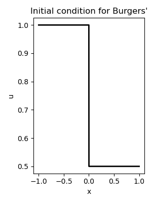

<!--
title: Lecture 032 Nonlinear Hyperbolic PDEs
paginate: true
_class: titlepage
-->

# Nonlinear Hyperbolic PDEs

---

# A nonlinear Conservation law

We have seen the general form for a scalar conservation law
$$
\partial_t u + \partial_x f(u)=0.
$$
Some hypothesis on the flux function $f$ are needed to have a well posed problem. For example, we will assume that $f$ is a convex function, i.e., $f''(u)\geq 0$ for all $u$.
We can think about the first generalization of the advection equation, i.e., **Burgers'** equation
$$
\partial_t u + \partial_x \left( \frac{u^2}{2} \right)=0.
$$
Here, we have chosen $f(u)=\frac{u^2}{2}$, which is a nonlinear function of $u$. **Burgers'** equation approximates the Navier-Stokes equations for incompressible fluids in a very simplified version.
In this context, we can write the conservation law in its linearized form
$$
\partial_t u + u\partial_x u=0
$$
where we see that this is equivalent to a transport problem where the velocity is $u$ itself.

---

# Viscous Burgers' equation
$$
\partial_t u + u\partial_x u = 0
$$
is also called **inviscid Burgers' equation**. We can add a diffusion term to the equation, leading to the **viscous Burgers' equation**
$$
\partial_t u + u\partial_x u = \nu \partial_{xx} u.
$$
Again, this is the simplest model to describe nonlinear and viscous effects in fluids.

---

## Exact solution of inviscid Burgers' equation

The **inviscid Burgers' equation**, when smooth, is a nonlinear PDE that has a solution that uses again the characteristics.
The characteristics satisfy
$$
\partial_t x(t) = u(t,x(t)), \qquad x(0)=x_0,
$$
so,  $u$ is constant along the characteristics, since
$$
\frac{d}{dt} u(t,x(t)) = \partial_t u + \partial_x u \,\partial_t x(t) = \partial_t u + u \partial_x u = 0.
$$
So, the characteristics are straight lines, since $u$ is constant along them. So the characteristics are straight lines determined by the initial data $u_0(x),$ i.e., $u(t,x(t))=u_0(x_0)$.

---

## Shock formation in Burgers' equation

The solution of the inviscid Burgers' equation is not unique. As soon as the characteristics cross, we have a problem. Indeed, if we have two characteristics that cross, we have two different values of $u$ at the same point $(t,x)$, so the solution is not unique.
When for the first time two characteristics cross, the function has an infinite slope and the wave *breaks* and forms a **shock**. Beyond this point there is no classical solution anymore as the solution is discontinuous.

## Exercise
Show that if we solve $\partial_t u + u\partial_x u = 0$ with smooth initial data $u_0(x)$, we have that the solution is smooth until the time $t^*$ when the characteristics cross. The time $t^*$ is given by
$$
t^* = \frac{-1}{\min_{x} u'_0(x)}.
$$

---

## After breaking point?

If we want to continue to continue with the characteristics we will end up with solutions that is multivalued in some points. This does not make sense. 
We can find the correct physical model using the **viscous Burgers' equation** in the vanishing viscosity limit. The solution of the viscous Burgers' equation is smooth and converges to the solution of the inviscid Burgers' equation as $\nu\to 0$.

---

## Weak solutions
When discontinuities appear, the classical PDE has no longer meaning. So, we either look at the **integral version**
$$
\partial_t \int_{x_1}^{x_2} u(t,x) \mathrm{d}x +  f(u(t,x_2))-f(t,x_1) =0
$$
or we can recur to the **weak formulation** of the PDE: find $u:\mathbb R \times \mathbb R \to \mathbb R$ such that for all $\varphi\in C^\infty_0(\mathbb R \times \mathbb R)$
$$
\begin{align*}
&\int_0^\infty \int_{-\infty}^{+\infty} \varphi(t,x) \partial_t u(t,x) + \varphi(t,x) \partial_x f(u(t,x)) \mathrm{d}x\,\mathrm{d}t =0 \qquad \Longrightarrow\\
&\int_0^\infty \int_{-\infty}^{+\infty} \partial_t \varphi(t,x) u(t,x) + \partial_x\varphi(t,x)  f(u(t,x)) \mathrm{d}x\,\mathrm{d}t =\int_{-\infty}^{\infty} \varphi(0,x) u(0,x) \mathrm{d} x.
\end{align*}
$$

Here, we have ignored all boundary terms taking support on $\mathbb R \times \mathbb R$, except the initial condition. One can keep them into the formulation, integrating on compact domains.

The **vanishing viscosity solution** we defined above is a weak solution.
But **weak solutions** are not unique, and we might need to filter out the physically relevant solution, for example, adding entropy constraints, leading to **entropy solutions** (which are also the **vanishing viscosity solution**).

---

# Riemann Problem
The Riemann problem is the simplest discontinuous problem that a conservation law might observe. Once we understand it, we can generalize to all other solutions. Indeed, as we have seen before, discontinuities might arise also from smooth solutions, so, we better be ready to deal with them.

Riemann problem for Burgers' equation $\partial_t u + u \partial_x u = 0$ is given by the following initial condition
$$
u(0,x) = \begin{cases}
u_L & x<0\\
u_R & x>0
\end{cases}
$$

---

# Riemann problem: shock wave (1/n)
We first analyse the case when $u_L>u_R$ in Burgers'. The solution is given by a shock wave, as all the characteristics on the left of the domain travel faster than the one on the right

What do we do between the blue lines?

---

# Riemann problem: shock wave (2/n)
Between the blue lines we expect a discontinuity traveling with a given speed $s$. There are no other possibilities since at the left and at the right of this line the characteristics give constant solution.
So the exact solution is given by 
$$
u(t,x) = \begin{cases}
u_L & x<st\\
u_R & x>st
\end{cases}
$$

---

# Riemann problem: shock wave (3/3)
How do we find the speed $s$? Let's use conservation!

We know that 
$$
\int_{-L}^L \partial_t u(x,t) \mathrm{d}x = f(u(t,-L))-f(u(t,L)) = f(u_L)-f(u_R) = \frac{u_L^2}{2}-\frac{u_R^2}{2} = \frac{(u_L-u_R)(u_L+u_R)}{2}.
$$
On the other hand, using the exact solution formulation, we have that
$$
\begin{align*}
&\int_{-L}^L u(x,t) \mathrm{d}x = \int_{-L}^{st} u_L \mathrm{d}x + \int_{st}^{L} u_R \mathrm{d}x = (st+L)u_L - (st-L)u_R\\
&\partial_t \int_{-L}^L u(x,t) \mathrm{d}x = \partial_t \left( (st+L)u_L - (st-L)u_R \right) = s u_L -su_R = s(u_L-u_R).
\end{align*}
$$
So, we must have that 
$$
s = \frac{f(u_L)-f(u_R)}{u_L-u_R} \underbrace{=}_{\text{Burgers'}} \frac{u_L+u_R}{2}.
$$

which is called the **Rankine-Hugoniot condition**. 

---

# Dependence on the change of variables in conservative form
If we change Burgers' equation changing $y=u^{1/3}$ and $u=y^3$ (which is a smooth bijection), we can rewrite the equation as
$$
\begin{align*}
&\partial_t y^3 + \frac12 \partial_x y^6 = 3 y^2 \partial_t y + 3 y^5 \partial_x y=0\\
&\partial_t y + 3 y^3 \partial_x y= \partial_t y + \frac{3}{4} \partial_x y^4 = 0
\end{align*}
$$

If we compute the Rankine-Hugoniot condition we find
$$
s = \frac34\frac{ y_L^4-y_R^4}{y_L-y_R} = \frac34 (y_L+y_R)(y_L^2+y_R^2) = \frac34 (u_L^{1/3}+u_R^{1/3})(u_L^{2/3}+u_R^{2/3}) \neq \frac{u_L+u_R}{2}.
$$
For example for $u_L=1$ and $u_R=0$ we have that $s=\frac34$ for the changed-variable equation, while $s=\frac12$ for the original equation. 
This shows that changing the conserved variable changes the structure of the solution, hence it is important to use the conserved variables to evolve the system. For example, in Euler equations one might be tempeted to evolve density, velocity and pressure instead of momentum and total energy. This would lead to wrong solutions and not to conserve the conserved quantities.

---

# Riemann problem: rarefaction wave (1/n)
Now we consider the case when $u_L<u_R$. In this case, is not clear what we would like to put in between the characteristics. There are some points for $t>0$ where no characteristics comes from the initial condition.

In principle, one could fill that area with various (weak) solutions, using multiple discontinuities, filling with one of the value, choosing something in between, etc.
**Exercise**: check that the solution $u=u_L$ at the left of the line $x=st$ with $s$ the speed given by the Rankine-Hugoniot and $u=u_R$ at the right of this line is a weak solution.

---

# Riemann problem: rarefaction wave (2/n)
To choose a meaningful solution, we will use another principle. We note that in the original equation
$$
\partial_t u(t,x) + \partial_x f(u(t,x)) = 0
$$
if we replace $x,t$ with $\lambda x, \lambda t$ with $\lambda>0$, the equation still holds.
So, we can assume that the solution is self-similar, i.e., $u(t,x)=z(\frac{x}{t})$ for $t>0$. 

Define the similarity variable $\xi=\frac{x}{t}$ and we substitute it in the conservation law. We get
$$
\begin{align*}
  0=&\partial_t z(\xi) + \partial_x f(z(\xi)) =\partial_t z(\xi) +  f'(z(\xi)) \partial_x z(\xi) \\
=&z'(\xi) \xi_t + f'(z(\xi)) z'(\xi) \xi_x = -\frac{x}{t^2} z'(\xi) + f'(z(\xi)) \frac{1}{t} z'(\xi) \\
&z'(\xi) \left( -\xi + f'(z(\xi)) \right)=0.
\end{align*}
$$
Except the trivial solution $z'(\xi)=0$, we have that, since  $f$ is concave and $f'$ is increasing, so, it's an invertible function, we have that
$$
z\left(\xi\right) = (f'(z(\xi)))^{-1} (\xi).
$$

---

# Riemann problem: rarefaction wave (3/n)

So, the solution of the Riemann problem for the case $u_L<u_R$ is the following **rarefaction wave**
$$
u(t,x) = \begin{cases}
u_L & \text{if } x<f'(u_L)t\\
(f')^{-1}(x/t) & \text{if } f'(u_L)t<x<f'(u_R)t\\
u_R & \text{if } x>f'(u_R)t.
\end{cases}
$$

As an example for Burgers' equation $f(u)=\frac{u^2}{2}$ and $f'(u)=u$, so the solution for a rarefaction wave  reads
$$
u(t,x) = \begin{cases}
u_L & \text{if } x<u_Lt\\
(x/t) & \text{if } u_L t<x<u_Rt\\
u_R & \text{if } x>u_Rt.
\end{cases}
$$
This is a strong solution on $\Omega\times(0,t)$, so, clearly, also a weak solution of our problem.

There is **no uniqueness** of the **weak solution**.

---

# Riemann problem: rarefaction wave (4/4)

---

# From vanishing viscosity to entropy solution (1/2)

Consider the **unique** vanishing viscosity solution $u=\lim_{\nu\to 0} u^{\nu}$ solutions of
$$
\partial_t u^{\nu} + \partial_x f(u^{\nu}) = \nu \partial_{xx} u^{\nu}.
$$

Consider any convex function, the entropy, $\eta(u)$, i.e., $\eta''(u)\geq 0$ and an entropy flux $g(u)$ such that $g'(u)=\eta'(u)f'(u)$. $(\eta,g)$ is called **entropy pair**. We can multiply the equation by $\eta'(u^{\nu})$ and get
$$
\begin{align*}
&\eta'(u^{\nu})\partial_t u^{\nu} + \eta'(u^{\nu})\partial_x f(u^{\nu}) = \nu \partial_{xx} u^{\nu}\\
&\partial_t \eta(u^{\nu}) + \partial_x g(u^{\nu}) = \nu \partial_{xx} \eta(u^{\nu}) - \nu \underbrace{\eta''(u^{\nu})}_{\geq 0} (\partial_x u^{\nu})^2 \\
&\partial_t \eta(u^{\nu}) + \partial_x g(u^{\nu}) - \nu \partial_{xx} \eta(u^{\nu}) \leq 0.
\end{align*}
$$

---

# From vanishing viscosity to entropy solution (2/2)
Let's go to the weak formulation of the entropy inequality, where we consider the domain $\mathbb R \times \mathbb R$ and positive test functions $\varphi\in C^\infty_0(\mathbb R \times \mathbb R)$.
$$
\begin{align*}
&\partial_t \eta(u^{\nu}) + \partial_x g(u^{\nu}) - \nu \partial_{xx} \eta(u^{\nu}) \leq 0\\
&\int^x\int^t \varphi(\partial_t \eta(u^{\nu}) + \partial_x g(u^{\nu}) - \nu \partial_{xx} \eta(u^{\nu})) \mathrm d x\,\mathrm d t \leq 0\\
&\int^x\int^t \partial_t \varphi  \eta(u^{\nu}) + \partial_x \varphi g(u^{\nu}) + \nu \partial_{xx} \varphi \eta(u^{\nu}) \mathrm d x\,\mathrm d t \geq 0
\end{align*}
$$
**Now**, we take the limit $\nu\to 0$ and we get
$$
\begin{align*}
&\int^x\int^t \partial_t \varphi  \eta(u) + \partial_x \varphi g(u)  \mathrm d x\,\mathrm d t \geq 0
\end{align*}
$$
which is the weak form of the entropy inequality
$$
\partial_t \eta(u) + \partial_x  g(u)  \leq 0.
$$
So the vanishing viscosity solutions verify the entropy inequality! 
The solutions of the weak formulation of the conservation law that verify also the entropy inequality are called **entropy solutions**.

---

# Existence and uniqueness of the solution
Let $u_0\in L^\infty(\mathbb R) \cup BV(\mathbb R)$, then if the Cauchy problem
$$
\begin{cases}
\partial_t u + \partial_x f(u) =0 &\forall x \in \mathbb R, t\in \mathbb R^+,\\
u(0,x) = u_0(x) & \forall x \in \mathbb R,
\end{cases}
$$
in its weak form has an **entropy solution**, it is unique and 
$$
\lVert u(t,\cdot) \rVert_{L^\infty(\mathbb R)} \leq \lVert u_0 \rVert_{L^\infty(\mathbb R)}.
$$

P.S. $BV(\mathbb R)$ space of functions with bounded variation, i.e., 
$$
BV(\mathbb R) = \left\lbrace g :\mathbb R \to \mathbb R : \lVert g \rVert_{H^1(\mathbb R)} < \infty \, \right\rbrace.
$$

Proof in `E. Godlewski and P.A. Raviart, Hyperbolic systems of conservation laws, Ellipses, 1991.`

---

## Example of entropy for Burgers' equation

The entropy function $\eta(u) = u^2$ is convex and it is an entropy with the entropy flux $g(u) = \frac23 u^3$. Indeed, we have that
$$
g'(u)=2u^2 = \eta'(u)f'(u) = 2u u = 2u^2.
$$
One can also check that for smooth solutions, multiplying the Burgers' equation by $2u$, obtaining
$$
2u\partial_t u + 2u \frac12 \partial_x u^2 = \partial_t u^2 + \partial_x \left( \frac{2}3 u^3 \right) =0. 
$$

---

## Example of weak solution that is not an entropy solution
The Riemann problem for the inviscid Burgers' equation with $u_L< u_R$ cannot have as a solution a shock wave. By contradiction, suppose that 
$$
u(t,x)= \begin{cases}
u_L & x<st\\
u_R & x>st
\end{cases}
$$
with $s=\frac{u_L+u_R}{2}$, because it must verify the Rankine-Hugoniot condition. This is clearly a weak solution (exercise).

Let's check if it satisfies the entropy condition in the integral form on a small domain $[0,\Delta t] \times [-\Delta x, \Delta x]$ with $\Delta t \leq |s|^{-1}\Delta x$ with the entropy pair $(\eta, g)$ with $\eta(u)=u^2$ and $g(u)=\frac23 u^3$. 
Next page computations.

---

$$
\begin{align*}
&\int_{-\Delta x}^{\Delta x} \int_0^{\Delta t} \partial_t \eta(u(t,x)) + \partial_x  g(u(t,x)) \mathrm{d}x\,\mathrm{d}t \\
=& \int_{-\Delta x}^{\Delta x} u^2(\Delta t,x)-u^2(0,x) \mathrm{d}x + \int_0^{\Delta t} \frac23 u^3(t,\Delta x)- \frac23 u^3(t,-\Delta x) \,\mathrm{d}t \\
=&s\Delta t (u_L^2 - u_R^2) +\frac23 \Delta t ( u_R^3-u_L^3)= \Delta t \left[ \frac{u_L+u_R}{2} (u_L^2-u_R^2)-\frac23 \frac{u_L^3-u_R^3}{u_L^2-u_R^2}(u_L^2-u_R^2)\right]
\\
=& \Delta t \left[ \frac{u_L+u_R}{2} -\frac23 \frac{u_L^2+u_Lu_R+ u_R^2}{u_L+u_R}\right](u_L^2-u_R^2)\\
= &\Delta t \left[ \frac{3u_L^2+6u_Lu_R + 3u_R^2-4u_L^2-4u_Lu_R-4 u_R^2}{6(u_L+u_R)}\right](u_L^2-u_R^2)\\
=&\Delta t \left[ \frac{-u_L^2+2u_Lu_R -u_R^2}{6(u_L+u_R)}\right](u_L^2-u_R^2)=-\frac{\Delta t}{6}  \left[ \frac{(u_L-u_R)^2}{(u_L+u_R)}\right](u_L^2-u_R^2)\\
=&-\frac{\Delta t}{6}  (u_L-u_R)^2(u_L-u_R) > 0 \qquad \text{for }u_L<u_R.
\end{align*}
$$

---

# Numerics for conservation laws (finite difference)

Most of what we said for linear advection problems holds also here.
1. The **Riemann problem** that we discussed in this lesson is the essential bit of the discretization. If we think to two neighboring points at every interface between two points we are solving a Riemann problem. So, if we know what they lead to, we can use this solution to get a numerical solution.
2. **Conservation**: we know that for a conservation law what is produced or destroyed goes thorugh the boundaries. So, the contribution for the point $u_i$ should arrive from the left $f_{i-1/2}$ and from the right $f_{i+1/2}$. So, we can write a discrete approximation of conseravation law as 
  $$
  u_i^{n+1} = u_i^n - \frac{\Delta t}{\Delta x} \left( f_{i+1/2} - f_{i-1/2} \right).
  $$
3. $f_{i+1/2}$ has to be defined (we know only $u_i$ values) and it is the flux at the interface between $u_i$ and $u_{i+1}$. We can use the Riemann problem to define it.

---

# Godunov method

Main idea: what changes in one cell is given by the flux crossing the interface between two cells in time.
$$
u_i^{n+1}-u^n_{i}\approx\int_{t_0}^{t_1}\int_{x_{i-1/2}}^{x_{i+1/2}} \partial_t u(t,x) \mathrm{d}x\,\mathrm{d}t = \int_{t_0}^{t_1}f(u_{i+1/2}(t)) - f(u_{i-1/2}(t)) \,\mathrm{d}t,
$$
where $u_{i+1/2}$ is the exact solution of the Riemann problem given by $u_L=u_{i}$ and $u_R=u_{i+1}$.

It is not always easy to compute the exact solution of the Riemann problem, so we can use a numerical approximation of the flux. 
In particular, we define a function called **numerical flux** $\hat{f}$ which approximates the value of the flux at the interface.
$$
\hat{f}(u_i,u_{i+1}) \approx f(u_{i+1/2}). 
$$

---

# Numerical fluxes

#### Lax-Friedrichs flux
Central is not good (see linear), so let's use some numerical dissipation
$$
\hat{f}(u_L,u_R) = \frac{f(u_L)+f(u_R)}{2} - \frac{\Delta x}{2\Delta t}(u_R-u_L).
$$
#### Rusanov flux
Reduce the numerical dissipation, making it more local
$$
\hat{f}(u_L,u_R) = \frac{f(u_L)+f(u_R)}{2} - \frac{\max(|f'(u_L)|,|f'(u_R)|)}{2}(u_R-u_L).
$$

#### Linearized Roe
$$
\hat{f}(u_L,u_R) =  \begin{cases}
  f(u_L) & \text{if } a_{LR}>0\\
  f(u_R) & \text{if } a_{LR}<0
\end{cases} 
$$
with $a_{LR}=\frac{f(u_R)-f(u_L)}{u_R-u_L}$ the approximate speed of the wave if $u_R\neq u_L$, $a_{LR}=f'(u_L)$ if $u_R=u_L$. 
